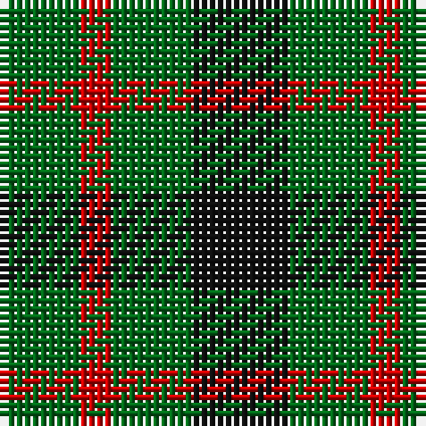

In pattern [GRGK](/patterns/grgk/).

This was sourced from register-of-tartans.  It is a [4 stripes tartan](/stripes/stripes4/).

Original link https://www.tartanregister.gov.uk/tartanDetails.aspx?ref=1383

## Thread count
G/10 R4 G10 K/12

## Palette
Each colour and its ΔE from the base-6 reference it is a variant of.

| Colour | Shade | Base | ΔE (OKLab) |
|---|---|---|---|
| G | <code style="background-color:#006818;">#006818</code> `#006818` | G <code style="background-color:#006400;">#006400</code> | 0.02 |
| K | <code style="background-color:#101010;">#101010</code> `#101010` | K <code style="background-color:#000000;">#000000</code> | 0.17 |
| R | <code style="background-color:#C80000;">#C80000</code> `#C80000` | R <code style="background-color:#C80000;">#C80000</code> | 0.00 |

# Sample pattern

## Nearest tartans

The nearest existing variants by ΔTartan distance.

1. [Wilson's No.053 #2](/setts/s4/g8k10g8y2-g006818-k101010-yd8b000/) — ΔT 1.15
1. [Wilson's No.094](/setts/s4/g8k10g8r4-g408060-k101010-rc80000/) — ΔT 1.17
1. [Wilson's No.209](/setts/s4/g8b10g8ba4-b440044-ba2888c4-g006818/) — ΔT 1.22
1. [Glen Lyon District Tartan Tartan Number: 23. Earliest known date: 1820 Appears to be No 185 in Wilson's '1819' See products available Copyright © Blair Urquhart, Comrie, 2015](/setts/s3/k12g10r4-g006818-k101010-rc80000/) — ΔT 1.32
1. [Glen Lyon or Mull (No.53) District Tartan Tartan Number: 24. Earliest known date: 1820 Appears to be No 185 in Wilson's '1819' See products available Copyright © Blair Urquhart, Comrie, 2015](/setts/s3/k10g6b4-b5c8ca8-g006818-k101010/) — ΔT 1.38
1. [Mull](/setts/s3/k10g8b4-b5c8ca8-g006818-k101010/) — ΔT 1.44
1. [Wilson's No.207](/setts/s4/g8r8g8b4-b2888c4-g006818-rc80000/) — ΔT 1.50
1. [Glen Lyon #2](/setts/s5/b4g8k10g8b2-b2888c4-g006818-k101010/) — ΔT 1.64
1. [Wilson's No.201](/setts/s3/b8g16y4-b440044-g006818-ye8c000/) — ΔT 1.71
1. [Wilson's No.202](/setts/s3/g14k8r8-g006818-k101010-rc80000/) — ΔT 1.72

## Neighbour map

Every grey dot is one of 15726 variants placed by the first two principal components of the ΔTartan feature space (44% of its variance). Red is this tartan; blue dots are its nearest — click one to open its page.

<svg viewBox="0 0 640 380" role="img" style="max-width:100%;height:auto;border:1px solid #e0e0e0;border-radius:4px;display:block" xmlns="http://www.w3.org/2000/svg"><image href="/nn/cloud.v1.png" width="640" height="380"/><a href="/setts/s4/g8k10g8y2-g006818-k101010-yd8b000/"><circle cx="280.2" cy="326.2" r="4" fill="#3465a4"><title>Wilson's No.053 #2</title></circle></a><a href="/setts/s4/g8k10g8r4-g408060-k101010-rc80000/"><circle cx="202.2" cy="359.6" r="4" fill="#3465a4"><title>Wilson's No.094</title></circle></a><a href="/setts/s4/g8b10g8ba4-b440044-ba2888c4-g006818/"><circle cx="218.8" cy="366.0" r="4" fill="#3465a4"><title>Wilson's No.209</title></circle></a><a href="/setts/s3/k12g10r4-g006818-k101010-rc80000/"><circle cx="208.1" cy="356.0" r="4" fill="#3465a4"><title>Glen Lyon District Tartan Tartan Number: 23. Earliest known date: 1820 Appears to be No 185 in Wilson's '1819' See products available Copyright © Blair Urquhart, Comrie, 2015</title></circle></a><a href="/setts/s3/k10g6b4-b5c8ca8-g006818-k101010/"><circle cx="199.5" cy="366.0" r="4" fill="#3465a4"><title>Glen Lyon or Mull (No.53) District Tartan Tartan Number: 24. Earliest known date: 1820 Appears to be No 185 in Wilson's '1819' See products available Copyright © Blair Urquhart, Comrie, 2015</title></circle></a><a href="/setts/s3/k10g8b4-b5c8ca8-g006818-k101010/"><circle cx="178.8" cy="366.0" r="4" fill="#3465a4"><title>Mull</title></circle></a><a href="/setts/s4/g8r8g8b4-b2888c4-g006818-rc80000/"><circle cx="230.1" cy="366.0" r="4" fill="#3465a4"><title>Wilson's No.207</title></circle></a><a href="/setts/s5/b4g8k10g8b2-b2888c4-g006818-k101010/"><circle cx="229.6" cy="312.3" r="4" fill="#3465a4"><title>Glen Lyon #2</title></circle></a><a href="/setts/s3/b8g16y4-b440044-g006818-ye8c000/"><circle cx="266.3" cy="317.7" r="4" fill="#3465a4"><title>Wilson's No.201</title></circle></a><a href="/setts/s3/g14k8r8-g006818-k101010-rc80000/"><circle cx="162.6" cy="366.0" r="4" fill="#3465a4"><title>Wilson's No.202</title></circle></a><circle cx="244.9" cy="359.0" r="5" fill="#c00000"/></svg>

ID: /setts/s4/k12g10r4g10-g006818-k101010-rc80000/
