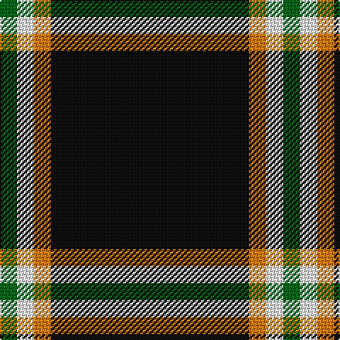

In pattern [GWYK](/patterns/gwyk/).

This was sourced from register-of-tartans.  It is a [4 stripes tartan](/stripes/stripes4/).

Original link https://www.tartanregister.gov.uk/tartanDetails.aspx?ref=928

## Attestations

This cloth appears in 2 source records; the oldest owns this page.

- 01/01/2007 — Dhillon (Personal) (register-of-tartans, [record](https://www.tartanregister.gov.uk/tartanDetails.aspx?ref=928))
- pre 2007 — Dhillon (Personal) (tartans-authority, [record](http://www.tartansauthority.com/tartan-ferret/display/7175/))

## Thread count
G/12 W12 O12 K/140

## Palette
Each colour and its ΔE from the base-6 reference it is a variant of.

| Colour | Shade | Base | ΔE (OKLab) |
|---|---|---|---|
| G | <code style="background-color:#006818;">#006818</code> `#006818` | G <code style="background-color:#006100;">#006100</code> | 0.02 |
| K | <code style="background-color:#101010;">#101010</code> `#101010` | K <code style="background-color:#000000;">#000000</code> | 0.17 |
| O | <code style="background-color:#D87C00;">#D87C00</code> `#D87C00` | Y <code style="background-color:#F2BF00;">#F2BF00</code> | 0.17 |
| W | <code style="background-color:#F8F8F8;">#F8F8F8</code> `#F8F8F8` | W <code style="background-color:#F7F7F7;">#F7F7F7</code> | 0.00 |

# Sample pattern

## Nearest tartans

The nearest existing variants by ΔTartan distance.

1. [Rogues, The (Corporate)](/setts/s4/r6b24k100y6-b5c8ca8-k101010-rc80000-yfccc00/) — ΔT 1.08
1. [Rogues (United States), The](/setts/s4/r6b24k100y6-b506987-k101010-rff2400-yffc125/) — ΔT 1.18
1. [Gwynn (Name)](/setts/s5/y18k8y8k90r8-k101010-rc80000-ye8c000/) — ΔT 1.37
1. [Fily, Sylvain Roger](/setts/s5/r12g12k120w6b6-b0000cd-g008b00-k101010-rff0000-wffffff/) — ΔT 1.39
1. [Welsh National #3](/setts/s5/y14k8y8k78r8-k101010-rdc0000-ye8c000/) — ΔT 1.43
1. [Dobelman (Personal)](/setts/s4/r4k80w20r4-k101010-r880000-wc0c0c0/) — ΔT 1.44
1. [C-Tec N.I. Ltd](/setts/s4/k124b30w12y8-b000080-k1c1714-wf8f8f8-yfccc00/) — ΔT 1.49
1. [London Fog Black](/setts/s6/k20y4w10y8k100b4-b1474b4-k101010-we0e0e0-yb8b8b8/) — ΔT 1.55
1. [Batson (Personal)](/setts/s3/k138r28y10-k101010-rc80000-ye8c000/) — ΔT 1.57
1. [Fily (Personal)](/setts/s5/r12g12k120w6b6-b2c2c80-g006818-k101010-rc80000-we0e0e0/) — ΔT 1.61

## Neighbour map

Every grey dot is one of 15726 variants placed by the first two principal components of the ΔTartan feature space (44% of its variance). Red is this tartan; blue dots are its nearest — click one to open its page.

<svg viewBox="0 0 640 380" role="img" style="max-width:100%;height:auto;border:1px solid #e0e0e0;border-radius:4px;display:block" xmlns="http://www.w3.org/2000/svg"><image href="/nn/cloud.v1.png" width="640" height="380"/><a href="/setts/s4/r6b24k100y6-b5c8ca8-k101010-rc80000-yfccc00/"><circle cx="455.3" cy="196.0" r="4" fill="#3465a4"><title>Rogues, The (Corporate)</title></circle></a><a href="/setts/s4/r6b24k100y6-b506987-k101010-rff2400-yffc125/"><circle cx="465.1" cy="199.6" r="4" fill="#3465a4"><title>Rogues (United States), The</title></circle></a><a href="/setts/s5/y18k8y8k90r8-k101010-rc80000-ye8c000/"><circle cx="453.5" cy="203.0" r="4" fill="#3465a4"><title>Gwynn (Name)</title></circle></a><a href="/setts/s5/r12g12k120w6b6-b0000cd-g008b00-k101010-rff0000-wffffff/"><circle cx="474.8" cy="149.6" r="4" fill="#3465a4"><title>Fily, Sylvain Roger</title></circle></a><a href="/setts/s5/y14k8y8k78r8-k101010-rdc0000-ye8c000/"><circle cx="445.4" cy="209.2" r="4" fill="#3465a4"><title>Welsh National #3</title></circle></a><a href="/setts/s4/r4k80w20r4-k101010-r880000-wc0c0c0/"><circle cx="479.2" cy="199.2" r="4" fill="#3465a4"><title>Dobelman (Personal)</title></circle></a><a href="/setts/s4/k124b30w12y8-b000080-k1c1714-wf8f8f8-yfccc00/"><circle cx="423.4" cy="199.4" r="4" fill="#3465a4"><title>C-Tec N.I. Ltd</title></circle></a><a href="/setts/s6/k20y4w10y8k100b4-b1474b4-k101010-we0e0e0-yb8b8b8/"><circle cx="538.3" cy="152.6" r="4" fill="#3465a4"><title>London Fog Black</title></circle></a><a href="/setts/s3/k138r28y10-k101010-rc80000-ye8c000/"><circle cx="516.0" cy="245.8" r="4" fill="#3465a4"><title>Batson (Personal)</title></circle></a><a href="/setts/s5/r12g12k120w6b6-b2c2c80-g006818-k101010-rc80000-we0e0e0/"><circle cx="496.6" cy="159.2" r="4" fill="#3465a4"><title>Fily (Personal)</title></circle></a><circle cx="489.8" cy="203.1" r="5" fill="#c00000"/></svg>

ID: /setts/s4/k140y12w12g12-g006818-k101010-wf8f8f8-yd87c00/
