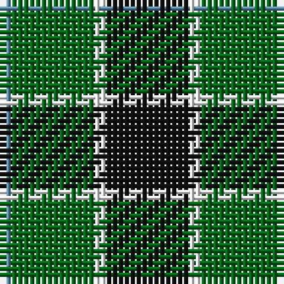

In pattern [BGWK](/patterns/bgwk/).

This was sourced from register-of-tartans.  It is a [4 stripes tartan](/stripes/stripes4/).

Original link https://www.tartanregister.gov.uk/tartanDetails.aspx?ref=4667

## Thread count
B/2 G14 W2 K/14

## Palette
Each colour and its ΔE from the base-6 reference it is a variant of.

| Colour | Shade | Base | ΔE (OKLab) |
|---|---|---|---|
| B | <code style="background-color:#5C8CA8;">#5C8CA8</code> `#5C8CA8` | B <code style="background-color:#2A418A;">#2A418A</code> | 0.23 |
| DG | <code style="background-color:#003820;">#003820</code> `#003820` | G <code style="background-color:#006100;">#006100</code> | 0.15 |
| G | <code style="background-color:#006818;">#006818</code> `#006818` | G <code style="background-color:#006100;">#006100</code> | 0.02 |
| K | <code style="background-color:#101010;">#101010</code> `#101010` | K <code style="background-color:#000000;">#000000</code> | 0.17 |
| LG | <code style="background-color:#789484;">#789484</code> `#789484` | G <code style="background-color:#006100;">#006100</code> | 0.24 |
| W | <code style="background-color:#FCFCFC;">#FCFCFC</code> `#FCFCFC` | W <code style="background-color:#F7F7F7;">#F7F7F7</code> | 0.01 |

# Sample pattern

## Nearest tartans

The nearest existing variants by ΔTartan distance.

1. [Wilson's, No 79](/setts/s4/k14w2g14b2-b5480b0-g008000-k000000-we0e0e0/) — ΔT 0.94
1. [Innes Hunting](/setts/s4/k60w14g72k10-g006818-k101010-w98c8e8/) — ΔT 0.99
1. [Wilson's, No 140](/setts/s4/k14y2g14b2-b5480b0-g008000-k000000-yf0c000/) — ΔT 0.99
1. [Wilson's No.197](/setts/s4/g24y4k24y4-g006818-k101010-ye8c000/) — ΔT 1.05
1. [Salt Spring Island](/setts/s4/r4g24b24w4-b000048-g285800-rdc0000-wffffff/) — ΔT 1.08
1. [Trafalger](/setts/s6/g6b2g16b14k6y2-b304080-g008000-k000000-yf0c000/) — ΔT 1.09
1. [Michaluk (Personal)](/setts/s6/k12b16g80k80g12y12-b1474b4-g408060-k101010-ybc8c00/) — ΔT 1.20
1. [Unnamed 3](/setts/s6/g4b8k12ba2g18k4-b8080d0-ba5480b0-g008000-k000000/) — ΔT 1.20
1. [MacKay](/setts/s6/g2b10g2k10g12y2-b304080-g008000-k000000-yf0c000/) — ΔT 1.21
1. [Raeside](/setts/s5/k12g8ga88k82w8-g289c18-ga006818-k101010-we0e0e0/) — ΔT 1.26

## Neighbour map

Every grey dot is one of 15726 variants placed by the first two principal components of the ΔTartan feature space (44% of its variance). Red is this tartan; blue dots are its nearest — click one to open its page.

<svg viewBox="0 0 640 380" role="img" style="max-width:100%;height:auto;border:1px solid #e0e0e0;border-radius:4px;display:block" xmlns="http://www.w3.org/2000/svg"><image href="/nn/cloud.v1.png" width="640" height="380"/><a href="/setts/s4/k14w2g14b2-b5480b0-g008000-k000000-we0e0e0/"><circle cx="198.0" cy="244.5" r="4" fill="#3465a4"><title>Wilson's, No 79</title></circle></a><a href="/setts/s4/k60w14g72k10-g006818-k101010-w98c8e8/"><circle cx="263.3" cy="275.6" r="4" fill="#3465a4"><title>Innes Hunting</title></circle></a><a href="/setts/s4/k14y2g14b2-b5480b0-g008000-k000000-yf0c000/"><circle cx="199.9" cy="245.0" r="4" fill="#3465a4"><title>Wilson's, No 140</title></circle></a><a href="/setts/s4/g24y4k24y4-g006818-k101010-ye8c000/"><circle cx="223.5" cy="271.9" r="4" fill="#3465a4"><title>Wilson's No.197</title></circle></a><a href="/setts/s4/r4g24b24w4-b000048-g285800-rdc0000-wffffff/"><circle cx="197.8" cy="254.2" r="4" fill="#3465a4"><title>Salt Spring Island</title></circle></a><a href="/setts/s6/g6b2g16b14k6y2-b304080-g008000-k000000-yf0c000/"><circle cx="214.6" cy="230.7" r="4" fill="#3465a4"><title>Trafalger</title></circle></a><a href="/setts/s6/k12b16g80k80g12y12-b1474b4-g408060-k101010-ybc8c00/"><circle cx="231.2" cy="225.4" r="4" fill="#3465a4"><title>Michaluk (Personal)</title></circle></a><a href="/setts/s6/g4b8k12ba2g18k4-b8080d0-ba5480b0-g008000-k000000/"><circle cx="187.2" cy="221.9" r="4" fill="#3465a4"><title>Unnamed 3</title></circle></a><a href="/setts/s6/g2b10g2k10g12y2-b304080-g008000-k000000-yf0c000/"><circle cx="154.3" cy="237.3" r="4" fill="#3465a4"><title>MacKay</title></circle></a><a href="/setts/s5/k12g8ga88k82w8-g289c18-ga006818-k101010-we0e0e0/"><circle cx="286.9" cy="218.6" r="4" fill="#3465a4"><title>Raeside</title></circle></a><circle cx="220.0" cy="250.4" r="5" fill="#c00000"/></svg>

ID: /setts/s4/k14w2g14b2-b5c8ca8-g006818-k101010-wfcfcfc/
