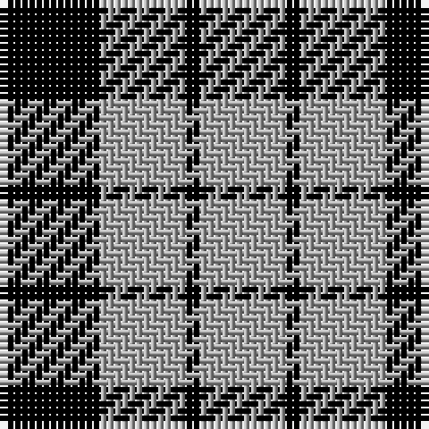

In pattern [KYKY](/patterns/kyky/).

This was sourced from weddslist.  It is a [4 stripes tartan](/stripes/stripes4/).

Original link http://www.weddslist.com/cgi-bin/tartans/pg.pl?source=tinsel

## Thread count
K/14 N12 K2 N/12

## Palette
Each colour and its ΔE from the base-6 reference it is a variant of.

| Colour | Shade | Base | ΔE (OKLab) |
|---|---|---|---|
| K | <code style="background-color:#000000;">#000000</code> `#000000` | K <code style="background-color:#000000;">#000000</code> | 0.00 |
| N | <code style="background-color:#AAAAAA;">#AAAAAA</code> `#AAAAAA` | Y <code style="background-color:#E8C000;">#E8C000</code> | 0.19 |

# Sample pattern

## Nearest tartans

The nearest existing variants by ΔTartan distance.

1. [MacFarlane VS](/setts/s4/k7y6k1y6-k000000-yaaaaaa/) — ΔT 0.00
1. [MacFarlane VS](/setts/s4/k7w6k1w6-k000000-wd0d0d0/) — ΔT 0.62
1. [MacFarlane, Lendrum Black and White](/setts/s4/k28w24k4w24-k000000-we0e0e0/) — ΔT 0.87
1. [Raeburn Family Tartan Tartan Number: 1275. Earliest known date: 1930 Very little is known about the origin of the tartan other than that it first appeared in the trade lists of Ross's and Johnston's around 1930. It bears a family resemblance to the MacLeod illustrated in the Vestiarium Scoticum in 1842 but the yellow bands are considerably narrower and there is no central red stripe. The name derives from the old lands of Rayburn in the Parish of Dunlop in Ayrshire. Undoubtedly the most famous person of the name was Sir Henry Raeburn (1756 - 1823) to whom we are indebted for so many famous paintings including the famous 'The MacNab'. He was knighted during the Royal visit to Edinburgh of King George IV in 1822. See products available Copyright © Blair Urquhart, Comrie, 2015](/setts/s4/k36y6k36y36-k101010-ye8c000/) — ΔT 1.37
1. [MacFarlane B/W or Lendrum Clan Tartan Tartan Number: 1251. Earliest known date: 1842 The design comes from the Vestiarium Scoticum (1842). The authors, the Sobieski Stuart brothers, enjoyed a popular following among the Scottish gentry in the early Victorian era, and in the spirit of the times, added mystery, romance and some spurious historical documentation to the subject of tartan. Of the better known tartans, the book offers some minor variation, but in other cases it provides the only recorded version of many tartans in use today. See products available Copyright © Blair Urquhart, Comrie, 2015](/setts/s4/k14w12k2w12-k101010-we0e0e0/) — ΔT 1.43
1. [MacPhee (B&W)](/setts/s4/k44w6k6w44-k000000-we0e0e0/) — ΔT 1.53
1. [MacLeod, Black & White](/setts/s5/w16k2w16k24w2-k000000-we0e0e0/) — ΔT 1.62
1. [Cairn (Marton Mills)](/setts/s5/k16w8k64w64k8-k101010-we0e0e0/) — ΔT 1.71
1. [MacPhee (B&W) Clan Tartan Tartan Number: 1252. Earliest known date: c.1930 In 1992, Sandy MacFie, the Chief of the MacPhees wrote to the Scottish Tartans Society from his home in Queensland Australia, with a request to register the MacPhee tartans. The existance of a black and white pattern was known to him but the precise details of the pattern were obscure. The Society had two reported examples of a MacPhee which met the description. One from the researches of a Canadian member, A.C. Lumsden, and the other from a Mr D. Brown in Leeds. The chosen black and white sett mirrors the clan pattern and was duly registered by the Society. The clan tartan was registered by Lord Lyon in the previous year. See products available Copyright © Blair Urquhart, Comrie, 2015](/setts/s4/k44w6k6w44-k101010-we0e0e0/) — ΔT 1.72
1. [Lords of Skye (Fashion?)](/setts/s4/k92g14k16w40-g604000-k101010-wfcfcfc/) — ΔT 1.73

## Neighbour map

Every grey dot is one of 15726 variants placed by the first two principal components of the ΔTartan feature space (44% of its variance). Red is this tartan; blue dots are its nearest — click one to open its page.

<svg viewBox="0 0 640 380" role="img" style="max-width:100%;height:auto;border:1px solid #e0e0e0;border-radius:4px;display:block" xmlns="http://www.w3.org/2000/svg"><image href="/nn/cloud.v1.png" width="640" height="380"/><a href="/setts/s4/k7y6k1y6-k000000-yaaaaaa/"><circle cx="302.2" cy="296.4" r="4" fill="#3465a4"><title>MacFarlane VS</title></circle></a><a href="/setts/s4/k7w6k1w6-k000000-wd0d0d0/"><circle cx="295.4" cy="290.7" r="4" fill="#3465a4"><title>MacFarlane VS</title></circle></a><a href="/setts/s4/k28w24k4w24-k000000-we0e0e0/"><circle cx="293.2" cy="288.6" r="4" fill="#3465a4"><title>MacFarlane, Lendrum Black and White</title></circle></a><a href="/setts/s4/k36y6k36y36-k101010-ye8c000/"><circle cx="318.2" cy="306.5" r="4" fill="#3465a4"><title>Raeburn Family Tartan Tartan Number: 1275. Earliest known date: 1930 Very little is known about the origin of the tartan other than that it first appeared in the trade lists of Ross's and Johnston's around 1930. It bears a family resemblance to the MacLeod illustrated in the Vestiarium Scoticum in 1842 but the yellow bands are considerably narrower and there is no central red stripe. The name derives from the old lands of Rayburn in the Parish of Dunlop in Ayrshire. Undoubtedly the most famous person of the name was Sir Henry Raeburn (1756 - 1823) to whom we are indebted for so many famous paintings including the famous 'The MacNab'. He was knighted during the Royal visit to Edinburgh of King George IV in 1822. See products available Copyright © Blair Urquhart, Comrie, 2015</title></circle></a><a href="/setts/s4/k14w12k2w12-k101010-we0e0e0/"><circle cx="295.6" cy="286.5" r="4" fill="#3465a4"><title>MacFarlane B/W or Lendrum Clan Tartan Tartan Number: 1251. Earliest known date: 1842 The design comes from the Vestiarium Scoticum (1842). The authors, the Sobieski Stuart brothers, enjoyed a popular following among the Scottish gentry in the early Victorian era, and in the spirit of the times, added mystery, romance and some spurious historical documentation to the subject of tartan. Of the better known tartans, the book offers some minor variation, but in other cases it provides the only recorded version of many tartans in use today. See products available Copyright © Blair Urquhart, Comrie, 2015</title></circle></a><a href="/setts/s4/k44w6k6w44-k000000-we0e0e0/"><circle cx="288.5" cy="259.4" r="4" fill="#3465a4"><title>MacPhee (B&amp;W)</title></circle></a><a href="/setts/s5/w16k2w16k24w2-k000000-we0e0e0/"><circle cx="320.8" cy="233.0" r="4" fill="#3465a4"><title>MacLeod, Black &amp; White</title></circle></a><a href="/setts/s5/k16w8k64w64k8-k101010-we0e0e0/"><circle cx="313.0" cy="240.6" r="4" fill="#3465a4"><title>Cairn (Marton Mills)</title></circle></a><a href="/setts/s4/k44w6k6w44-k101010-we0e0e0/"><circle cx="289.9" cy="256.2" r="4" fill="#3465a4"><title>MacPhee (B&amp;W) Clan Tartan Tartan Number: 1252. Earliest known date: c.1930 In 1992, Sandy MacFie, the Chief of the MacPhees wrote to the Scottish Tartans Society from his home in Queensland Australia, with a request to register the MacPhee tartans. The existance of a black and white pattern was known to him but the precise details of the pattern were obscure. The Society had two reported examples of a MacPhee which met the description. One from the researches of a Canadian member, A.C. Lumsden, and the other from a Mr D. Brown in Leeds. The chosen black and white sett mirrors the clan pattern and was duly registered by the Society. The clan tartan was registered by Lord Lyon in the previous year. See products available Copyright © Blair Urquhart, Comrie, 2015</title></circle></a><a href="/setts/s4/k92g14k16w40-g604000-k101010-wfcfcfc/"><circle cx="336.6" cy="252.5" r="4" fill="#3465a4"><title>Lords of Skye (Fashion?)</title></circle></a><circle cx="302.2" cy="296.4" r="5" fill="#c00000"/></svg>

ID: /setts/s4/k14y12k2y12-k000000-yaaaaaa/
