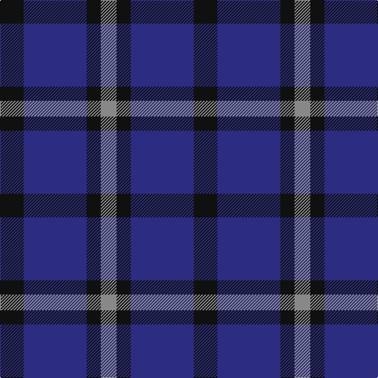

This page is one **sett** — a single exact thread-count. It belongs to the [tartan](/tartans/k15db40k9o10/)
(the same proportion at any scale), whose colour order is pattern [KBKR](/stripes/kbkr/).

Sourced from tartans-authority.  It is a [4 stripe tartan](/stripes/stripes4/).

Original link http://www.tartansauthority.com/tartan-ferret/display/11189/

## Register references

External register numbers recorded for this tartan.

- Scottish Register of Tartans: [11189](https://www.tartanregister.gov.uk/tartanDetails?ref=11189)
- Scottish Tartans Authority (ITI): 11189

## Thread count
K/30 DB80 K18 N/20

## Palette

Palette: <strong>Tartan Register</strong>
<table><thead><tr><th>Colour</th><th>Threads</th><th>Shade</th><th>Base</th><th>OKLCh</th></tr></thead><tbody><tr><td>K/</td><td style="text-align:right;font-variant-numeric:tabular-nums">30</td><td><code style="background-color:#101010;">#101010</code> <small style="color:#888">#101010</small></td><td>K <code style="background-color:#000000;">#000000</code></td><td><small style="color:#888">oklch(17.3% 0.000 89.9)</small></td></tr><tr><td>DB</td><td style="text-align:right;font-variant-numeric:tabular-nums">80</td><td><code style="background-color:#2C2C80;">#2C2C80</code> <small style="color:#888">#2C2C80</small></td><td>B <code style="background-color:#2A418A;">#2A418A</code></td><td><small style="color:#888">oklch(35.0% 0.138 276.6)</small></td></tr><tr><td>K</td><td style="text-align:right;font-variant-numeric:tabular-nums">18</td><td><code style="background-color:#101010;">#101010</code> <small style="color:#888">#101010</small></td><td>K <code style="background-color:#000000;">#000000</code></td><td><small style="color:#888">oklch(17.3% 0.000 89.9)</small></td></tr><tr><td>N/</td><td style="text-align:right;font-variant-numeric:tabular-nums">20</td><td><code style="background-color:#888888;">#888888</code> <small style="color:#888">#888888</small></td><td>R <code style="background-color:#CC0000;">#CC0000</code></td><td><small style="color:#888">oklch(62.7% 0.000 89.9)</small></td></tr></tbody></table>

# Sample pattern

## Nearest tartans

The nearest existing variants by ΔTartan distance, with this tartan at the top so the swatches line up against it.

ΔTartan

Tartan

Sett

—

<a href="/ttd/edit/#slug=k15db40k9o10~x2">Omega Delta Sigma, National Veterans</a> <a class="nn-out" href="/setts/s4/k15db40k9o10~x2/" title="open its dictionary page">↗</a>

0.97

<a href="/ttd/edit/#slug=k15dt40k9o10~x2">Omega Delta Sigma, National Veterans Fraternity</a> <a class="nn-out" href="/setts/s4/k15dt40k9o10~x2/" title="open its dictionary page">↗</a>

1.31

<a href="/ttd/edit/#slug=db5k2db14k14db2lr2~x2">Royal Scotsman Train (Corporate)</a> <a class="nn-out" href="/setts/s6/db5k2db14k14db2lr2~x2/" title="open its dictionary page">↗</a>

1.35

<a href="/ttd/edit/#slug=k1db7k7ly1~x10">Wallace (Personal)</a> <a class="nn-out" href="/setts/s4/k1db7k7ly1~x10/" title="open its dictionary page">↗</a>

1.45

<a href="/ttd/edit/#slug=r6db35k36db36w6">Davidson of Tulloch Clan Tartan Tartan Number: 1360. Earliest known date: 1984 The Davidsons or Clan Dhai maintained a constant battle for precedence within Clan Chattan. The Davidsons of Tulloch in Ross-shire are one of the main branches of the Davidson family. See products available Copyright © Blair Urquhart, Comrie, 2015</a> <a class="nn-out" href="/setts/s5/r6db35k36db36w6/" title="open its dictionary page">↗</a>

1.52

<a href="/ttd/edit/#slug=r21db43dt86lb10">Fong (Personal)</a> <a class="nn-out" href="/setts/s4/r21db43dt86lb10/" title="open its dictionary page">↗</a>

1.58

<a href="/ttd/edit/#slug=k1db7k4lb1k4p1~x4">Scottish Express International</a> <a class="nn-out" href="/setts/s6/k1db7k4lb1k4p1~x4/" title="open its dictionary page">↗</a>

1.59

<a href="/ttd/edit/#slug=db1r3db1r3db6g1~x8">Robbins</a> <a class="nn-out" href="/setts/s6/db1r3db1r3db6g1~x8/" title="open its dictionary page">↗</a>

1.67

<a href="/ttd/edit/#slug=db2dg7db7w1~x2">Unidentified No 78</a> <a class="nn-out" href="/setts/s4/db2dg7db7w1~x2/" title="open its dictionary page">↗</a>

1.68

<a href="/ttd/edit/#slug=k14r4k25db30w4~x2">Britannia</a> <a class="nn-out" href="/setts/s5/k14r4k25db30w4~x2/" title="open its dictionary page">↗</a>

1.77

<a href="/ttd/edit/#slug=db1k3db1k3db8r1~x4">Morgan (MacKay Blue) Clan Tartan Tartan Number: 264. Earliest known date: 1842 The design comes from the Vestiarium Scoticum (1842). The authors, the Sobieski Stuart brothers, enjoyed a popular following among the Scottish gentry in the early Victorian era, and in the spirit of the times, added mystery, romance and some spurious historical documentation to the subject of tartan. Of the better known tartans, the book offers some minor variation, but in other cases it provides the only recorded version of many tartans in use today. See products available Copyright © Blair Urquhart, Comrie, 2015</a> <a class="nn-out" href="/setts/s6/db1k3db1k3db8r1~x4/" title="open its dictionary page">↗</a>

## Neighbour map

Every grey dot is one of 14359 variants placed by the first two principal components of the ΔTartan feature space (44% of its variance). Red is this tartan; blue dots are its nearest — click one to open its page.

<svg viewBox="0 0 640 380" role="img" style="max-width:100%;height:auto;border:1px solid #e0e0e0;border-radius:4px;display:block" xmlns="http://www.w3.org/2000/svg"><image href="/nn/cloud.v1.png" width="640" height="380"/><a href="/setts/s4/k15dt40k9o10~x2/"><circle cx="319.2" cy="322.1" r="4" fill="#3465a4"><title>Omega Delta Sigma, National Veterans Fraternity</title></circle></a><a href="/setts/s6/db5k2db14k14db2lr2~x2/"><circle cx="353.0" cy="271.8" r="4" fill="#3465a4"><title>Royal Scotsman Train (Corporate)</title></circle></a><a href="/setts/s4/k1db7k7ly1~x10/"><circle cx="308.5" cy="283.1" r="4" fill="#3465a4"><title>Wallace (Personal)</title></circle></a><a href="/setts/s5/r6db35k36db36w6/"><circle cx="305.4" cy="275.3" r="4" fill="#3465a4"><title>Davidson of Tulloch Clan Tartan Tartan Number: 1360. Earliest known date: 1984 The Davidsons or Clan Dhai maintained a constant battle for precedence within Clan Chattan. The Davidsons of Tulloch in Ross-shire are one of the main branches of the Davidson family. See products available Copyright © Blair Urquhart, Comrie, 2015</title></circle></a><a href="/setts/s4/r21db43dt86lb10/"><circle cx="291.7" cy="258.8" r="4" fill="#3465a4"><title>Fong (Personal)</title></circle></a><a href="/setts/s6/k1db7k4lb1k4p1~x4/"><circle cx="285.7" cy="258.2" r="4" fill="#3465a4"><title>Scottish Express International</title></circle></a><a href="/setts/s6/db1r3db1r3db6g1~x8/"><circle cx="332.0" cy="274.1" r="4" fill="#3465a4"><title>Robbins</title></circle></a><a href="/setts/s4/db2dg7db7w1~x2/"><circle cx="333.0" cy="305.2" r="4" fill="#3465a4"><title>Unidentified No 78</title></circle></a><a href="/setts/s5/k14r4k25db30w4~x2/"><circle cx="285.4" cy="263.8" r="4" fill="#3465a4"><title>Britannia</title></circle></a><a href="/setts/s6/db1k3db1k3db8r1~x4/"><circle cx="404.2" cy="272.9" r="4" fill="#3465a4"><title>Morgan (MacKay Blue) Clan Tartan Tartan Number: 264. Earliest known date: 1842 The design comes from the Vestiarium Scoticum (1842). The authors, the Sobieski Stuart brothers, enjoyed a popular following among the Scottish gentry in the early Victorian era, and in the spirit of the times, added mystery, romance and some spurious historical documentation to the subject of tartan. Of the better known tartans, the book offers some minor variation, but in other cases it provides the only recorded version of many tartans in use today. See products available Copyright © Blair Urquhart, Comrie, 2015</title></circle></a><circle cx="311.0" cy="313.5" r="5" fill="#c00000"/></svg>

ID: /setts/s4/k15db40k9o10~x2/
