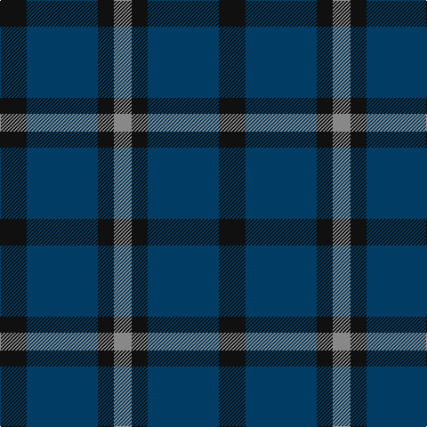

This page is one **sett** — a single exact thread-count. It belongs to the [tartan](/tartans/k15dt40k9o10/)
(the same proportion at any scale), whose colour order is pattern [KBKR](/stripes/kbkr/).

Sourced from register-of-tartans.  It is a [4 stripe tartan](/stripes/stripes4/).

Original link https://www.tartanregister.gov.uk/tartanDetails.aspx?ref=11189

## Register references

External register numbers recorded for this tartan.

- Scottish Register of Tartans: [11189](https://www.tartanregister.gov.uk/tartanDetails.aspx?ref=11189)

## Thread count
K/30 DB80 K18 N/20

## Palette

Palette: <strong>Tartan Register</strong>
<table><thead><tr><th>Colour</th><th>Threads</th><th>Shade</th><th>Base</th><th>OKLCh</th></tr></thead><tbody><tr><td>K/</td><td style="text-align:right;font-variant-numeric:tabular-nums">30</td><td><code style="background-color:#101010;">#101010</code> <small style="color:#888">#101010</small></td><td>K <code style="background-color:#000000;">#000000</code></td><td><small style="color:#888">oklch(17.3% 0.000 89.9)</small></td></tr><tr><td>DB</td><td style="text-align:right;font-variant-numeric:tabular-nums">80</td><td><code style="background-color:#003C64;">#003C64</code> <small style="color:#888">#003C64</small></td><td>B <code style="background-color:#2A418A;">#2A418A</code></td><td><small style="color:#888">oklch(34.5% 0.089 246.0)</small></td></tr><tr><td>K</td><td style="text-align:right;font-variant-numeric:tabular-nums">18</td><td><code style="background-color:#101010;">#101010</code> <small style="color:#888">#101010</small></td><td>K <code style="background-color:#000000;">#000000</code></td><td><small style="color:#888">oklch(17.3% 0.000 89.9)</small></td></tr><tr><td>N/</td><td style="text-align:right;font-variant-numeric:tabular-nums">20</td><td><code style="background-color:#888888;">#888888</code> <small style="color:#888">#888888</small></td><td>R <code style="background-color:#CC0000;">#CC0000</code></td><td><small style="color:#888">oklch(62.7% 0.000 89.9)</small></td></tr></tbody></table>

# Sample pattern

## Nearest tartans

The nearest existing variants by ΔTartan distance, with this tartan at the top so the swatches line up against it.

ΔTartan

Tartan

Sett

—

<a href="/ttd/edit/#slug=k15dt40k9o10~x2">Omega Delta Sigma, National Veterans Fraternity</a> <a class="nn-out" href="/setts/s4/k15dt40k9o10~x2/" title="open its dictionary page">↗</a>

0.97

<a href="/ttd/edit/#slug=k15db40k9o10~x2">Omega Delta Sigma, National Veterans</a> <a class="nn-out" href="/setts/s4/k15db40k9o10~x2/" title="open its dictionary page">↗</a>

1.18

<a href="/ttd/edit/#slug=db2dg7db7w1~x2">Unidentified No 78</a> <a class="nn-out" href="/setts/s4/db2dg7db7w1~x2/" title="open its dictionary page">↗</a>

1.44

<a href="/ttd/edit/#slug=db6dg5r1~x4">Ferguson</a> <a class="nn-out" href="/setts/s3/db6dg5r1~x4/" title="open its dictionary page">↗</a>

1.54

<a href="/ttd/edit/#slug=k5g14db12g4~x4">MacCurdie (Clan?)</a> <a class="nn-out" href="/setts/s4/k5g14db12g4~x4/" title="open its dictionary page">↗</a>

1.54

<a href="/ttd/edit/#slug=db11dg2db15dg18w2~x2">Hamilton Hunting</a> <a class="nn-out" href="/setts/s5/db11dg2db15dg18w2~x2/" title="open its dictionary page">↗</a>

1.59

<a href="/ttd/edit/#slug=t3k16dg16k16db3t3~x2">Murray</a> <a class="nn-out" href="/setts/s6/t3k16dg16k16db3t3~x2/" title="open its dictionary page">↗</a>

1.60

<a href="/ttd/edit/#slug=db5k2db14k14db2lr2~x2">Royal Scotsman Train (Corporate)</a> <a class="nn-out" href="/setts/s6/db5k2db14k14db2lr2~x2/" title="open its dictionary page">↗</a>

1.66

<a href="/ttd/edit/#slug=dg14r3db9t2~x2">Unidentified #4</a> <a class="nn-out" href="/setts/s4/dg14r3db9t2~x2/" title="open its dictionary page">↗</a>

1.68

<a href="/ttd/edit/#slug=dg15r3db11t2~x2">MacNab</a> <a class="nn-out" href="/setts/s4/dg15r3db11t2~x2/" title="open its dictionary page">↗</a>

1.70

<a href="/setts/s4/db13r2g13~x2/">Wilson's No.062</a>

## Neighbour map

Every grey dot is one of 14359 variants placed by the first two principal components of the ΔTartan feature space (44% of its variance). Red is this tartan; blue dots are its nearest — click one to open its page.

<svg viewBox="0 0 640 380" role="img" style="max-width:100%;height:auto;border:1px solid #e0e0e0;border-radius:4px;display:block" xmlns="http://www.w3.org/2000/svg"><image href="/nn/cloud.v1.png" width="640" height="380"/><a href="/setts/s4/k15db40k9o10~x2/"><circle cx="311.0" cy="313.5" r="4" fill="#3465a4"><title>Omega Delta Sigma, National Veterans</title></circle></a><a href="/setts/s4/db2dg7db7w1~x2/"><circle cx="333.0" cy="305.2" r="4" fill="#3465a4"><title>Unidentified No 78</title></circle></a><a href="/setts/s3/db6dg5r1~x4/"><circle cx="331.1" cy="345.5" r="4" fill="#3465a4"><title>Ferguson</title></circle></a><a href="/setts/s4/k5g14db12g4~x4/"><circle cx="265.3" cy="347.4" r="4" fill="#3465a4"><title>MacCurdie (Clan?)</title></circle></a><a href="/setts/s5/db11dg2db15dg18w2~x2/"><circle cx="365.8" cy="292.5" r="4" fill="#3465a4"><title>Hamilton Hunting</title></circle></a><a href="/setts/s6/t3k16dg16k16db3t3~x2/"><circle cx="300.9" cy="282.5" r="4" fill="#3465a4"><title>Murray</title></circle></a><a href="/setts/s6/db5k2db14k14db2lr2~x2/"><circle cx="353.0" cy="271.8" r="4" fill="#3465a4"><title>Royal Scotsman Train (Corporate)</title></circle></a><a href="/setts/s4/dg14r3db9t2~x2/"><circle cx="292.0" cy="285.6" r="4" fill="#3465a4"><title>Unidentified #4</title></circle></a><a href="/setts/s4/dg15r3db11t2~x2/"><circle cx="282.6" cy="279.0" r="4" fill="#3465a4"><title>MacNab</title></circle></a><a href="/setts/s4/db13r2g13~x2/"><circle cx="272.9" cy="285.7" r="4" fill="#3465a4"><title>Wilson's No.062</title></circle></a><circle cx="319.2" cy="322.1" r="5" fill="#c00000"/></svg>

ID: /setts/s4/k15dt40k9o10~x2/
