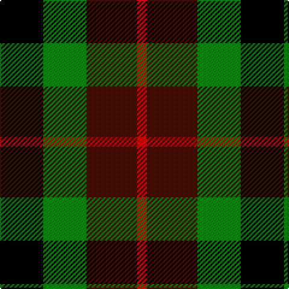

In pattern [KGBR](/stripes/kgbr/).

This was sourced from weddslist.  It is a [4 stripe tartan](/stripes/stripes4/).

Original link http://www.weddslist.com/cgi-bin/tartans/pg.pl?source=sts

## Thread count
K/36 G36 DR42 R/8

## Palette
Each colour and the base-6 reference it is a variant of.

| Colour | Shade | Base |
|---|---|---|
| DR | <code style="background-color:#401000;">#401000</code> `oklch(25.3% 0.079 39.9)` <small>#401000</small> | B <code style="background-color:#2A418A;">#2A418A</code> |
| G | <code style="background-color:#008000;">#008000</code> `oklch(52.0% 0.177 142.5)` <small>#008000</small> | G <code style="background-color:#006100;">#006100</code> |
| K | <code style="background-color:#000000;">#000000</code> `oklch(0.0% 0.000 0.0)` <small>#000000</small> | K <code style="background-color:#000000;">#000000</code> |
| R | <code style="background-color:#C00000;">#C00000</code> `oklch(50.7% 0.208 29.2)` <small>#C00000</small> | R <code style="background-color:#CC0000;">#CC0000</code> |

# Sample pattern

## Nearest tartans

The nearest existing variants by ΔTartan distance.

1. [Unidentified, pattern](/setts/s4/db4k5g4r1~x4/) — ΔT 1.16
1. [Unnamed, No 28](/setts/s4/r6g5k5t1~x2/) — ΔT 1.16
1. [Wilson's, No 159](/setts/s4/p8k11g9r2~x2/) — ΔT 1.19
1. [Wilson's No.196](/setts/s4/r9g9k10t2~x2/) — ΔT 1.21
1. [Wilson's, No 220](/setts/s4/p8k11g9w2~x2/) — ΔT 1.39
1. [Denholme](/setts/s5/k2g8k7db8r2~x2/) — ΔT 1.39
1. [Wilson's, No 196](/setts/s4/lo9g9k10t2~x2/) — ΔT 1.51
1. [Unnamed, No 60](/setts/s4/p6k5g5r1~x2/) — ΔT 1.53
1. [Denholm (Fashion)](/setts/s5/k5g20k18db20r5~x2/) — ΔT 1.54
1. [Unidentified No 28](/setts/s4/r6dg5k5t1~x2/) — ΔT 1.55

## Neighbour map

Every grey dot is one of 14299 variants placed by the first two principal components of the ΔTartan feature space (44% of its variance). Red is this tartan; blue dots are its nearest — click one to open its page.

<svg viewBox="0 0 640 380" role="img" style="max-width:100%;height:auto;border:1px solid #e0e0e0;border-radius:4px;display:block" xmlns="http://www.w3.org/2000/svg"><image href="/nn/cloud.v1.png" width="640" height="380"/><a href="/setts/s4/db4k5g4r1~x4/"><circle cx="108.8" cy="293.2" r="4" fill="#3465a4"><title>Unidentified, pattern</title></circle></a><a href="/setts/s4/r6g5k5t1~x2/"><circle cx="118.6" cy="268.6" r="4" fill="#3465a4"><title>Unnamed, No 28</title></circle></a><a href="/setts/s4/p8k11g9r2~x2/"><circle cx="119.3" cy="279.1" r="4" fill="#3465a4"><title>Wilson's, No 159</title></circle></a><a href="/setts/s4/r9g9k10t2~x2/"><circle cx="124.6" cy="290.8" r="4" fill="#3465a4"><title>Wilson's No.196</title></circle></a><a href="/setts/s4/p8k11g9w2~x2/"><circle cx="109.8" cy="275.9" r="4" fill="#3465a4"><title>Wilson's, No 220</title></circle></a><a href="/setts/s5/k2g8k7db8r2~x2/"><circle cx="98.7" cy="279.6" r="4" fill="#3465a4"><title>Denholme</title></circle></a><a href="/setts/s4/lo9g9k10t2~x2/"><circle cx="83.9" cy="274.0" r="4" fill="#3465a4"><title>Wilson's, No 196</title></circle></a><a href="/setts/s4/p6k5g5r1~x2/"><circle cx="121.7" cy="273.4" r="4" fill="#3465a4"><title>Unnamed, No 60</title></circle></a><a href="/setts/s5/k5g20k18db20r5~x2/"><circle cx="110.5" cy="284.5" r="4" fill="#3465a4"><title>Denholm (Fashion)</title></circle></a><a href="/setts/s4/r6dg5k5t1~x2/"><circle cx="144.5" cy="277.3" r="4" fill="#3465a4"><title>Unidentified No 28</title></circle></a><circle cx="121.3" cy="292.9" r="5" fill="#c00000"/></svg>

ID: /setts/s4/k18g18dr21r4~x2/
