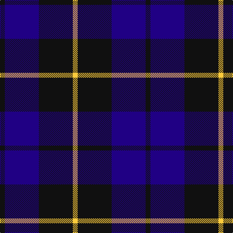

**Bands:** [KBKY](/stripes/kbky/) · **Stripes:** [K DB K LY](/stripes/stripes4/) K DB K LY

This was sourced from tartans-authority.  It is a [4 band tartan](/bands/bands4/).

Original link http://www.tartansauthority.com/tartan-ferret/display/8125/

## Variants

Other setts woven to the same stripe pattern.

- [Wallace Blue](/setts/s4/k1db8k8ly1/)

## Thread count
K/10 DB70 K70 Y/10

## Palette
Each colour and its ΔE from the base-6 reference it is a variant of.

| Colour | Shade | Base | ΔE (OKLab) |
|---|---|---|---|
| DB | <code style="background-color:#200084;">#200084</code> `#200084` | B <code style="background-color:#2A418A;">#2A418A</code> | 0.12 |
| K | <code style="background-color:#101010;">#101010</code> `#101010` | K <code style="background-color:#000000;">#000000</code> | 0.17 |
| Y | <code style="background-color:#FCCC3C;">#FCCC3C</code> `#FCCC3C` | Y <code style="background-color:#F2BF00;">#F2BF00</code> | 0.04 |

# Sample pattern

## Nearest tartans

The nearest existing variants by ΔTartan distance.

1. [College of Radiographers](/setts/s5/k15lo2k10db18lb3~x2/) — ΔT 1.21
1. [Britannia](/setts/s5/k14r4k25db30w4~x2/) — ΔT 1.32
1. [Wallace Blue](/setts/s4/k1db8k8ly1/) — ΔT 1.32
1. [Omega Delta Sigma, National Veterans](/setts/s4/k15db40k9o10~x2/) — ΔT 1.36
1. [Scottish Express International](/setts/s6/k1db7k4lb1k4p1~x4/) — ΔT 1.37
1. [Royal Scotsman Train (Corporate)](/setts/s6/db5k2db14k14db2lr2~x2/) — ΔT 1.39
1. [College of Radiographers Corporate Tartan Tartan Number: 1274. Earliest known date: 1988 Marketed in Edinburgh around 1930s but no longer seen. See products available Copyright © Blair Urquhart, Comrie, 2015](/setts/s5/k15ly2k10db18w3~x2/) — ΔT 1.40
1. [Mother's Pride (Corporate)](/setts/s3/k10db10lo1~x4/) — ΔT 1.42
1. [Scottish Nuclear (Corporate)](/setts/s4/r1db9k4lb1~x4/) — ΔT 1.50
1. [Scottish Express International](/setts/s6/k6db50k29b6k29db6/) — ΔT 1.51

## Neighbour map

Every grey dot is one of 14299 variants placed by the first two principal components of the ΔTartan feature space (44% of its variance). Red is this tartan; blue dots are its nearest — click one to open its page.

<svg viewBox="0 0 640 380" role="img" style="max-width:100%;height:auto;border:1px solid #e0e0e0;border-radius:4px;display:block" xmlns="http://www.w3.org/2000/svg"><image href="/nn/cloud.v1.png" width="640" height="380"/><a href="/setts/s5/k15lo2k10db18lb3~x2/"><circle cx="273.8" cy="252.7" r="4" fill="#3465a4"><title>College of Radiographers</title></circle></a><a href="/setts/s5/k14r4k25db30w4~x2/"><circle cx="285.5" cy="262.5" r="4" fill="#3465a4"><title>Britannia</title></circle></a><a href="/setts/s4/k1db8k8ly1/"><circle cx="324.2" cy="285.9" r="4" fill="#3465a4"><title>Wallace Blue</title></circle></a><a href="/setts/s4/k15db40k9o10~x2/"><circle cx="311.0" cy="312.0" r="4" fill="#3465a4"><title>Omega Delta Sigma, National Veterans</title></circle></a><a href="/setts/s6/k1db7k4lb1k4p1~x4/"><circle cx="285.7" cy="256.9" r="4" fill="#3465a4"><title>Scottish Express International</title></circle></a><a href="/setts/s6/db5k2db14k14db2lr2~x2/"><circle cx="353.1" cy="270.6" r="4" fill="#3465a4"><title>Royal Scotsman Train (Corporate)</title></circle></a><a href="/setts/s5/k15ly2k10db18w3~x2/"><circle cx="267.5" cy="244.6" r="4" fill="#3465a4"><title>College of Radiographers Corporate Tartan Tartan Number: 1274. Earliest known date: 1988 Marketed in Edinburgh around 1930s but no longer seen. See products available Copyright © Blair Urquhart, Comrie, 2015</title></circle></a><a href="/setts/s3/k10db10lo1~x4/"><circle cx="308.3" cy="298.4" r="4" fill="#3465a4"><title>Mother's Pride (Corporate)</title></circle></a><a href="/setts/s4/r1db9k4lb1~x4/"><circle cx="346.7" cy="243.5" r="4" fill="#3465a4"><title>Scottish Nuclear (Corporate)</title></circle></a><a href="/setts/s6/k6db50k29b6k29db6/"><circle cx="255.9" cy="234.7" r="4" fill="#3465a4"><title>Scottish Express International</title></circle></a><circle cx="308.7" cy="281.6" r="5" fill="#c00000"/></svg>

ID: /setts/s4/k1db7k7ly1~x10/
