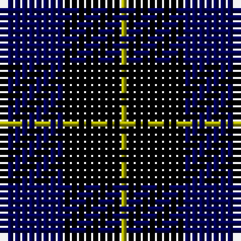

This page is one **sett** — a single exact thread-count. It belongs to the [tartan](/tartans/k1db8k8lg1/)
(the same proportion at any scale), whose colour order is pattern [KBKY](/stripes/kbky/).

Sourced from weddslist.  It is a [4 stripe tartan](/stripes/stripes4/).

Original link http://www.weddslist.com/cgi-bin/tartans/pg.pl?source=x

## Thread count
K/1 DB8 K8 LG/1

## Palette
Each colour and the base-6 reference it is a variant of.

| Colour | Shade | Base |
|---|---|---|
| DB | <code style="background-color:#000052;">#000052</code> `oklch(19.8% 0.137 264.1)` <small>#000052</small> | B <code style="background-color:#2A418A;">#2A418A</code> |
| K | <code style="background-color:#000000;">#000000</code> `oklch(0.0% 0.000 0.0)` <small>#000000</small> | K <code style="background-color:#000000;">#000000</code> |
| LG | <code style="background-color:#AAAA00;">#AAAA00</code> `oklch(71.4% 0.156 109.8)` <small>#AAAA00</small> | Y <code style="background-color:#F2BF00;">#F2BF00</code> |

# Sample pattern

## Nearest tartans

The nearest existing variants by ΔTartan distance, with this tartan at the top so the swatches line up against it.

ΔTartan

Tartan

Sett

—

<a href="/ttd/edit/#slug=k1db8k8ly1">Wallace Blue</a> <a class="nn-out" href="/setts/s4/k1db8k8ly1/" title="open its dictionary page">↗</a>

1.21

<a href="/ttd/edit/#slug=k10db10lo1~x4">Mother's Pride (Corporate)</a> <a class="nn-out" href="/setts/s3/k10db10lo1~x4/" title="open its dictionary page">↗</a>

1.32

<a href="/ttd/edit/#slug=k1db7k7ly1~x10">Wallace (Personal)</a> <a class="nn-out" href="/setts/s4/k1db7k7ly1~x10/" title="open its dictionary page">↗</a>

1.59

<a href="/ttd/edit/#slug=k6db50k29b6k29db6">Scottish Express International</a> <a class="nn-out" href="/setts/s6/k6db50k29b6k29db6/" title="open its dictionary page">↗</a>

1.69

<a href="/ttd/edit/#slug=k4dg3dp18k18lb2~x2">Wcwm 1106-2</a> <a class="nn-out" href="/setts/s5/k4dg3dp18k18lb2~x2/" title="open its dictionary page">↗</a>

1.73

<a href="/ttd/edit/#slug=k21db3k12r2db12k2db12w2~x2">Inverness Caledonian Thistle Football Club</a> <a class="nn-out" href="/setts/s8/k21db3k12r2db12k2db12w2~x2/" title="open its dictionary page">↗</a>

1.77

<a href="/ttd/edit/#slug=k15lo2k10db18lb3~x2">College of Radiographers</a> <a class="nn-out" href="/setts/s5/k15lo2k10db18lb3~x2/" title="open its dictionary page">↗</a>

1.81

<a href="/ttd/edit/#slug=k14r4k25db30w4~x2">Britannia</a> <a class="nn-out" href="/setts/s5/k14r4k25db30w4~x2/" title="open its dictionary page">↗</a>

1.90

<a href="/ttd/edit/#slug=k1db12k12g1k12db12w1~x4">Marchmont</a> <a class="nn-out" href="/setts/s7/k1db12k12g1k12db12w1~x4/" title="open its dictionary page">↗</a>

1.93

<a href="/ttd/edit/#slug=k1db7k4lb1k4p1~x4">Scottish Express International</a> <a class="nn-out" href="/setts/s6/k1db7k4lb1k4p1~x4/" title="open its dictionary page">↗</a>

1.94

<a href="/ttd/edit/#slug=k15y2k10db18w3~x2">College of Radiographers</a> <a class="nn-out" href="/setts/s5/k15y2k10db18w3~x2/" title="open its dictionary page">↗</a>

## Neighbour map

Every grey dot is one of 14299 variants placed by the first two principal components of the ΔTartan feature space (44% of its variance). Red is this tartan; blue dots are its nearest — click one to open its page.

<svg viewBox="0 0 640 380" role="img" style="max-width:100%;height:auto;border:1px solid #e0e0e0;border-radius:4px;display:block" xmlns="http://www.w3.org/2000/svg"><image href="/nn/cloud.v1.png" width="640" height="380"/><a href="/setts/s3/k10db10lo1~x4/"><circle cx="308.3" cy="298.4" r="4" fill="#3465a4"><title>Mother's Pride (Corporate)</title></circle></a><a href="/setts/s4/k1db7k7ly1~x10/"><circle cx="308.7" cy="281.6" r="4" fill="#3465a4"><title>Wallace (Personal)</title></circle></a><a href="/setts/s6/k6db50k29b6k29db6/"><circle cx="255.9" cy="234.7" r="4" fill="#3465a4"><title>Scottish Express International</title></circle></a><a href="/setts/s5/k4dg3dp18k18lb2~x2/"><circle cx="271.8" cy="231.2" r="4" fill="#3465a4"><title>Wcwm 1106-2</title></circle></a><a href="/setts/s8/k21db3k12r2db12k2db12w2~x2/"><circle cx="310.8" cy="227.4" r="4" fill="#3465a4"><title>Inverness Caledonian Thistle Football Club</title></circle></a><a href="/setts/s5/k15lo2k10db18lb3~x2/"><circle cx="273.8" cy="252.7" r="4" fill="#3465a4"><title>College of Radiographers</title></circle></a><a href="/setts/s5/k14r4k25db30w4~x2/"><circle cx="285.5" cy="262.5" r="4" fill="#3465a4"><title>Britannia</title></circle></a><a href="/setts/s7/k1db12k12g1k12db12w1~x4/"><circle cx="284.8" cy="218.0" r="4" fill="#3465a4"><title>Marchmont</title></circle></a><a href="/setts/s6/k1db7k4lb1k4p1~x4/"><circle cx="285.7" cy="256.9" r="4" fill="#3465a4"><title>Scottish Express International</title></circle></a><a href="/setts/s5/k15y2k10db18w3~x2/"><circle cx="250.7" cy="240.1" r="4" fill="#3465a4"><title>College of Radiographers</title></circle></a><circle cx="324.2" cy="285.9" r="5" fill="#c00000"/></svg>

ID: /setts/s4/k1db8k8ly1/
