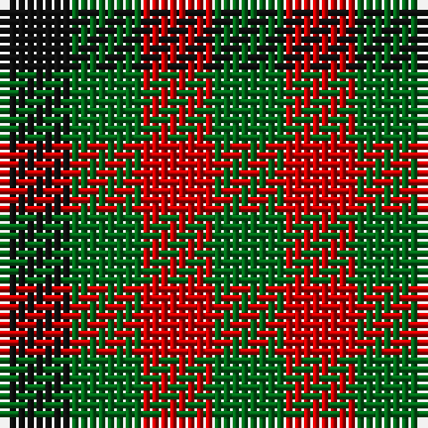

**Bands:** [KGRG](/stripes/kgrg/) · **Stripes:** [K G R G](/stripes/stripes4/) K G R G

This was sourced from register-of-tartans.  It is a [4 band tartan](/bands/bands4/).

Original link https://www.tartanregister.gov.uk/tartanDetails.aspx?ref=4720

## Also known as

This cloth is also recorded under:

- Wilson's, No 187

## Register references

External register numbers recorded for this tartan.

- Scottish Register of Tartans: [4720](https://www.tartanregister.gov.uk/tartanDetails.aspx?ref=4720)
- Scottish Tartans Authority (ITI): 1108
- Scottish Tartans World Register: 1108

## Variants

Other setts woven to the same stripe pattern.

- [Glen Lyon #1](/setts/s4/k6g5r2~x2/)

## Thread count
K/8 G8 R8 G/8

## Palette
Each colour and its ΔE from the base-6 reference it is a variant of.

| Colour | Shade | Base | ΔE (OKLab) |
|---|---|---|---|
| DG | <code style="background-color:#003820;">#003820</code> `#003820` | G <code style="background-color:#006100;">#006100</code> | 0.15 |
| G | <code style="background-color:#006818;">#006818</code> `#006818` | G <code style="background-color:#006100;">#006100</code> | 0.02 |
| K | <code style="background-color:#101010;">#101010</code> `#101010` | K <code style="background-color:#000000;">#000000</code> | 0.17 |
| R | <code style="background-color:#C80000;">#C80000</code> `#C80000` | R <code style="background-color:#CC0000;">#CC0000</code> | 0.01 |
| Ra | <code style="background-color:#C80000;">#C80000</code> `#C80000` | R <code style="background-color:#CC0000;">#CC0000</code> | 0.01 |

# Sample pattern

## Nearest tartans

The nearest existing variants by ΔTartan distance.

1. [Ballindalloch Check](/setts/s5/dr1o1dr1o1dg1~x8/) — ΔT 1.43
1. [Wilson's No.204](/setts/s3/k11g9r10~x2/) — ΔT 1.81
1. [Wilson's, No 187](/setts/s3/k1g1r1~x8/) — ΔT 2.10
1. [Rob Roy, Black & Tan (Fashion)](/setts/s2/k1y1~x100/) — ΔT 2.17
1. [Wilson's, No 204](/setts/s3/r10k11g9~x2/) — ΔT 2.23
1. [Wilson's No.185](/setts/s3/k11g9dp10~x2/) — ΔT 2.35
1. [Seaforth (Estate Check)](/setts/s9/r1o1k1o1y1o1k1o1y1~x12/) — ΔT 2.36
1. [Seaforth Estate Check Estate Check Weavers Tartan Tartan Number: 5344. Earliest known date: pre 1990 No details. See products available Copyright © Blair Urquhart, Comrie, 2015](/setts/s9/r1o1k1o1y1o1k1o1y1~x6/) — ΔT 2.36
1. [Shepherd (Brown & White)](/setts/s4/dy1lb1~x6/) — ΔT 2.43
1. [Hogg](/setts/s4/k1w1do1~x8/) — ΔT 2.51

## Neighbour map

Every grey dot is one of 14299 variants placed by the first two principal components of the ΔTartan feature space (44% of its variance). Red is this tartan; blue dots are its nearest — click one to open its page.

<svg viewBox="0 0 640 380" role="img" style="max-width:100%;height:auto;border:1px solid #e0e0e0;border-radius:4px;display:block" xmlns="http://www.w3.org/2000/svg"><image href="/nn/cloud.v1.png" width="640" height="380"/><a href="/setts/s5/dr1o1dr1o1dg1~x8/"><circle cx="67.6" cy="366.0" r="4" fill="#3465a4"><title>Ballindalloch Check</title></circle></a><a href="/setts/s3/k11g9r10~x2/"><circle cx="64.1" cy="366.0" r="4" fill="#3465a4"><title>Wilson's No.204</title></circle></a><a href="/setts/s3/k1g1r1~x8/"><circle cx="14.0" cy="366.0" r="4" fill="#3465a4"><title>Wilson's, No 187</title></circle></a><a href="/setts/s2/k1y1~x100/"><circle cx="161.5" cy="366.0" r="4" fill="#3465a4"><title>Rob Roy, Black &amp; Tan (Fashion)</title></circle></a><a href="/setts/s3/r10k11g9~x2/"><circle cx="34.9" cy="366.0" r="4" fill="#3465a4"><title>Wilson's, No 204</title></circle></a><a href="/setts/s3/k11g9dp10~x2/"><circle cx="78.1" cy="366.0" r="4" fill="#3465a4"><title>Wilson's No.185</title></circle></a><a href="/setts/s9/r1o1k1o1y1o1k1o1y1~x12/"><circle cx="14.0" cy="366.0" r="4" fill="#3465a4"><title>Seaforth (Estate Check)</title></circle></a><a href="/setts/s9/r1o1k1o1y1o1k1o1y1~x6/"><circle cx="14.0" cy="366.0" r="4" fill="#3465a4"><title>Seaforth Estate Check Estate Check Weavers Tartan Tartan Number: 5344. Earliest known date: pre 1990 No details. See products available Copyright © Blair Urquhart, Comrie, 2015</title></circle></a><a href="/setts/s4/dy1lb1~x6/"><circle cx="132.0" cy="366.0" r="4" fill="#3465a4"><title>Shepherd (Brown &amp; White)</title></circle></a><a href="/setts/s4/k1w1do1~x8/"><circle cx="35.5" cy="366.0" r="4" fill="#3465a4"><title>Hogg</title></circle></a><circle cx="90.0" cy="366.0" r="5" fill="#c00000"/></svg>

ID: /setts/s4/k1g1r1~x8/
