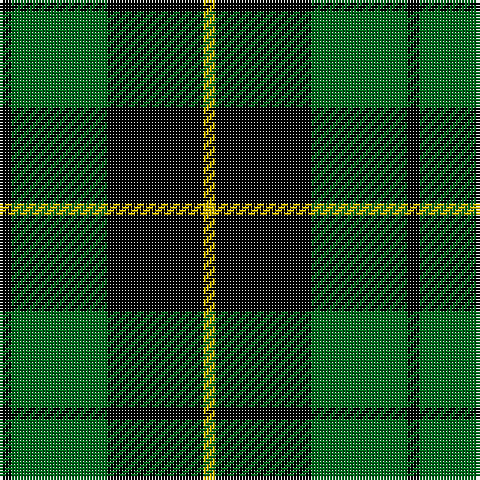

In pattern [KGKY](/patterns/kgky/).

This was sourced from tartans-authority.  It is a [4 stripes tartan](/stripes/stripes4/).

Original link http://www.tartansauthority.com/tartan-ferret/display/1101/

## Thread count
K/4 G32 K32 Y/4

## Palette
Each colour and its ΔE from the base-6 reference it is a variant of.

| Colour | Shade | Base | ΔE (OKLab) |
|---|---|---|---|
| G | <code style="background-color:#006818;">#006818</code> `#006818` | G <code style="background-color:#006100;">#006100</code> | 0.02 |
| K | <code style="background-color:#000000;">#000000</code> `#000000` | K <code style="background-color:#000000;">#000000</code> | 0.00 |
| Y | <code style="background-color:#DCBC00;">#DCBC00</code> `#DCBC00` | Y <code style="background-color:#F2BF00;">#F2BF00</code> | 0.04 |

# Sample pattern

## Nearest tartans

The nearest existing variants by ΔTartan distance.

1. [Wallace, hunting](/setts/s4/k4g33k33y4x2~g008000-k000000-yf0c000/) — ΔT 0.49
1. [Innes, hunting](/setts/s4/k30b7g36k5x2~b304080-g008000-k000000/) — ΔT 0.65
1. [MacArthur](/setts/s5/k32g6k12g30y3~g008000-k000000-yf0c000/) — ΔT 0.79
1. [Wallace Hunting](/setts/s4/k1g8k8y1~g11450d-k000000-yaaaa00/) — ΔT 0.84
1. [MacArthur](/setts/s5/k32g6k12g30y3~g004c00-k000000-yffff00/) — ΔT 0.91
1. [MacArthur-Fox](/setts/s5/k19g8k10g31r3~g008000-k000000-rc00000/) — ΔT 1.09
1. [Douglas, (Black)](/setts/s5/k12b3g23k23r3x2~b304080-g008000-k000000-rc00000/) — ΔT 1.12
1. [Douglas, Black](/setts/s5/k8b5g44k40r6~b3070fc-g007800-k000000-rc40000/) — ΔT 1.15
1. [Wallace Hunting](/setts/s6/g8k8y1k8g8k1x4~g006818-k000000-ydcbc00/) — ΔT 1.17
1. [Scotch Tape 2 (Corporate)](/setts/s4/k3g15k20y3x2~g006818-k101010-ye8c000/) — ΔT 1.22

## Neighbour map

Every grey dot is one of 15726 variants placed by the first two principal components of the ΔTartan feature space (44% of its variance). Red is this tartan; blue dots are its nearest — click one to open its page.

<svg viewBox="0 0 640 380" role="img" style="max-width:100%;height:auto;border:1px solid #e0e0e0;border-radius:4px;display:block" xmlns="http://www.w3.org/2000/svg"><image href="/nn/cloud.v1.png" width="640" height="380"/><a href="/setts/s4/k4g33k33y4x2~g008000-k000000-yf0c000/"><circle cx="269.9" cy="260.4" r="4" fill="#3465a4"><title>Wallace, hunting</title></circle></a><a href="/setts/s4/k30b7g36k5x2~b304080-g008000-k000000/"><circle cx="239.7" cy="274.3" r="4" fill="#3465a4"><title>Innes, hunting</title></circle></a><a href="/setts/s5/k32g6k12g30y3~g008000-k000000-yf0c000/"><circle cx="289.2" cy="249.4" r="4" fill="#3465a4"><title>MacArthur</title></circle></a><a href="/setts/s4/k1g8k8y1~g11450d-k000000-yaaaa00/"><circle cx="299.4" cy="274.6" r="4" fill="#3465a4"><title>Wallace Hunting</title></circle></a><a href="/setts/s5/k32g6k12g30y3~g004c00-k000000-yffff00/"><circle cx="307.7" cy="257.2" r="4" fill="#3465a4"><title>MacArthur</title></circle></a><a href="/setts/s5/k19g8k10g31r3~g008000-k000000-rc00000/"><circle cx="291.4" cy="252.8" r="4" fill="#3465a4"><title>MacArthur-Fox</title></circle></a><a href="/setts/s5/k12b3g23k23r3x2~b304080-g008000-k000000-rc00000/"><circle cx="255.6" cy="247.9" r="4" fill="#3465a4"><title>Douglas, (Black)</title></circle></a><a href="/setts/s5/k8b5g44k40r6~b3070fc-g007800-k000000-rc40000/"><circle cx="234.1" cy="225.5" r="4" fill="#3465a4"><title>Douglas, Black</title></circle></a><a href="/setts/s6/g8k8y1k8g8k1x4~g006818-k000000-ydcbc00/"><circle cx="261.9" cy="271.2" r="4" fill="#3465a4"><title>Wallace Hunting</title></circle></a><a href="/setts/s4/k3g15k20y3x2~g006818-k101010-ye8c000/"><circle cx="309.2" cy="281.0" r="4" fill="#3465a4"><title>Scotch Tape 2 (Corporate)</title></circle></a><circle cx="277.3" cy="265.8" r="5" fill="#c00000"/></svg>

ID: /setts/s4/k1g8k8y1x4~g006818-k000000-ydcbc00/
