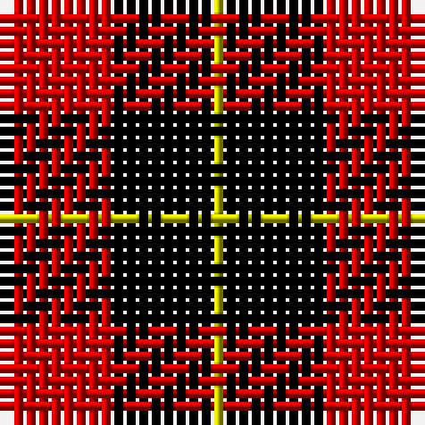

In pattern [KRKY](/patterns/krky/).

This was sourced from weddslist.  It is a [4 stripes tartan](/stripes/stripes4/).

Original link http://www.weddslist.com/cgi-bin/tartans/pg.pl?source=rb

## Thread count
K/1 R8 K8 Y/1

## Palette
Each colour and its ΔE from the base-6 reference it is a variant of.

| Colour | Shade | Base | ΔE (OKLab) |
|---|---|---|---|
| K | <code style="background-color:#000000;">#000000</code> `#000000` | K <code style="background-color:#000000;">#000000</code> | 0.00 |
| R | <code style="background-color:#C80000;">#C80000</code> `#C80000` | R <code style="background-color:#C80000;">#C80000</code> | 0.00 |
| Y | <code style="background-color:#C8C800;">#C8C800</code> `#C8C800` | Y <code style="background-color:#E8C000;">#E8C000</code> | 0.05 |

# Sample pattern

ID: /setts/s4/k1r8k8y1-k000000-rc80000-yc8c800/
