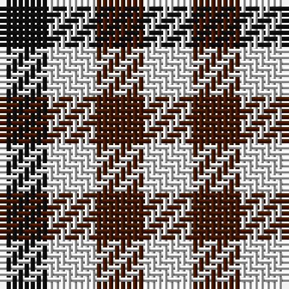

In pattern [KWBW](/patterns/kwbw/).

This was sourced from register-of-tartans.  It is a [4 stripes tartan](/stripes/stripes4/).

Original link https://www.tartanregister.gov.uk/tartanDetails.aspx?ref=1745

## Attestations

This cloth appears in 2 source records; the oldest owns this page.

- 01/01/2002 — Hogg (register-of-tartans, [record](https://www.tartanregister.gov.uk/tartanDetails.aspx?ref=1745))
- pre 2002 — Hogg (Clan) (tartans-authority, [record](http://www.tartansauthority.com/tartan-ferret/display/5206/))

## Thread count
K/8 LN8 DR8 LN/8

## Palette
Each colour and its ΔE from the base-6 reference it is a variant of.

| Colour | Shade | Base | ΔE (OKLab) |
|---|---|---|---|
| DR | <code style="background-color:#441800;">#441800</code> `#441800` | B <code style="background-color:#2A418A;">#2A418A</code> | 0.23 |
| K | <code style="background-color:#101010;">#101010</code> `#101010` | K <code style="background-color:#000000;">#000000</code> | 0.17 |
| LN | <code style="background-color:#E0E0E0;">#E0E0E0</code> `#E0E0E0` | W <code style="background-color:#F7F7F7;">#F7F7F7</code> | 0.07 |
| N | <code style="background-color:#C0C0C0;">#C0C0C0</code> `#C0C0C0` | W <code style="background-color:#F7F7F7;">#F7F7F7</code> | 0.17 |

# Sample pattern

## Nearest tartans

The nearest existing variants by ΔTartan distance.

1. [Shepherd or Falkirk](/setts/s4/k1w1k1w1x6~k101010-wf8e8d8/) — ΔT 1.46
1. [Buccleuch Check Regimental Tartan Tartan Number: 647. Earliest known date: 1908 Designed by the Colonel of the 4th Battalion Kings Own Scottish Borderers in 1908 and used for the pipers' plaids. Originally woven by Ballantynes of Walkerburn. Earl Haig's family adopted it since he was also a Colonel of the battalion.This - according to J Cant - is the correct version of the Buccleuch check with nine black squares between the blue. The black and white squares measure 5/16 inch and the blue 3/8 inch (about 2 threads more?). Sample in STA Dalgety Collection has 8 black squares between the blue lines and label saying woven by Ballantynes of Walkerburn. See products available Copyright © Blair Urquhart, Comrie, 2015](/setts/s8/b1w1k1w1k1w1k1w1x12~b2c2c80-k101010-we0e0e0/) — ΔT 1.59
1. [Buccleuch, Check](/setts/s8/b1w1k1w1k1w1k1w1x12~b304080-k000000-we0e0e0/) — ΔT 1.67
1. [Haig Check (Estate Check)](/setts/s8/b1w1k1w1k1w1k1w1x12~b1474b4-k101010-wfcfcfc/) — ΔT 1.70
1. [Dacre Estate Check](/setts/s3/k1w1r1x14~k101010-r800028-wf0e0c4/) — ΔT 1.83
1. [Border Bell](/setts/s7/b1k1w1k1w1r1k1x16~b2c2c80-k101010-rc80000-wfcfcfc/) — ΔT 1.86
1. [Bell, Border (Name)](/setts/s7/b1k1w1k1w1r1k1x14~b2c2c80-k101010-rc80000-wfcfcfc/) — ΔT 1.86
1. [Glen Feshie Check](/setts/s8/r4w4k3w4k4w4k4w4x2~k000000-rc82800-wf0dcbc/) — ΔT 1.88
1. [Coigach Tweed](/setts/s3/k1w1r1x6~k000000-ra43c14-wc8c8c8/) — ΔT 1.91
1. [Bell Southern Family Tartan Tartan Number: 370. Earliest known date: 1986 Originally anotated with 'Authorized by The Clan Bell of Lochmaben' but not now recognised by Chief Apparent, Benjamin. This tartan was known, possibly in error, as Bell of Blackethouse or Bell Blackethouse, and is now called 'Southern Bell'. See products available Copyright © Blair Urquhart, Comrie, 2015](/setts/s7/b1k1w1k1w1r1k1x8~b2c2c80-k101010-rc80000-we0e0e0/) — ΔT 1.95

## Neighbour map

Every grey dot is one of 15726 variants placed by the first two principal components of the ΔTartan feature space (44% of its variance). Red is this tartan; blue dots are its nearest — click one to open its page.

<svg viewBox="0 0 640 380" role="img" style="max-width:100%;height:auto;border:1px solid #e0e0e0;border-radius:4px;display:block" xmlns="http://www.w3.org/2000/svg"><image href="/nn/cloud.v1.png" width="640" height="380"/><a href="/setts/s4/k1w1k1w1x6~k101010-wf8e8d8/"><circle cx="94.0" cy="366.0" r="4" fill="#3465a4"><title>Shepherd or Falkirk</title></circle></a><a href="/setts/s8/b1w1k1w1k1w1k1w1x12~b2c2c80-k101010-we0e0e0/"><circle cx="28.0" cy="366.0" r="4" fill="#3465a4"><title>Buccleuch Check Regimental Tartan Tartan Number: 647. Earliest known date: 1908 Designed by the Colonel of the 4th Battalion Kings Own Scottish Borderers in 1908 and used for the pipers' plaids. Originally woven by Ballantynes of Walkerburn. Earl Haig's family adopted it since he was also a Colonel of the battalion.This - according to J Cant - is the correct version of the Buccleuch check with nine black squares between the blue. The black and white squares measure 5/16 inch and the blue 3/8 inch (about 2 threads more?). Sample in STA Dalgety Collection has 8 black squares between the blue lines and label saying woven by Ballantynes of Walkerburn. See products available Copyright © Blair Urquhart, Comrie, 2015</title></circle></a><a href="/setts/s8/b1w1k1w1k1w1k1w1x12~b304080-k000000-we0e0e0/"><circle cx="24.9" cy="366.0" r="4" fill="#3465a4"><title>Buccleuch, Check</title></circle></a><a href="/setts/s8/b1w1k1w1k1w1k1w1x12~b1474b4-k101010-wfcfcfc/"><circle cx="21.3" cy="366.0" r="4" fill="#3465a4"><title>Haig Check (Estate Check)</title></circle></a><a href="/setts/s3/k1w1r1x14~k101010-r800028-wf0e0c4/"><circle cx="14.0" cy="366.0" r="4" fill="#3465a4"><title>Dacre Estate Check</title></circle></a><a href="/setts/s7/b1k1w1k1w1r1k1x16~b2c2c80-k101010-rc80000-wfcfcfc/"><circle cx="14.0" cy="366.0" r="4" fill="#3465a4"><title>Border Bell</title></circle></a><a href="/setts/s7/b1k1w1k1w1r1k1x14~b2c2c80-k101010-rc80000-wfcfcfc/"><circle cx="14.0" cy="366.0" r="4" fill="#3465a4"><title>Bell, Border (Name)</title></circle></a><a href="/setts/s8/r4w4k3w4k4w4k4w4x2~k000000-rc82800-wf0dcbc/"><circle cx="68.0" cy="365.8" r="4" fill="#3465a4"><title>Glen Feshie Check</title></circle></a><a href="/setts/s3/k1w1r1x6~k000000-ra43c14-wc8c8c8/"><circle cx="14.0" cy="366.0" r="4" fill="#3465a4"><title>Coigach Tweed</title></circle></a><a href="/setts/s7/b1k1w1k1w1r1k1x8~b2c2c80-k101010-rc80000-we0e0e0/"><circle cx="14.0" cy="366.0" r="4" fill="#3465a4"><title>Bell Southern Family Tartan Tartan Number: 370. Earliest known date: 1986 Originally anotated with 'Authorized by The Clan Bell of Lochmaben' but not now recognised by Chief Apparent, Benjamin. This tartan was known, possibly in error, as Bell of Blackethouse or Bell Blackethouse, and is now called 'Southern Bell'. See products available Copyright © Blair Urquhart, Comrie, 2015</title></circle></a><circle cx="33.8" cy="366.0" r="5" fill="#c00000"/></svg>

ID: /setts/s4/k1w1b1w1x8~b441800-k101010-we0e0e0/
