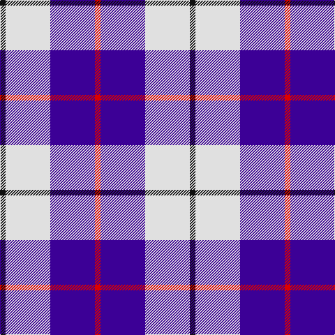

In pattern [KWBR](/patterns/kwbr/).

This was sourced from register-of-tartans.  It is a [4 stripes tartan](/stripes/stripes4/).

Original link https://www.tartanregister.gov.uk/tartanDetails.aspx?ref=5948

## Thread count
K/8 LN64 P64 R/8

## Palette
Each colour and its ΔE from the base-6 reference it is a variant of.

| Colour | Shade | Base | ΔE (OKLab) |
|---|---|---|---|
| K | <code style="background-color:#101010;">#101010</code> `#101010` | K <code style="background-color:#000000;">#000000</code> | 0.17 |
| LN | <code style="background-color:#E0E0E0;">#E0E0E0</code> `#E0E0E0` | W <code style="background-color:#F7F7F7;">#F7F7F7</code> | 0.07 |
| P | <code style="background-color:#3C0096;">#3C0096</code> `#3C0096` | B <code style="background-color:#2A418A;">#2A418A</code> | 0.11 |
| R | <code style="background-color:#DC0000;">#DC0000</code> `#DC0000` | R <code style="background-color:#CC0000;">#CC0000</code> | 0.03 |

# Sample pattern

## Nearest tartans

The nearest existing variants by ΔTartan distance.

1. [Kellogg College University of Oxford](/setts/s4/r21b61y8w21x2~b00008c-rff0000-wffffff-yd87c00/) — ΔT 1.12
1. [Kellogg College University of Oxford](/setts/s4/r21b61y8w21x2~b38409c-rc80000-wfcfcfc-ye8c000/) — ΔT 1.13
1. [MacRae - 2000 (Dress, Purple)](/setts/s4/k4w35b35r4x2~b780078-k101010-rb468ac-wf8f8f8/) — ΔT 1.20
1. [Ailsa, Royal Blue (Dance)](/setts/s6/b8ba3b28w32bb3w4x2~b2c2c80-ba5c8ca8-bb003c64-wf0e0c8/) — ΔT 1.40
1. [MacRae of Conchra](/setts/s4/r1w8b8y1x4~b102040-rc00000-we0e0e0-yf0c000/) — ΔT 1.48
1. [MacPherson Dress, Royal Blue (Dance)](/setts/s7/w5k3w26b21w3b8y3x2~b1c0070-k101010-we0e0e0-ye8c000/) — ΔT 1.49
1. [Lands of Liberty](/setts/s5/r10w5b30ba20r3x4~b2c4084-ba0596fa-rc80000-wffffff/) — ΔT 1.52
1. [Boswell Dress Check (Personal)](/setts/s5/b8w13r3w2k5x2~b3850c8-k101010-rc80000-wf8f8f8/) — ΔT 1.54
1. [Lands of Liberty (Fashion)](/setts/s5/r15w10b48ba32r6x2~b202060-ba2888c4-rc80000-wfcfcfc/) — ΔT 1.56
1. [Wallace Blue Dress (Dance)](/setts/s5/b2ba29b12w29g2x2~b2888c4-ba1c0070-g289c18-wf8f8f8/) — ΔT 1.56

## Neighbour map

Every grey dot is one of 15726 variants placed by the first two principal components of the ΔTartan feature space (44% of its variance). Red is this tartan; blue dots are its nearest — click one to open its page.

<svg viewBox="0 0 640 380" role="img" style="max-width:100%;height:auto;border:1px solid #e0e0e0;border-radius:4px;display:block" xmlns="http://www.w3.org/2000/svg"><image href="/nn/cloud.v1.png" width="640" height="380"/><a href="/setts/s4/r21b61y8w21x2~b00008c-rff0000-wffffff-yd87c00/"><circle cx="228.3" cy="227.9" r="4" fill="#3465a4"><title>Kellogg College University of Oxford</title></circle></a><a href="/setts/s4/r21b61y8w21x2~b38409c-rc80000-wfcfcfc-ye8c000/"><circle cx="240.3" cy="227.9" r="4" fill="#3465a4"><title>Kellogg College University of Oxford</title></circle></a><a href="/setts/s4/k4w35b35r4x2~b780078-k101010-rb468ac-wf8f8f8/"><circle cx="223.0" cy="204.5" r="4" fill="#3465a4"><title>MacRae - 2000 (Dress, Purple)</title></circle></a><a href="/setts/s6/b8ba3b28w32bb3w4x2~b2c2c80-ba5c8ca8-bb003c64-wf0e0c8/"><circle cx="240.6" cy="180.5" r="4" fill="#3465a4"><title>Ailsa, Royal Blue (Dance)</title></circle></a><a href="/setts/s4/r1w8b8y1x4~b102040-rc00000-we0e0e0-yf0c000/"><circle cx="205.6" cy="218.5" r="4" fill="#3465a4"><title>MacRae of Conchra</title></circle></a><a href="/setts/s7/w5k3w26b21w3b8y3x2~b1c0070-k101010-we0e0e0-ye8c000/"><circle cx="227.5" cy="182.4" r="4" fill="#3465a4"><title>MacPherson Dress, Royal Blue (Dance)</title></circle></a><a href="/setts/s5/r10w5b30ba20r3x4~b2c4084-ba0596fa-rc80000-wffffff/"><circle cx="207.8" cy="216.5" r="4" fill="#3465a4"><title>Lands of Liberty</title></circle></a><a href="/setts/s5/b8w13r3w2k5x2~b3850c8-k101010-rc80000-wf8f8f8/"><circle cx="164.6" cy="220.4" r="4" fill="#3465a4"><title>Boswell Dress Check (Personal)</title></circle></a><a href="/setts/s5/r15w10b48ba32r6x2~b202060-ba2888c4-rc80000-wfcfcfc/"><circle cx="183.3" cy="224.9" r="4" fill="#3465a4"><title>Lands of Liberty (Fashion)</title></circle></a><a href="/setts/s5/b2ba29b12w29g2x2~b2888c4-ba1c0070-g289c18-wf8f8f8/"><circle cx="181.8" cy="182.6" r="4" fill="#3465a4"><title>Wallace Blue Dress (Dance)</title></circle></a><circle cx="210.3" cy="217.6" r="5" fill="#c00000"/></svg>

ID: /setts/s4/k1w8b8r1x8~b3c0096-k101010-rdc0000-we0e0e0/
