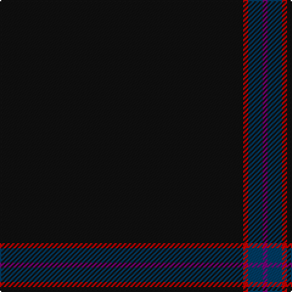

In pattern [BBRK](/patterns/bbrk/).

This was sourced from tartans-authority.  It is a [4 stripes tartan](/stripes/stripes4/).

Original link http://www.tartansauthority.com/tartan-ferret/display/10130/

## Attestations

This cloth appears in 2 source records; the oldest owns this page.

- 23rd Nov. 2009 — Alich (Personal) (tartans-authority, [record](http://www.tartansauthority.com/tartan-ferret/display/10130/))
- undated — Alich Dutch Personal Tartan Tartan Number: 10130. Earliest known date: 23rd Nov. 2009 This tartan is for the use of the families of Dirk Alich and his brothers Robert and Carsten. The almost black of the tartan represents the secrets the Alich family is hiding. The red lines represent the bloodlines and the fights that have been won. See products available Copyright © Blair Urquhart, Comrie, 2015 (house-of-tartan, [record](http://www.house-of-tartan.scotland.net/house/TartanViewjs.asp?colr=Def&tnam=10130))

## Thread count
K/200 R4 DB12 P/4

## Palette
Each colour and its ΔE from the base-6 reference it is a variant of.

| Colour | Shade | Base | ΔE (OKLab) |
|---|---|---|---|
| DB | <code style="background-color:#003C64;">#003C64</code> `#003C64` | B <code style="background-color:#2C4084;">#2C4084</code> | 0.07 |
| K | <code style="background-color:#101010;">#101010</code> `#101010` | K <code style="background-color:#000000;">#000000</code> | 0.17 |
| P | <code style="background-color:#780078;">#780078</code> `#780078` | B <code style="background-color:#2C4084;">#2C4084</code> | 0.16 |
| R | <code style="background-color:#C80000;">#C80000</code> `#C80000` | R <code style="background-color:#C80000;">#C80000</code> | 0.00 |

# Sample pattern

ID: /setts/s4/k200r4b12ba4-b003c64-ba780078-k101010-rc80000/
