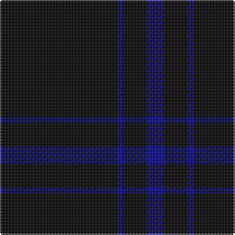

This page is one **sett** — a single exact thread-count. It belongs to the [tartan](/tartans/k20db1k4db3/)
(the same proportion at any scale), whose colour order is pattern [BKBK](/stripes/bkbk/).

Sourced from tartans-authority.  It is a [4 stripe tartan](/stripes/stripes4/).

Original link http://www.tartansauthority.com/tartan-ferret/display/3633/

## Thread count
K/80 DB4 K16 DB/12

## Palette
Each colour and the base-6 reference it is a variant of.

| Colour | Shade | Base |
|---|---|---|
| DB | <code style="background-color:#00008C;">#00008C</code> `oklch(28.9% 0.200 264.1)` <small>#00008C</small> | B <code style="background-color:#2A418A;">#2A418A</code> |
| K | <code style="background-color:#000000;">#000000</code> `oklch(0.0% 0.000 0.0)` <small>#000000</small> | K <code style="background-color:#000000;">#000000</code> |

# Sample pattern

## Nearest tartans

The nearest existing variants by ΔTartan distance, with this tartan at the top so the swatches line up against it.

ΔTartan

Tartan

Sett

—

<a href="/ttd/edit/#slug=k20db1k4db3~x4">Loevenstein Castle 2 (Artefact)</a> <a class="nn-out" href="/setts/s4/k20db1k4db3~x4/" title="open its dictionary page">↗</a>

1.70

<a href="/ttd/edit/#slug=db1k12db1~x10">Staines (2013)</a> <a class="nn-out" href="/setts/s3/db1k12db1~x10/" title="open its dictionary page">↗</a>

1.86

<a href="/ttd/edit/#slug=k72w3k11db9">Dunnotar (School)</a> <a class="nn-out" href="/setts/s4/k72w3k11db9/" title="open its dictionary page">↗</a>

2.25

<a href="/ttd/edit/#slug=k60t3k9g7">Wallington (Corporate?)</a> <a class="nn-out" href="/setts/s4/k60t3k9g7/" title="open its dictionary page">↗</a>

2.26

<a href="/ttd/edit/#slug=k72r3k11t9k11r3k37">Chafyn House (School)</a> <a class="nn-out" href="/setts/s7/k72r3k11t9k11r3k37/" title="open its dictionary page">↗</a>

2.36

<a href="/ttd/edit/#slug=k10r3k1~x4">Red Watch</a> <a class="nn-out" href="/setts/s3/k10r3k1~x4/" title="open its dictionary page">↗</a>

2.54

<a href="/ttd/edit/#slug=k15n7k6n11k50n4~x2">Freedom of Scotland</a> <a class="nn-out" href="/setts/s6/k15n7k6n11k50n4~x2/" title="open its dictionary page">↗</a>

2.60

<a href="/ttd/edit/#slug=k4k12k3o7k26o3~x2">Crombie House Check</a> <a class="nn-out" href="/setts/s6/k4k12k3o7k26o3~x2/" title="open its dictionary page">↗</a>

2.65

<a href="/ttd/edit/#slug=r2k50n2r1~x2">Galloway (Name)</a> <a class="nn-out" href="/setts/s4/r2k50n2r1~x2/" title="open its dictionary page">↗</a>

2.68

<a href="/ttd/edit/#slug=k24dg3r3k24r2k2r2">Unidentified #45</a> <a class="nn-out" href="/setts/s7/k24dg3r3k24r2k2r2/" title="open its dictionary page">↗</a>

2.75

<a href="/ttd/edit/#slug=r2k50y2r1~x2">Galloway Family</a> <a class="nn-out" href="/setts/s4/r2k50y2r1~x2/" title="open its dictionary page">↗</a>

## Neighbour map

Every grey dot is one of 14299 variants placed by the first two principal components of the ΔTartan feature space (44% of its variance). Red is this tartan; blue dots are its nearest — click one to open its page.

<svg viewBox="0 0 640 380" role="img" style="max-width:100%;height:auto;border:1px solid #e0e0e0;border-radius:4px;display:block" xmlns="http://www.w3.org/2000/svg"><image href="/nn/cloud.v1.png" width="640" height="380"/><a href="/setts/s3/db1k12db1~x10/"><circle cx="626.0" cy="299.7" r="4" fill="#3465a4"><title>Staines (2013)</title></circle></a><a href="/setts/s4/k72w3k11db9/"><circle cx="626.0" cy="233.0" r="4" fill="#3465a4"><title>Dunnotar (School)</title></circle></a><a href="/setts/s4/k60t3k9g7/"><circle cx="626.0" cy="231.3" r="4" fill="#3465a4"><title>Wallington (Corporate?)</title></circle></a><a href="/setts/s7/k72r3k11t9k11r3k37/"><circle cx="626.0" cy="213.8" r="4" fill="#3465a4"><title>Chafyn House (School)</title></circle></a><a href="/setts/s3/k10r3k1~x4/"><circle cx="550.6" cy="307.7" r="4" fill="#3465a4"><title>Red Watch</title></circle></a><a href="/setts/s6/k15n7k6n11k50n4~x2/"><circle cx="565.0" cy="265.8" r="4" fill="#3465a4"><title>Freedom of Scotland</title></circle></a><a href="/setts/s6/k4k12k3o7k26o3~x2/"><circle cx="552.8" cy="280.2" r="4" fill="#3465a4"><title>Crombie House Check</title></circle></a><a href="/setts/s4/r2k50n2r1~x2/"><circle cx="626.0" cy="204.2" r="4" fill="#3465a4"><title>Galloway (Name)</title></circle></a><a href="/setts/s7/k24dg3r3k24r2k2r2/"><circle cx="578.3" cy="225.2" r="4" fill="#3465a4"><title>Unidentified #45</title></circle></a><a href="/setts/s4/r2k50y2r1~x2/"><circle cx="626.0" cy="184.4" r="4" fill="#3465a4"><title>Galloway Family</title></circle></a><circle cx="626.0" cy="278.9" r="5" fill="#c00000"/></svg>

ID: /setts/s4/k20db1k4db3~x4/
