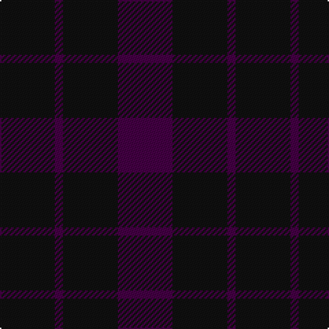

This page is one **sett** — a single exact thread-count. It belongs to the [tartan](/tartans/k20dp3k20dp20/)
(the same proportion at any scale), whose colour order is pattern [BKBK](/stripes/bkbk/).

Sourced from register-of-tartans.  It is a [4 stripe tartan](/stripes/stripes4/).

Original link https://www.tartanregister.gov.uk/tartanDetails.aspx?ref=4558

## Register references

External register numbers recorded for this tartan.

- Scottish Register of Tartans: [4558](https://www.tartanregister.gov.uk/tartanDetails.aspx?ref=4558)
- Scottish Tartans Authority (ITI): 4393

## Thread count
K/40 DP6 K40 DP/40

## Palette

Palette: <strong>Tartan Register</strong>
<table><thead><tr><th>Colour</th><th>Threads</th><th>Shade</th><th>Base</th><th>OKLCh</th></tr></thead><tbody><tr><td>K/</td><td style="text-align:right;font-variant-numeric:tabular-nums">40</td><td><code style="background-color:#101010;">#101010</code> <small style="color:#888">#101010</small></td><td>K <code style="background-color:#000000;">#000000</code></td><td><small style="color:#888">oklch(17.3% 0.000 89.9)</small></td></tr><tr><td>DP</td><td style="text-align:right;font-variant-numeric:tabular-nums">6</td><td><code style="background-color:#440044;">#440044</code> <small style="color:#888">#440044</small></td><td>B <code style="background-color:#2A418A;">#2A418A</code></td><td><small style="color:#888">oklch(27.1% 0.125 328.4)</small></td></tr><tr><td>K</td><td style="text-align:right;font-variant-numeric:tabular-nums">40</td><td><code style="background-color:#101010;">#101010</code> <small style="color:#888">#101010</small></td><td>K <code style="background-color:#000000;">#000000</code></td><td><small style="color:#888">oklch(17.3% 0.000 89.9)</small></td></tr><tr><td>DP/</td><td style="text-align:right;font-variant-numeric:tabular-nums">40</td><td><code style="background-color:#440044;">#440044</code> <small style="color:#888">#440044</small></td><td>B <code style="background-color:#2A418A;">#2A418A</code></td><td><small style="color:#888">oklch(27.1% 0.125 328.4)</small></td></tr></tbody></table>

# Sample pattern

## Nearest tartans

The nearest existing variants by ΔTartan distance, with this tartan at the top so the swatches line up against it.

ΔTartan

Tartan

Sett

—

<a href="/ttd/edit/#slug=k20dp3k20dp20~x2">Wcwm 9275-1333-1</a> <a class="nn-out" href="/setts/s4/k20dp3k20dp20~x2/" title="open its dictionary page">↗</a>

2.48

<a href="/ttd/edit/#slug=dg4dp4dg1dp1~x4">Wilson's No.116</a> <a class="nn-out" href="/setts/s4/dg4dp4dg1dp1~x4/" title="open its dictionary page">↗</a>

2.51

<a href="/ttd/edit/#slug=k46dg6k6dg6k42dg47k12">Taiheiyo Club, Inc.</a> <a class="nn-out" href="/setts/s7/k46dg6k6dg6k42dg47k12/" title="open its dictionary page">↗</a>

2.88

<a href="/ttd/edit/#slug=n13do15n2~x4">Outlander #5</a> <a class="nn-out" href="/setts/s3/n13do15n2~x4/" title="open its dictionary page">↗</a>

2.88

<a href="/ttd/edit/#slug=do11n1do4n8r1~x8">Cairns, David (Personal)</a> <a class="nn-out" href="/setts/s5/do11n1do4n8r1~x8/" title="open its dictionary page">↗</a>

2.98

<a href="/ttd/edit/#slug=do9k3do17k6do4k4do12k3do12k3do7~x2">Black Shadow Fashion Tartan Tartan Number: 3193. Earliest known date: 01/01/2007 Designed as a combination of two shades of black, shown here as black and dark grey to illustrate the sett. See products available Copyright © Blair Urquhart, Comrie, 2015</a> <a class="nn-out" href="/setts/s11/do9k3do17k6do4k4do12k3do12k3do7~x2/" title="open its dictionary page">↗</a>

3.06

<a href="/ttd/edit/#slug=db5k2db14k14db2k2r2~x2">Royal Scotsman Train</a> <a class="nn-out" href="/setts/s7/db5k2db14k14db2k2r2~x2/" title="open its dictionary page">↗</a>

3.06

<a href="/ttd/edit/#slug=k34db13k7db14~x2">Auchincloss (Personal)</a> <a class="nn-out" href="/setts/s4/k34db13k7db14~x2/" title="open its dictionary page">↗</a>

3.15

<a href="/ttd/edit/#slug=dg1db3dg3r1~x4">Barwell</a> <a class="nn-out" href="/setts/s4/dg1db3dg3r1~x4/" title="open its dictionary page">↗</a>

3.18

<a href="/ttd/edit/#slug=do18k5do34k12do8k8do24k5do24k5do14">Black Shadow</a> <a class="nn-out" href="/setts/s11/do18k5do34k12do8k8do24k5do24k5do14/" title="open its dictionary page">↗</a>

3.25

<a href="/ttd/edit/#slug=dg3dy30dg40r3~x2">Sanix Muted</a> <a class="nn-out" href="/setts/s4/dg3dy30dg40r3~x2/" title="open its dictionary page">↗</a>

## Neighbour map

Every grey dot is one of 14299 variants placed by the first two principal components of the ΔTartan feature space (44% of its variance). Red is this tartan; blue dots are its nearest — click one to open its page.

<svg viewBox="0 0 640 380" role="img" style="max-width:100%;height:auto;border:1px solid #e0e0e0;border-radius:4px;display:block" xmlns="http://www.w3.org/2000/svg"><image href="/nn/cloud.v1.png" width="640" height="380"/><a href="/setts/s4/dg4dp4dg1dp1~x4/"><circle cx="418.1" cy="366.0" r="4" fill="#3465a4"><title>Wilson's No.116</title></circle></a><a href="/setts/s7/k46dg6k6dg6k42dg47k12/"><circle cx="576.1" cy="366.0" r="4" fill="#3465a4"><title>Taiheiyo Club, Inc.</title></circle></a><a href="/setts/s3/n13do15n2~x4/"><circle cx="522.3" cy="366.0" r="4" fill="#3465a4"><title>Outlander #5</title></circle></a><a href="/setts/s5/do11n1do4n8r1~x8/"><circle cx="545.1" cy="340.1" r="4" fill="#3465a4"><title>Cairns, David (Personal)</title></circle></a><a href="/setts/s11/do9k3do17k6do4k4do12k3do12k3do7~x2/"><circle cx="579.1" cy="351.8" r="4" fill="#3465a4"><title>Black Shadow Fashion Tartan Tartan Number: 3193. Earliest known date: 01/01/2007 Designed as a combination of two shades of black, shown here as black and dark grey to illustrate the sett. See products available Copyright © Blair Urquhart, Comrie, 2015</title></circle></a><a href="/setts/s7/db5k2db14k14db2k2r2~x2/"><circle cx="431.1" cy="309.7" r="4" fill="#3465a4"><title>Royal Scotsman Train</title></circle></a><a href="/setts/s4/k34db13k7db14~x2/"><circle cx="440.8" cy="366.0" r="4" fill="#3465a4"><title>Auchincloss (Personal)</title></circle></a><a href="/setts/s4/dg1db3dg3r1~x4/"><circle cx="334.1" cy="366.0" r="4" fill="#3465a4"><title>Barwell</title></circle></a><a href="/setts/s11/do18k5do34k12do8k8do24k5do24k5do14/"><circle cx="599.9" cy="341.0" r="4" fill="#3465a4"><title>Black Shadow</title></circle></a><a href="/setts/s4/dg3dy30dg40r3~x2/"><circle cx="536.7" cy="335.3" r="4" fill="#3465a4"><title>Sanix Muted</title></circle></a><circle cx="531.5" cy="366.0" r="5" fill="#c00000"/></svg>

ID: /setts/s4/k20dp3k20dp20~x2/
