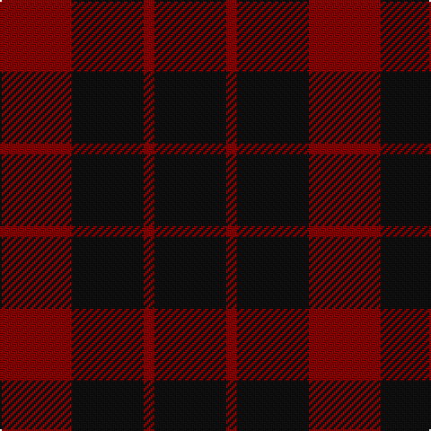

In pattern [KRKR](/stripes/krkr/).

This was sourced from register-of-tartans.  It is a [4 stripe tartan](/stripes/stripes4/).

Original link https://www.tartanregister.gov.uk/tartanDetails.aspx?ref=4559

## Register references

External register numbers recorded for this tartan.

- Scottish Register of Tartans: [4559](https://www.tartanregister.gov.uk/tartanDetails.aspx?ref=4559)
- Scottish Tartans Authority (ITI): 4392

## Thread count
K/40 DR6 K40 DR/40

## Palette
Each colour and the base-6 reference it is a variant of.

| Colour | Shade | Base |
|---|---|---|
| DR | <code style="background-color:#880000;">#880000</code> `oklch(39.4% 0.162 29.2)` <small>#880000</small> | R <code style="background-color:#CC0000;">#CC0000</code> |
| K | <code style="background-color:#101010;">#101010</code> `oklch(17.3% 0.000 89.9)` <small>#101010</small> | K <code style="background-color:#000000;">#000000</code> |

# Sample pattern

## Nearest tartans

The nearest existing variants by ΔTartan distance, with this tartan at the top so the swatches line up against it.

ΔTartan

Tartan

Sett

—

<a href="/ttd/edit/#slug=k20r3k20r20~x2">Wcwm 9275-1333-2</a> <a class="nn-out" href="/setts/s4/k20r3k20r20~x2/" title="open its dictionary page">↗</a>

1.19

<a href="/ttd/edit/#slug=k2r4k7r1k2~x2">Romsdal Tresfjord</a> <a class="nn-out" href="/setts/s5/k2r4k7r1k2~x2/" title="open its dictionary page">↗</a>

1.43

<a href="/ttd/edit/#slug=k12r7k1r9~x4">Lendrum (Black &amp; Red) or MacFarlane</a> <a class="nn-out" href="/setts/s4/k12r7k1r9~x4/" title="open its dictionary page">↗</a>

1.74

<a href="/ttd/edit/#slug=k3r20k20r3~x2">Clan Anord (Corporate)</a> <a class="nn-out" href="/setts/s4/k3r20k20r3~x2/" title="open its dictionary page">↗</a>

2.03

<a href="/ttd/edit/#slug=r9k1r5g6r4k2~x4">MacAn of Lurgyvallan (Hose)</a> <a class="nn-out" href="/setts/s6/r9k1r5g6r4k2~x4/" title="open its dictionary page">↗</a>

2.06

<a href="/ttd/edit/#slug=k30dp5k10dp9~x4">Leonard Hunting (Name)</a> <a class="nn-out" href="/setts/s4/k30dp5k10dp9~x4/" title="open its dictionary page">↗</a>

2.16

<a href="/ttd/edit/#slug=k10dp5k30dp5k10dp9~x4">Leonard Hunting</a> <a class="nn-out" href="/setts/s6/k10dp5k30dp5k10dp9~x4/" title="open its dictionary page">↗</a>

2.28

<a href="/ttd/edit/#slug=dg6dp5r1~x4">Wilson's No.084</a> <a class="nn-out" href="/setts/s3/dg6dp5r1~x4/" title="open its dictionary page">↗</a>

2.39

<a href="/ttd/edit/#slug=r2k4r2k4r6k1lo1~x4">MacIan</a> <a class="nn-out" href="/setts/s7/r2k4r2k4r6k1lo1~x4/" title="open its dictionary page">↗</a>

2.48

<a href="/ttd/edit/#slug=k34db13k7db14~x2">Auchincloss (Personal)</a> <a class="nn-out" href="/setts/s4/k34db13k7db14~x2/" title="open its dictionary page">↗</a>

2.49

<a href="/ttd/edit/#slug=do12y6do2lo1~x4">Loch Garth</a> <a class="nn-out" href="/setts/s4/do12y6do2lo1~x4/" title="open its dictionary page">↗</a>

## Neighbour map

Every grey dot is one of 14299 variants placed by the first two principal components of the ΔTartan feature space (44% of its variance). Red is this tartan; blue dots are its nearest — click one to open its page.

<svg viewBox="0 0 640 380" role="img" style="max-width:100%;height:auto;border:1px solid #e0e0e0;border-radius:4px;display:block" xmlns="http://www.w3.org/2000/svg"><image href="/nn/cloud.v1.png" width="640" height="380"/><a href="/setts/s5/k2r4k7r1k2~x2/"><circle cx="481.0" cy="318.6" r="4" fill="#3465a4"><title>Romsdal Tresfjord</title></circle></a><a href="/setts/s4/k12r7k1r9~x4/"><circle cx="420.4" cy="307.3" r="4" fill="#3465a4"><title>Lendrum (Black &amp; Red) or MacFarlane</title></circle></a><a href="/setts/s4/k3r20k20r3~x2/"><circle cx="398.0" cy="309.9" r="4" fill="#3465a4"><title>Clan Anord (Corporate)</title></circle></a><a href="/setts/s6/r9k1r5g6r4k2~x4/"><circle cx="421.7" cy="277.1" r="4" fill="#3465a4"><title>MacAn of Lurgyvallan (Hose)</title></circle></a><a href="/setts/s4/k30dp5k10dp9~x4/"><circle cx="530.7" cy="339.8" r="4" fill="#3465a4"><title>Leonard Hunting (Name)</title></circle></a><a href="/setts/s6/k10dp5k30dp5k10dp9~x4/"><circle cx="511.7" cy="318.8" r="4" fill="#3465a4"><title>Leonard Hunting</title></circle></a><a href="/setts/s3/dg6dp5r1~x4/"><circle cx="309.3" cy="323.2" r="4" fill="#3465a4"><title>Wilson's No.084</title></circle></a><a href="/setts/s7/r2k4r2k4r6k1lo1~x4/"><circle cx="309.6" cy="272.6" r="4" fill="#3465a4"><title>MacIan</title></circle></a><a href="/setts/s4/k34db13k7db14~x2/"><circle cx="440.8" cy="366.0" r="4" fill="#3465a4"><title>Auchincloss (Personal)</title></circle></a><a href="/setts/s4/do12y6do2lo1~x4/"><circle cx="449.3" cy="255.6" r="4" fill="#3465a4"><title>Loch Garth</title></circle></a><circle cx="427.8" cy="347.7" r="5" fill="#c00000"/></svg>

ID: /setts/s4/k20r3k20r20~x2/
