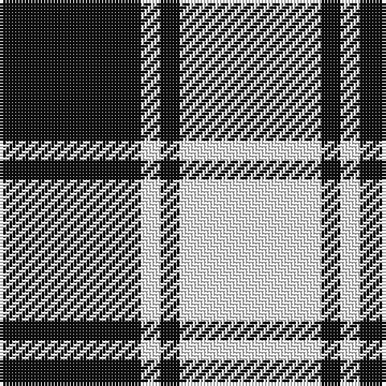

In pattern [KWKW](/stripes/kwkw/).

This was sourced from register-of-tartans.  It is a [4 stripe tartan](/stripes/stripes4/).

Original link https://www.tartanregister.gov.uk/tartanDetails.aspx?ref=2699

## Also known as

This cloth is also recorded under:

- MacFie B&W

## Attestations

This cloth appears in 4 source records; the oldest owns this page.

- 01/01/1992 — MacPhee (Black and White) (register-of-tartans, [record](https://www.tartanregister.gov.uk/tartanDetails.aspx?ref=2699))
- pre 1992 — MacFie B&W (Clan) (tartans-authority, [record](http://www.tartansauthority.com/tartan-ferret/display/1252/))
- undated — MacPhee (B&W) (weddslist, [record](http://www.weddslist.com/cgi-bin/tartans/pg.pl?source=sts))
- undated — MacPhee (B&W) Clan Tartan Tartan Number: 1252. Earliest known date: c.1930 In 1992, Sandy MacFie, the Chief of the MacPhees wrote to the Scottish Tartans Society from his home in Queensland Australia, with a request to register the MacPhee tartans. The existance of a black and white pattern was known to him but the precise details of the pattern were obscure. The Society had two reported examples of a MacPhee which met the description. One from the researches of a Canadian member, A.C. Lumsden, and the other from a Mr D. Brown in Leeds. The chosen black and white sett mirrors the clan pattern and was duly registered by the Society. The clan tartan was registered by Lord Lyon in the previous year. See products available Copyright © Blair Urquhart, Comrie, 2015 (house-of-tartan, [record](http://www.house-of-tartan.scotland.net/house/TartanViewjs.asp?colr=Def&tnam=1252))

## Register references

External register numbers recorded for this tartan.

- Scottish Register of Tartans: [2699](https://www.tartanregister.gov.uk/tartanDetails.aspx?ref=2699)
- Scottish Tartans Authority (ITI): 1252
- Scottish Tartans World Register: 1252

## Thread count
K/44 W6 K6 W/44

## Palette
Each colour and the base-6 reference it is a variant of.

| Colour | Shade | Base |
|---|---|---|
| K | <code style="background-color:#101010;">#101010</code> `oklch(17.3% 0.000 89.9)` <small>#101010</small> | K <code style="background-color:#000000;">#000000</code> |
| W | <code style="background-color:#FCFCFC;">#FCFCFC</code> `oklch(99.1% 0.000 89.9)` <small>#FCFCFC</small> | W <code style="background-color:#F7F7F7;">#F7F7F7</code> |

# Sample pattern

## Nearest tartans

The nearest existing variants by ΔTartan distance.

1. [Cairn (Marton Mills)](/setts/s5/k2w1k8w8k1~x8/) — ΔT 0.94
1. [Erskine (Black and White)](/setts/s6/k2w1k9w9k1w2~x6/) — ΔT 0.99
1. [Erskine BW MINI Design Tartan Tartan Number: 12466. Earliest known date: Generated for display purposes. Reduced copy of the original 1246 Erskine BW. See products available Copyright © Blair Urquhart, Comrie, 2015](/setts/s6/k2w1k9w9k1w2~x3/) — ΔT 1.05
1. [MacLeod Black & White](/setts/s5/w14k2w14k19w2~x2/) — ΔT 1.15
1. [MacLeod, Black & White](/setts/s5/w8k1w8k12w1~x2/) — ΔT 1.18
1. [MacMugen](/setts/s6/dt3w16dt4w3dt12w2~x3/) — ΔT 1.25
1. [Lewis, Navy (Dance)](/setts/s4/db4w35db31w4~x2/) — ΔT 1.30
1. [Scott (Abbreviated)](/setts/s7/w2k1w6k6w2k1w1~x2/) — ΔT 1.34
1. [Valley Forge (Artefact)](/setts/s6/lb5k4lb32k32lb5k4~x2/) — ΔT 1.35
1. [MacFarlane B/W or Lendrum Clan Tartan Tartan Number: 1251. Earliest known date: 1842 The design comes from the Vestiarium Scoticum (1842). The authors, the Sobieski Stuart brothers, enjoyed a popular following among the Scottish gentry in the early Victorian era, and in the spirit of the times, added mystery, romance and some spurious historical documentation to the subject of tartan. Of the better known tartans, the book offers some minor variation, but in other cases it provides the only recorded version of many tartans in use today. See products available Copyright © Blair Urquhart, Comrie, 2015](/setts/s4/k7w6k1~x2/) — ΔT 1.55

## Neighbour map

Every grey dot is one of 14299 variants placed by the first two principal components of the ΔTartan feature space (44% of its variance). Red is this tartan; blue dots are its nearest — click one to open its page.

<svg viewBox="0 0 640 380" role="img" style="max-width:100%;height:auto;border:1px solid #e0e0e0;border-radius:4px;display:block" xmlns="http://www.w3.org/2000/svg"><image href="/nn/cloud.v1.png" width="640" height="380"/><a href="/setts/s5/k2w1k8w8k1~x8/"><circle cx="312.6" cy="237.3" r="4" fill="#3465a4"><title>Cairn (Marton Mills)</title></circle></a><a href="/setts/s6/k2w1k9w9k1w2~x6/"><circle cx="294.5" cy="213.5" r="4" fill="#3465a4"><title>Erskine (Black and White)</title></circle></a><a href="/setts/s6/k2w1k9w9k1w2~x3/"><circle cx="299.2" cy="217.4" r="4" fill="#3465a4"><title>Erskine BW MINI Design Tartan Tartan Number: 12466. Earliest known date: Generated for display purposes. Reduced copy of the original 1246 Erskine BW. See products available Copyright © Blair Urquhart, Comrie, 2015</title></circle></a><a href="/setts/s5/w14k2w14k19w2~x2/"><circle cx="313.1" cy="233.7" r="4" fill="#3465a4"><title>MacLeod Black &amp; White</title></circle></a><a href="/setts/s5/w8k1w8k12w1~x2/"><circle cx="320.2" cy="229.4" r="4" fill="#3465a4"><title>MacLeod, Black &amp; White</title></circle></a><a href="/setts/s6/dt3w16dt4w3dt12w2~x3/"><circle cx="294.2" cy="226.2" r="4" fill="#3465a4"><title>MacMugen</title></circle></a><a href="/setts/s4/db4w35db31w4~x2/"><circle cx="307.3" cy="241.2" r="4" fill="#3465a4"><title>Lewis, Navy (Dance)</title></circle></a><a href="/setts/s7/w2k1w6k6w2k1w1~x2/"><circle cx="299.8" cy="231.1" r="4" fill="#3465a4"><title>Scott (Abbreviated)</title></circle></a><a href="/setts/s6/lb5k4lb32k32lb5k4~x2/"><circle cx="304.6" cy="219.1" r="4" fill="#3465a4"><title>Valley Forge (Artefact)</title></circle></a><a href="/setts/s4/k7w6k1~x2/"><circle cx="293.1" cy="281.9" r="4" fill="#3465a4"><title>MacFarlane B/W or Lendrum Clan Tartan Tartan Number: 1251. Earliest known date: 1842 The design comes from the Vestiarium Scoticum (1842). The authors, the Sobieski Stuart brothers, enjoyed a popular following among the Scottish gentry in the early Victorian era, and in the spirit of the times, added mystery, romance and some spurious historical documentation to the subject of tartan. Of the better known tartans, the book offers some minor variation, but in other cases it provides the only recorded version of many tartans in use today. See products available Copyright © Blair Urquhart, Comrie, 2015</title></circle></a><circle cx="284.4" cy="248.4" r="5" fill="#c00000"/></svg>

ID: /setts/s4/k22w3k3w22~x2/
