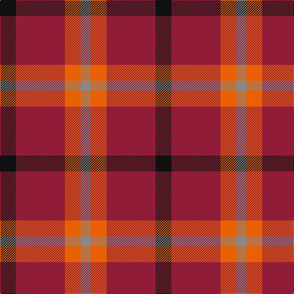

In pattern [KRRR](/patterns/krrr/).

This was sourced from register-of-tartans.  It is a [4 stripes tartan](/stripes/stripes4/).

Original link https://www.tartanregister.gov.uk/tartanDetails.aspx?ref=2848

## Thread count
K/26 DR80 O26 N/16

## Palette
Each colour and its ΔE from the base-6 reference it is a variant of.

| Colour | Shade | Base | ΔE (OKLab) |
|---|---|---|---|
| DR | <code style="background-color:#901C38;">#901C38</code> `#901C38` | R <code style="background-color:#C80000;">#C80000</code> | 0.12 |
| K | <code style="background-color:#101010;">#101010</code> `#101010` | K <code style="background-color:#000000;">#000000</code> | 0.17 |
| N | <code style="background-color:#888888;">#888888</code> `#888888` | R <code style="background-color:#C80000;">#C80000</code> | 0.24 |
| O | <code style="background-color:#E86000;">#E86000</code> `#E86000` | R <code style="background-color:#C80000;">#C80000</code> | 0.14 |

# Sample pattern

ID: /setts/s4/k26r80ra26rb16-k101010-r901c38-rae86000-rb888888/
888888/
