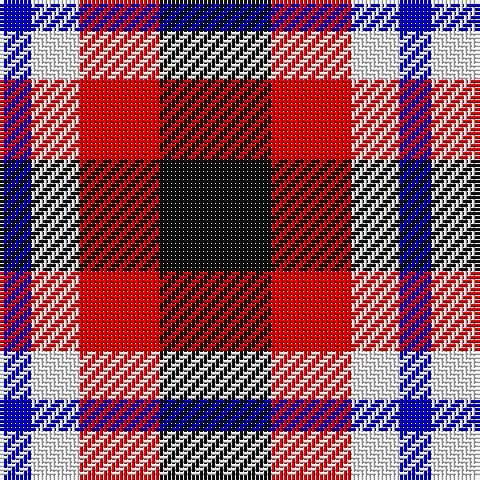

In pattern [BWRK](/patterns/bwrk/).

This was sourced from register-of-tartans.  It is a [4 stripes tartan](/stripes/stripes4/).

Original link https://www.tartanregister.gov.uk/tartanDetails.aspx?ref=10849

## Thread count
B/8 W12 R20 K/28

## Palette
Each colour and its ΔE from the base-6 reference it is a variant of.

| Colour | Shade | Base | ΔE (OKLab) |
|---|---|---|---|
| B | <code style="background-color:#0000CD;">#0000CD</code> `#0000CD` | B <code style="background-color:#2C4084;">#2C4084</code> | 0.15 |
| K | <code style="background-color:#101010;">#101010</code> `#101010` | K <code style="background-color:#000000;">#000000</code> | 0.17 |
| R | <code style="background-color:#FF0000;">#FF0000</code> `#FF0000` | R <code style="background-color:#C80000;">#C80000</code> | 0.11 |
| W | <code style="background-color:#FFFFFF;">#FFFFFF</code> `#FFFFFF` | W <code style="background-color:#F4F4F0;">#F4F4F0</code> | 0.03 |

# Sample pattern

## Nearest tartans

The nearest existing variants by ΔTartan distance.

1. [Thomas Newcomen's Combustion Engine](/setts/s4/k28r20w12b8-b202060-k101010-rc80000-wfcfcfc/) — ΔT 0.49
1. [SAL Grindrande Stiernan (Corporate)](/setts/s4/r60g20k60w20-g006818-k101010-rc80000-wfcfcfc/) — ΔT 1.12
1. [SAL Glindrande Stiernan](/setts/s4/r60g20k60w20-g008b00-k101010-rff0000-wffffff/) — ΔT 1.25
1. [Clark](/setts/s5/r12k4g4k4w12-g004c00-k000000-rc80000-wd0d0d0/) — ΔT 1.25
1. [Brodie Dress](/setts/s5/b12w40k36r66k12-b2c2c80-k101010-rc80000-wfcfcfc/) — ΔT 1.33
1. [Wilson's, No 113](/setts/s4/r4g12b12w4-b800080-g008000-rc00000-we0e0e0/) — ΔT 1.33
1. [Haggis Hostels](/setts/s4/r80b40w40ba32-b5f749c-ba14283c-r960028-we8ccb8/) — ΔT 1.35
1. [Austin / Wilson's No 137](/setts/s5/b6k6b6g12r4-b800080-g008000-k000000-rc00000/) — ΔT 1.43
1. [Heidrick Family (Personal)](/setts/s5/w28k60b18r16ra18-b0596fa-k101010-r960000-rae86000-we0e0e0/) — ΔT 1.47
1. [Hamby Sport (Personal)](/setts/s4/r50k26w16b10-b2c2c80-k101010-rc8002c-we0e0e0/) — ΔT 1.52

## Neighbour map

Every grey dot is one of 15726 variants placed by the first two principal components of the ΔTartan feature space (44% of its variance). Red is this tartan; blue dots are its nearest — click one to open its page.

<svg viewBox="0 0 640 380" role="img" style="max-width:100%;height:auto;border:1px solid #e0e0e0;border-radius:4px;display:block" xmlns="http://www.w3.org/2000/svg"><image href="/nn/cloud.v1.png" width="640" height="380"/><a href="/setts/s4/k28r20w12b8-b202060-k101010-rc80000-wfcfcfc/"><circle cx="111.5" cy="280.1" r="4" fill="#3465a4"><title>Thomas Newcomen's Combustion Engine</title></circle></a><a href="/setts/s4/r60g20k60w20-g006818-k101010-rc80000-wfcfcfc/"><circle cx="110.8" cy="280.9" r="4" fill="#3465a4"><title>SAL Grindrande Stiernan (Corporate)</title></circle></a><a href="/setts/s4/r60g20k60w20-g008b00-k101010-rff0000-wffffff/"><circle cx="104.7" cy="273.8" r="4" fill="#3465a4"><title>SAL Glindrande Stiernan</title></circle></a><a href="/setts/s5/r12k4g4k4w12-g004c00-k000000-rc80000-wd0d0d0/"><circle cx="74.7" cy="258.3" r="4" fill="#3465a4"><title>Clark</title></circle></a><a href="/setts/s5/b12w40k36r66k12-b2c2c80-k101010-rc80000-wfcfcfc/"><circle cx="136.4" cy="228.0" r="4" fill="#3465a4"><title>Brodie Dress</title></circle></a><a href="/setts/s4/r4g12b12w4-b800080-g008000-rc00000-we0e0e0/"><circle cx="120.1" cy="286.6" r="4" fill="#3465a4"><title>Wilson's, No 113</title></circle></a><a href="/setts/s4/r80b40w40ba32-b5f749c-ba14283c-r960028-we8ccb8/"><circle cx="114.7" cy="306.5" r="4" fill="#3465a4"><title>Haggis Hostels</title></circle></a><a href="/setts/s5/b6k6b6g12r4-b800080-g008000-k000000-rc00000/"><circle cx="85.1" cy="294.8" r="4" fill="#3465a4"><title>Austin / Wilson's No 137</title></circle></a><a href="/setts/s5/w28k60b18r16ra18-b0596fa-k101010-r960000-rae86000-we0e0e0/"><circle cx="95.2" cy="236.0" r="4" fill="#3465a4"><title>Heidrick Family (Personal)</title></circle></a><a href="/setts/s4/r50k26w16b10-b2c2c80-k101010-rc8002c-we0e0e0/"><circle cx="197.1" cy="248.5" r="4" fill="#3465a4"><title>Hamby Sport (Personal)</title></circle></a><circle cx="105.8" cy="275.3" r="5" fill="#c00000"/></svg>

ID: /setts/s4/k28r20w12b8-b0000cd-k101010-rff0000-wffffff/
