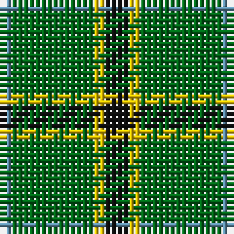

In pattern [BGYK](/stripes/bgyk/).

This was sourced from register-of-tartans.  It is a [4 stripe tartan](/stripes/stripes4/).

Original link https://www.tartanregister.gov.uk/tartanDetails.aspx?ref=4694

## Register references

External register numbers recorded for this tartan.

- Scottish Register of Tartans: [4694](https://www.tartanregister.gov.uk/tartanDetails.aspx?ref=4694)
- Scottish Tartans Authority (ITI): 1938
- Scottish Tartans World Register: 1938

## Thread count
K/4 Y2 G14 B/2

## Palette
Each colour and the base-6 reference it is a variant of.

| Colour | Shade | Base |
|---|---|---|
| B | <code style="background-color:#5C8CA8;">#5C8CA8</code> `oklch(61.7% 0.067 235.0)` <small>#5C8CA8</small> | B <code style="background-color:#2A418A;">#2A418A</code> |
| DG | <code style="background-color:#003820;">#003820</code> `oklch(30.0% 0.070 158.3)` <small>#003820</small> | G <code style="background-color:#006100;">#006100</code> |
| G | <code style="background-color:#006818;">#006818</code> `oklch(45.0% 0.142 145.0)` <small>#006818</small> | G <code style="background-color:#006100;">#006100</code> |
| K | <code style="background-color:#101010;">#101010</code> `oklch(17.3% 0.000 89.9)` <small>#101010</small> | K <code style="background-color:#000000;">#000000</code> |
| LG | <code style="background-color:#789484;">#789484</code> `oklch(64.0% 0.040 160.0)` <small>#789484</small> | G <code style="background-color:#006100;">#006100</code> |
| Y | <code style="background-color:#E8C000;">#E8C000</code> `oklch(81.9% 0.168 93.7)` <small>#E8C000</small> | Y <code style="background-color:#F2BF00;">#F2BF00</code> |
| Ya | <code style="background-color:#D8B000;">#D8B000</code> `oklch(77.1% 0.158 92.3)` <small>#D8B000</small> | Y <code style="background-color:#F2BF00;">#F2BF00</code> |

# Sample pattern

## Nearest tartans

The nearest existing variants by ΔTartan distance.

1. [Bacon, Green (Fashion)](/setts/s4/g14k3r3lr2~x2/) — ΔT 0.61
1. [Wilson's No.174](/setts/s4/t1db4g10ly1~x2/) — ΔT 1.00
1. [Wilson's No.192](/setts/s4/dp4g10r1ly1~x2/) — ΔT 1.12
1. [Wilson's, No 205](/setts/s4/t1db4g10w1~x2/) — ΔT 1.13
1. [Wilson's, No 192](/setts/s4/p4g10r1ly1~x2/) — ΔT 1.23
1. [Wilson's No.189](/setts/s4/dp4g10r1w1~x2/) — ΔT 1.26
1. [Wilson's, No 189](/setts/s4/p4g10w1r1~x2/) — ΔT 1.31
1. [Robert Byers Family - Dooballagh, Ireland](/setts/s4/k5g40db20ly3~x2/) — ΔT 1.45
1. [Moore Caledonian (Personal)](/setts/s6/r1k6g6ly1g6ly1~x6/) — ΔT 1.46
1. [Paton (Personal)](/setts/s7/r3g20k20g20lo2g2lo2~x2/) — ΔT 1.48

## Neighbour map

Every grey dot is one of 14299 variants placed by the first two principal components of the ΔTartan feature space (44% of its variance). Red is this tartan; blue dots are its nearest — click one to open its page.

<svg viewBox="0 0 640 380" role="img" style="max-width:100%;height:auto;border:1px solid #e0e0e0;border-radius:4px;display:block" xmlns="http://www.w3.org/2000/svg"><image href="/nn/cloud.v1.png" width="640" height="380"/><a href="/setts/s4/g14k3r3lr2~x2/"><circle cx="347.5" cy="250.5" r="4" fill="#3465a4"><title>Bacon, Green (Fashion)</title></circle></a><a href="/setts/s4/t1db4g10ly1~x2/"><circle cx="362.6" cy="241.7" r="4" fill="#3465a4"><title>Wilson's No.174</title></circle></a><a href="/setts/s4/dp4g10r1ly1~x2/"><circle cx="357.4" cy="230.6" r="4" fill="#3465a4"><title>Wilson's No.192</title></circle></a><a href="/setts/s4/t1db4g10w1~x2/"><circle cx="360.2" cy="240.0" r="4" fill="#3465a4"><title>Wilson's, No 205</title></circle></a><a href="/setts/s4/p4g10r1ly1~x2/"><circle cx="348.1" cy="222.1" r="4" fill="#3465a4"><title>Wilson's, No 192</title></circle></a><a href="/setts/s4/dp4g10r1w1~x2/"><circle cx="343.3" cy="223.6" r="4" fill="#3465a4"><title>Wilson's No.189</title></circle></a><a href="/setts/s4/p4g10w1r1~x2/"><circle cx="343.3" cy="220.0" r="4" fill="#3465a4"><title>Wilson's, No 189</title></circle></a><a href="/setts/s4/k5g40db20ly3~x2/"><circle cx="353.5" cy="237.3" r="4" fill="#3465a4"><title>Robert Byers Family - Dooballagh, Ireland</title></circle></a><a href="/setts/s6/r1k6g6ly1g6ly1~x6/"><circle cx="262.6" cy="243.2" r="4" fill="#3465a4"><title>Moore Caledonian (Personal)</title></circle></a><a href="/setts/s7/r3g20k20g20lo2g2lo2~x2/"><circle cx="347.8" cy="221.4" r="4" fill="#3465a4"><title>Paton (Personal)</title></circle></a><circle cx="337.4" cy="247.7" r="5" fill="#c00000"/></svg>

ID: /setts/s4/k2ly1g7t1~x2/
