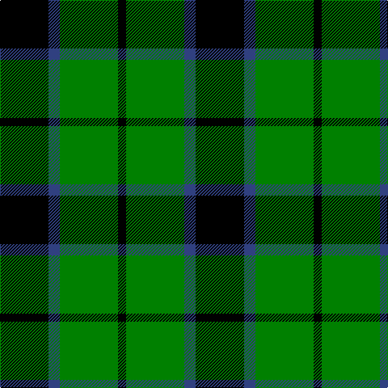

In pattern [KBGK](/stripes/kbgk/).

This was sourced from weddslist.  It is a [4 stripe tartan](/stripes/stripes4/).

Original link http://www.weddslist.com/cgi-bin/tartans/pg.pl?source=sts

## Thread count
K/60 B14 G72 K/10

## Palette
Each colour and the base-6 reference it is a variant of.

| Colour | Shade | Base |
|---|---|---|
| B | <code style="background-color:#304080;">#304080</code> `oklch(39.4% 0.109 270.2)` <small>#304080</small> | B <code style="background-color:#2A418A;">#2A418A</code> |
| G | <code style="background-color:#008000;">#008000</code> `oklch(52.0% 0.177 142.5)` <small>#008000</small> | G <code style="background-color:#006100;">#006100</code> |
| K | <code style="background-color:#000000;">#000000</code> `oklch(0.0% 0.000 0.0)` <small>#000000</small> | K <code style="background-color:#000000;">#000000</code> |

# Sample pattern

## Nearest tartans

The nearest existing variants by ΔTartan distance.

1. [Wallace Htg (Clan)](/setts/s4/k1g8k8ly1~x4/) — ΔT 0.65
1. [Wallace, hunting](/setts/s4/k4g33k33ly4~x2/) — ΔT 0.69
1. [Wilson's, No 50](/setts/s3/g5k6t1~x4/) — ΔT 1.02
1. [Wilson's, No 140](/setts/s4/k7ly1g7t1~x2/) — ΔT 1.06
1. [MacArthur](/setts/s5/k32g6k12g30ly3/) — ΔT 1.09
1. [Innes Hunting](/setts/s4/k30lb7g36k5~x2/) — ΔT 1.10
1. [Wilson's, No 197](/setts/s3/k6ly1g6~x4/) — ΔT 1.12
1. [Wallace Hunting](/setts/s6/g8k8ly1k8g8k1~x4/) — ΔT 1.20
1. [Douglas, Black](/setts/s5/k8b5g44k40r6/) — ΔT 1.21
1. [MacArthur-Fox](/setts/s5/k19g8k10g31r3/) — ΔT 1.22

## Neighbour map

Every grey dot is one of 14299 variants placed by the first two principal components of the ΔTartan feature space (44% of its variance). Red is this tartan; blue dots are its nearest — click one to open its page.

<svg viewBox="0 0 640 380" role="img" style="max-width:100%;height:auto;border:1px solid #e0e0e0;border-radius:4px;display:block" xmlns="http://www.w3.org/2000/svg"><image href="/nn/cloud.v1.png" width="640" height="380"/><a href="/setts/s4/k1g8k8ly1~x4/"><circle cx="280.8" cy="261.8" r="4" fill="#3465a4"><title>Wallace Htg (Clan)</title></circle></a><a href="/setts/s4/k4g33k33ly4~x2/"><circle cx="273.4" cy="255.7" r="4" fill="#3465a4"><title>Wallace, hunting</title></circle></a><a href="/setts/s3/g5k6t1~x4/"><circle cx="238.7" cy="305.7" r="4" fill="#3465a4"><title>Wilson's, No 50</title></circle></a><a href="/setts/s4/k7ly1g7t1~x2/"><circle cx="202.0" cy="244.5" r="4" fill="#3465a4"><title>Wilson's, No 140</title></circle></a><a href="/setts/s5/k32g6k12g30ly3/"><circle cx="292.6" cy="244.9" r="4" fill="#3465a4"><title>MacArthur</title></circle></a><a href="/setts/s4/k30lb7g36k5~x2/"><circle cx="264.6" cy="276.9" r="4" fill="#3465a4"><title>Innes Hunting</title></circle></a><a href="/setts/s3/k6ly1g6~x4/"><circle cx="221.3" cy="300.3" r="4" fill="#3465a4"><title>Wilson's, No 197</title></circle></a><a href="/setts/s6/g8k8ly1k8g8k1~x4/"><circle cx="265.3" cy="268.1" r="4" fill="#3465a4"><title>Wallace Hunting</title></circle></a><a href="/setts/s5/k8b5g44k40r6/"><circle cx="237.8" cy="222.7" r="4" fill="#3465a4"><title>Douglas, Black</title></circle></a><a href="/setts/s5/k19g8k10g31r3/"><circle cx="294.6" cy="248.4" r="4" fill="#3465a4"><title>MacArthur-Fox</title></circle></a><circle cx="243.4" cy="271.0" r="5" fill="#c00000"/></svg>

ID: /setts/s4/k30db7g36k5~x2/
