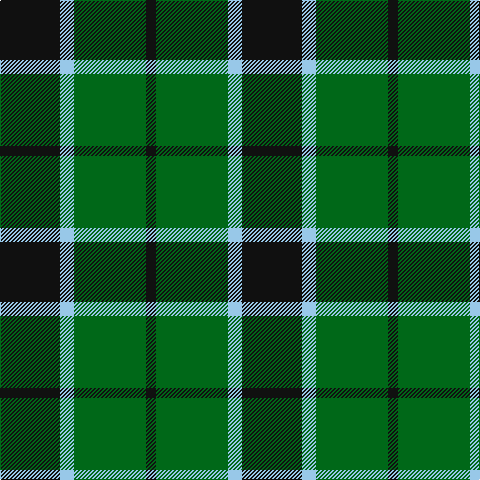

In pattern [KGWK](/stripes/kgwk/).

This was sourced from register-of-tartans.  It is a [4 stripe tartan](/stripes/stripes4/).

Original link https://www.tartanregister.gov.uk/tartanDetails.aspx?ref=1831

## Also known as

This cloth is also recorded under:

- Innes Hunting

## Attestations

This cloth appears in 2 source records; the oldest owns this page.

- 19/04/1969 — Innes Hunting (register-of-tartans, [record](https://www.tartanregister.gov.uk/tartanDetails.aspx?ref=1831))
- pre 1969 — Innes Htg (Clan?) (tartans-authority, [record](http://www.tartansauthority.com/tartan-ferret/display/368/))

## Register references

External register numbers recorded for this tartan.

- Scottish Register of Tartans: [1831](https://www.tartanregister.gov.uk/tartanDetails.aspx?ref=1831)
- Scottish Tartans Authority (ITI): 368
- Scottish Tartans World Register: 368

## Thread count
K/60 LB14 G72 K/10

## Palette
Each colour and the base-6 reference it is a variant of.

| Colour | Shade | Base |
|---|---|---|
| G | <code style="background-color:#006818;">#006818</code> `oklch(45.0% 0.142 145.0)` <small>#006818</small> | G <code style="background-color:#006100;">#006100</code> |
| K | <code style="background-color:#101010;">#101010</code> `oklch(17.3% 0.000 89.9)` <small>#101010</small> | K <code style="background-color:#000000;">#000000</code> |
| LB | <code style="background-color:#98C8E8;">#98C8E8</code> `oklch(81.0% 0.068 237.9)` <small>#98C8E8</small> | W <code style="background-color:#F7F7F7;">#F7F7F7</code> |

# Sample pattern

## Nearest tartans

The nearest existing variants by ΔTartan distance.

1. [MacArthur](/setts/s5/k9g3k3g12ly2~x4/) — ΔT 0.86
1. [Wilson's No.197](/setts/s4/k6ly1g6~x4/) — ΔT 0.87
1. [Scotch Tape 2 (Corporate)](/setts/s4/k3g15k20ly3~x2/) — ΔT 0.96
1. [Wilson's No.079](/setts/s4/k7w1g7t1~x2/) — ΔT 1.00
1. [Innes, hunting](/setts/s4/k30db7g36k5~x2/) — ΔT 1.10
1. [Wilson's No.050](/setts/s3/k5g6t1~x4/) — ΔT 1.28
1. [Wallace Htg (Clan)](/setts/s4/k1g8k8ly1~x4/) — ΔT 1.39
1. [Brooks Brothers (Corporate)](/setts/s4/r1g11k11lo1~x4/) — ΔT 1.41
1. [Bumbee #1 (Fashion)](/setts/s4/g10k2dp5g1~x8/) — ΔT 1.41
1. [Raeside](/setts/s5/k6g4g44k41w4~x2/) — ΔT 1.44

## Neighbour map

Every grey dot is one of 14299 variants placed by the first two principal components of the ΔTartan feature space (44% of its variance). Red is this tartan; blue dots are its nearest — click one to open its page.

<svg viewBox="0 0 640 380" role="img" style="max-width:100%;height:auto;border:1px solid #e0e0e0;border-radius:4px;display:block" xmlns="http://www.w3.org/2000/svg"><image href="/nn/cloud.v1.png" width="640" height="380"/><a href="/setts/s5/k9g3k3g12ly2~x4/"><circle cx="282.5" cy="278.4" r="4" fill="#3465a4"><title>MacArthur</title></circle></a><a href="/setts/s4/k6ly1g6~x4/"><circle cx="224.5" cy="271.9" r="4" fill="#3465a4"><title>Wilson's No.197</title></circle></a><a href="/setts/s4/k3g15k20ly3~x2/"><circle cx="311.9" cy="278.6" r="4" fill="#3465a4"><title>Scotch Tape 2 (Corporate)</title></circle></a><a href="/setts/s4/k7w1g7t1~x2/"><circle cx="222.0" cy="251.2" r="4" fill="#3465a4"><title>Wilson's No.079</title></circle></a><a href="/setts/s4/k30db7g36k5~x2/"><circle cx="243.4" cy="271.0" r="4" fill="#3465a4"><title>Innes, hunting</title></circle></a><a href="/setts/s3/k5g6t1~x4/"><circle cx="284.7" cy="325.3" r="4" fill="#3465a4"><title>Wilson's No.050</title></circle></a><a href="/setts/s4/k1g8k8ly1~x4/"><circle cx="280.8" cy="261.8" r="4" fill="#3465a4"><title>Wallace Htg (Clan)</title></circle></a><a href="/setts/s4/r1g11k11lo1~x4/"><circle cx="296.6" cy="244.7" r="4" fill="#3465a4"><title>Brooks Brothers (Corporate)</title></circle></a><a href="/setts/s4/g10k2dp5g1~x8/"><circle cx="355.8" cy="263.8" r="4" fill="#3465a4"><title>Bumbee #1 (Fashion)</title></circle></a><a href="/setts/s5/k6g4g44k41w4~x2/"><circle cx="289.7" cy="220.9" r="4" fill="#3465a4"><title>Raeside</title></circle></a><circle cx="264.6" cy="276.9" r="5" fill="#c00000"/></svg>

ID: /setts/s4/k30lb7g36k5~x2/
