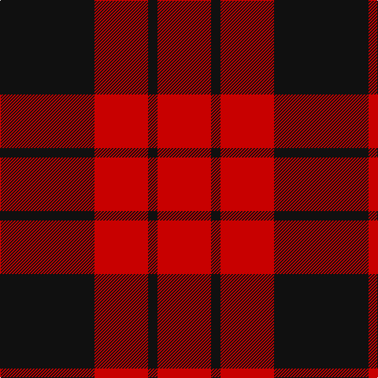

In pattern [KRKR](/stripes/krkr/).

This was sourced from tartans-authority.  It is a [4 stripe tartan](/stripes/stripes4/).

Original link http://www.tartansauthority.com/tartan-ferret/display/8936/

## Thread count
K/120 R68 K12 R/68

## Palette
Each colour and the base-6 reference it is a variant of.

| Colour | Shade | Base |
|---|---|---|
| K | <code style="background-color:#101010;">#101010</code> `oklch(17.3% 0.000 89.9)` <small>#101010</small> | K <code style="background-color:#000000;">#000000</code> |
| R | <code style="background-color:#C80000;">#C80000</code> `oklch(52.3% 0.215 29.2)` <small>#C80000</small> | R <code style="background-color:#CC0000;">#CC0000</code> |

# Sample pattern

## Nearest tartans

The nearest existing variants by ΔTartan distance.

1. [MacLeod of Raasay (Highland Society of London)](/setts/s5/k13r2k13r19k2~x2/) — ΔT 0.95
1. [Erskine (Paton)](/setts/s6/k31r4k47r47k4r31~x2/) — ΔT 1.00
1. [Ettrick (District)](/setts/s4/k5r26k26r5~x4/) — ΔT 1.09
1. [MacLeod Black & Red](/setts/s5/r8k1r8k12r1~x2/) — ΔT 1.16
1. [Munro (Black and Red)](/setts/s5/k18r4k18r32w3~x2/) — ΔT 1.32
1. [Lendrum, or MacFarlane](/setts/s4/k67r32k6/) — ΔT 1.35
1. [Bodog.com](/setts/s5/r3k25r25k10lb3~x2/) — ΔT 1.40
1. [Wallace](/setts/s4/k1r8k8ly1~x6/) — ΔT 1.41
1. [Wallace (Clan)](/setts/s4/k1r8k8ly1~x4/) — ΔT 1.41
1. [Erskine, Black & Red (Clan)](/setts/s6/k6r3k28r28k3r6~x2/) — ΔT 1.53

## Neighbour map

Every grey dot is one of 14299 variants placed by the first two principal components of the ΔTartan feature space (44% of its variance). Red is this tartan; blue dots are its nearest — click one to open its page.

<svg viewBox="0 0 640 380" role="img" style="max-width:100%;height:auto;border:1px solid #e0e0e0;border-radius:4px;display:block" xmlns="http://www.w3.org/2000/svg"><image href="/nn/cloud.v1.png" width="640" height="380"/><a href="/setts/s5/k13r2k13r19k2~x2/"><circle cx="373.7" cy="261.7" r="4" fill="#3465a4"><title>MacLeod of Raasay (Highland Society of London)</title></circle></a><a href="/setts/s6/k31r4k47r47k4r31~x2/"><circle cx="338.6" cy="239.7" r="4" fill="#3465a4"><title>Erskine (Paton)</title></circle></a><a href="/setts/s4/k5r26k26r5~x4/"><circle cx="328.7" cy="288.8" r="4" fill="#3465a4"><title>Ettrick (District)</title></circle></a><a href="/setts/s5/r8k1r8k12r1~x2/"><circle cx="376.2" cy="236.1" r="4" fill="#3465a4"><title>MacLeod Black &amp; Red</title></circle></a><a href="/setts/s5/k18r4k18r32w3~x2/"><circle cx="301.7" cy="227.1" r="4" fill="#3465a4"><title>Munro (Black and Red)</title></circle></a><a href="/setts/s4/k67r32k6/"><circle cx="343.1" cy="263.8" r="4" fill="#3465a4"><title>Lendrum, or MacFarlane</title></circle></a><a href="/setts/s5/r3k25r25k10lb3~x2/"><circle cx="317.5" cy="237.3" r="4" fill="#3465a4"><title>Bodog.com</title></circle></a><a href="/setts/s4/k1r8k8ly1~x6/"><circle cx="305.8" cy="242.6" r="4" fill="#3465a4"><title>Wallace</title></circle></a><a href="/setts/s4/k1r8k8ly1~x4/"><circle cx="305.8" cy="242.6" r="4" fill="#3465a4"><title>Wallace (Clan)</title></circle></a><a href="/setts/s6/k6r3k28r28k3r6~x2/"><circle cx="361.6" cy="231.6" r="4" fill="#3465a4"><title>Erskine, Black &amp; Red (Clan)</title></circle></a><circle cx="344.1" cy="277.1" r="5" fill="#c00000"/></svg>

ID: /setts/s4/k30r17k3~x4/
