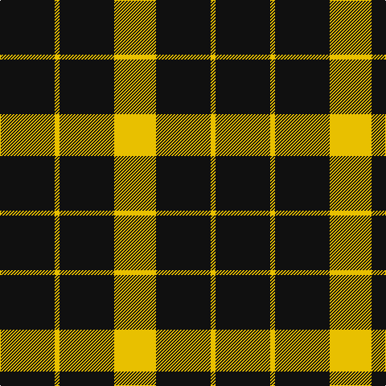

In pattern [KYKY](/patterns/kyky/).

This was sourced from register-of-tartans.  It is a [4 stripes tartan](/stripes/stripes4/).

Original link https://www.tartanregister.gov.uk/tartanDetails.aspx?ref=3436

## Attestations

This cloth appears in 2 source records; the oldest owns this page.

- 01/01/1930 — Raeburn (register-of-tartans, [record](https://www.tartanregister.gov.uk/tartanDetails.aspx?ref=3436))
- pre 1930 — Raeburn (Name) (tartans-authority, [record](http://www.tartansauthority.com/tartan-ferret/display/1275/))

## Thread count
K/68 Y6 K68 Y/52

## Palette
Each colour and its ΔE from the base-6 reference it is a variant of.

| Colour | Shade | Base | ΔE (OKLab) |
|---|---|---|---|
| K | <code style="background-color:#101010;">#101010</code> `#101010` | K <code style="background-color:#000000;">#000000</code> | 0.17 |
| Y | <code style="background-color:#E8C000;">#E8C000</code> `#E8C000` | Y <code style="background-color:#F2BF00;">#F2BF00</code> | 0.02 |

# Sample pattern

## Nearest tartans

The nearest existing variants by ΔTartan distance.

1. [Raeburn Family Tartan Tartan Number: 1275. Earliest known date: 1930 Very little is known about the origin of the tartan other than that it first appeared in the trade lists of Ross's and Johnston's around 1930. It bears a family resemblance to the MacLeod illustrated in the Vestiarium Scoticum in 1842 but the yellow bands are considerably narrower and there is no central red stripe. The name derives from the old lands of Rayburn in the Parish of Dunlop in Ayrshire. Undoubtedly the most famous person of the name was Sir Henry Raeburn (1756 - 1823) to whom we are indebted for so many famous paintings including the famous 'The MacNab'. He was knighted during the Royal visit to Edinburgh of King George IV in 1822. See products available Copyright © Blair Urquhart, Comrie, 2015](/setts/s4/k6y1k6y6~k101010-ye8c000~x6/) — ΔT 1.31
1. [Raeburn](/setts/s4/k6y1k6y6~k000000-yf0c000~x6/) — ΔT 1.41
1. [MacFarlane VS](/setts/s4/k7y6k1y6~k000000-yaaaaaa~x2/) — ΔT 1.76
1. [MacFarlane VS](/setts/s4/k7y6k1y6~k000000-yaaaaaa/) — ΔT 1.76
1. [Special Saffron](/setts/s6/g86y44g21y44g86b10~b2888c4-g003820-ydc943c/) — ΔT 1.91
1. [Special, Saffron](/setts/s4/g21y43g86b10~b8080d0-g003000-yd08010/) — ΔT 1.93
1. [New Zealand District Tartan Tartan Number: 3250. Earliest known date: 2000 Designed as a District sett by Timely Marketing Promotions, Christchurch, New Zealand See products available Copyright © Blair Urquhart, Comrie, 2015](/setts/s6/k21w2k5w9k13g2~g006818-k101010-we0e0e0~x4/) — ΔT 1.94
1. [Lords of Skye Trade Tartan Tartan Number: 1218. Earliest known date: 1983 Nothing See products available Copyright © Blair Urquhart, Comrie, 2015](/setts/s4/k46g7k8w20~g604000-k101010-we0e0e0~x2/) — ΔT 1.95
1. [Cowie, Justine (Personal)](/setts/s3/g9k18r2~g289c18-k101010-rc80000~x4/) — ΔT 1.95
1. [Lords of Skye](/setts/s4/k46g7k8w20~g503c14-k101010-we0e0e0~x2/) — ΔT 1.96

## Neighbour map

Every grey dot is one of 15726 variants placed by the first two principal components of the ΔTartan feature space (44% of its variance). Red is this tartan; blue dots are its nearest — click one to open its page.

<svg viewBox="0 0 640 380" role="img" style="max-width:100%;height:auto;border:1px solid #e0e0e0;border-radius:4px;display:block" xmlns="http://www.w3.org/2000/svg"><image href="/nn/cloud.v1.png" width="640" height="380"/><a href="/setts/s4/k6y1k6y6~k101010-ye8c000~x6/"><circle cx="313.7" cy="312.2" r="4" fill="#3465a4"><title>Raeburn Family Tartan Tartan Number: 1275. Earliest known date: 1930 Very little is known about the origin of the tartan other than that it first appeared in the trade lists of Ross's and Johnston's around 1930. It bears a family resemblance to the MacLeod illustrated in the Vestiarium Scoticum in 1842 but the yellow bands are considerably narrower and there is no central red stripe. The name derives from the old lands of Rayburn in the Parish of Dunlop in Ayrshire. Undoubtedly the most famous person of the name was Sir Henry Raeburn (1756 - 1823) to whom we are indebted for so many famous paintings including the famous 'The MacNab'. He was knighted during the Royal visit to Edinburgh of King George IV in 1822. See products available Copyright © Blair Urquhart, Comrie, 2015</title></circle></a><a href="/setts/s4/k6y1k6y6~k000000-yf0c000~x6/"><circle cx="310.9" cy="315.5" r="4" fill="#3465a4"><title>Raeburn</title></circle></a><a href="/setts/s4/k7y6k1y6~k000000-yaaaaaa~x2/"><circle cx="298.1" cy="302.0" r="4" fill="#3465a4"><title>MacFarlane VS</title></circle></a><a href="/setts/s4/k7y6k1y6~k000000-yaaaaaa/"><circle cx="298.1" cy="302.0" r="4" fill="#3465a4"><title>MacFarlane VS</title></circle></a><a href="/setts/s6/g86y44g21y44g86b10~b2888c4-g003820-ydc943c/"><circle cx="353.3" cy="261.2" r="4" fill="#3465a4"><title>Special Saffron</title></circle></a><a href="/setts/s4/g21y43g86b10~b8080d0-g003000-yd08010/"><circle cx="377.3" cy="268.5" r="4" fill="#3465a4"><title>Special, Saffron</title></circle></a><a href="/setts/s6/k21w2k5w9k13g2~g006818-k101010-we0e0e0~x4/"><circle cx="413.7" cy="235.4" r="4" fill="#3465a4"><title>New Zealand District Tartan Tartan Number: 3250. Earliest known date: 2000 Designed as a District sett by Timely Marketing Promotions, Christchurch, New Zealand See products available Copyright © Blair Urquhart, Comrie, 2015</title></circle></a><a href="/setts/s4/k46g7k8w20~g604000-k101010-we0e0e0~x2/"><circle cx="339.0" cy="261.0" r="4" fill="#3465a4"><title>Lords of Skye Trade Tartan Tartan Number: 1218. Earliest known date: 1983 Nothing See products available Copyright © Blair Urquhart, Comrie, 2015</title></circle></a><a href="/setts/s3/g9k18r2~g289c18-k101010-rc80000~x4/"><circle cx="340.9" cy="282.8" r="4" fill="#3465a4"><title>Cowie, Justine (Personal)</title></circle></a><a href="/setts/s4/k46g7k8w20~g503c14-k101010-we0e0e0~x2/"><circle cx="339.0" cy="261.3" r="4" fill="#3465a4"><title>Lords of Skye</title></circle></a><circle cx="389.4" cy="287.6" r="5" fill="#c00000"/></svg>

ID: /setts/s4/k34y3k34y26~k101010-ye8c000~x2/
