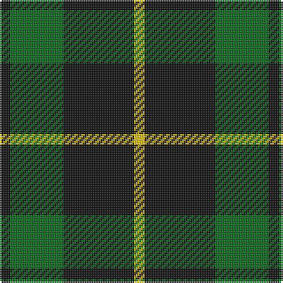

This page is one **sett** — a single exact thread-count. It belongs to the [tartan](/tartans/k3g15k20ly3/)
(the same proportion at any scale), whose colour order is pattern [KGKY](/stripes/kgky/).

Sourced from tartans-authority.  It is a [4 stripe tartan](/stripes/stripes4/).

Original link http://www.tartansauthority.com/tartan-ferret/display/7783/

## Also known as

This cloth is also recorded under:

- Scotch Tape #2

2 attestations — the source records this cloth was collapsed from (oldest owns this page)

<ul>
<li>pre 2008 — Scotch Tape 2 (Corporate) (tartans-authority, <a href="http://www.tartansauthority.com/tartan-ferret/display/7783/">record</a>)</li>
<li>undated — Scotch Tape #2 (register-of-tartans, <a href="https://www.tartanregister.gov.uk/tartanDetails.aspx?ref=5752">record</a>)</li>
</ul>

## Register references

External register numbers recorded for this tartan.

- Scottish Register of Tartans: [5752](https://www.tartanregister.gov.uk/tartanDetails.aspx?ref=5752)
- Scottish Tartans Authority (ITI): 7783

## Thread count
K/6 G30 K40 Y/6

## Palette

Palette: <strong>Tartan Register</strong>
<table><thead><tr><th>Colour</th><th>Threads</th><th>Shade</th><th>Base</th><th>OKLCh</th></tr></thead><tbody><tr><td>K/</td><td style="text-align:right;font-variant-numeric:tabular-nums">6</td><td><code style="background-color:#101010;">#101010</code> <small style="color:#888">#101010</small></td><td>K <code style="background-color:#000000;">#000000</code></td><td><small style="color:#888">oklch(17.3% 0.000 89.9)</small></td></tr><tr><td>G</td><td style="text-align:right;font-variant-numeric:tabular-nums">30</td><td><code style="background-color:#006818;">#006818</code> <small style="color:#888">#006818</small></td><td>G <code style="background-color:#006100;">#006100</code></td><td><small style="color:#888">oklch(45.0% 0.142 145.0)</small></td></tr><tr><td>K</td><td style="text-align:right;font-variant-numeric:tabular-nums">40</td><td><code style="background-color:#101010;">#101010</code> <small style="color:#888">#101010</small></td><td>K <code style="background-color:#000000;">#000000</code></td><td><small style="color:#888">oklch(17.3% 0.000 89.9)</small></td></tr><tr><td>Y/</td><td style="text-align:right;font-variant-numeric:tabular-nums">6</td><td><code style="background-color:#E8C000;">#E8C000</code> <small style="color:#888">#E8C000</small></td><td>Y <code style="background-color:#F2BF00;">#F2BF00</code></td><td><small style="color:#888">oklch(81.9% 0.168 93.7)</small></td></tr></tbody></table>

# Sample pattern

## Nearest tartans

The nearest existing variants by ΔTartan distance, with this tartan at the top so the swatches line up against it.

ΔTartan

Tartan

Sett

—

<a href="/ttd/edit/#slug=k3g15k20ly3~x2">Scotch Tape 2 (Corporate)</a> <a class="nn-out" href="/setts/s4/k3g15k20ly3~x2/" title="open its dictionary page">↗</a>

0.85

<a href="/ttd/edit/#slug=k9g3k3g12ly2~x4">MacArthur</a> <a class="nn-out" href="/setts/s5/k9g3k3g12ly2~x4/" title="open its dictionary page">↗</a>

0.90

<a href="/ttd/edit/#slug=g10k2dp5g1~x8">Bumbee #1 (Fashion)</a> <a class="nn-out" href="/setts/s4/g10k2dp5g1~x8/" title="open its dictionary page">↗</a>

0.96

<a href="/ttd/edit/#slug=k30lb7g36k5~x2">Innes Hunting</a> <a class="nn-out" href="/setts/s4/k30lb7g36k5~x2/" title="open its dictionary page">↗</a>

1.07

<a href="/ttd/edit/#slug=g9k18r2~x4">Cowie, Justine (Personal)</a> <a class="nn-out" href="/setts/s3/g9k18r2~x4/" title="open its dictionary page">↗</a>

1.20

<a href="/ttd/edit/#slug=k11dg17r3">Kincaid</a> <a class="nn-out" href="/setts/s3/k11dg17r3/" title="open its dictionary page">↗</a>

1.22

<a href="/ttd/edit/#slug=k1g8k8ly1~x4">Wallace Htg (Clan)</a> <a class="nn-out" href="/setts/s4/k1g8k8ly1~x4/" title="open its dictionary page">↗</a>

1.23

<a href="/ttd/edit/#slug=g7k1g7t1k6t1~x4">Innes, Georgina (Portrait)</a> <a class="nn-out" href="/setts/s6/g7k1g7t1k6t1~x4/" title="open its dictionary page">↗</a>

1.26

<a href="/ttd/edit/#slug=k1dg8k8ly1">Wallace Hunting</a> <a class="nn-out" href="/setts/s4/k1dg8k8ly1/" title="open its dictionary page">↗</a>

1.30

<a href="/ttd/edit/#slug=k11dg17r3~x2">Kincaid</a> <a class="nn-out" href="/setts/s3/k11dg17r3~x2/" title="open its dictionary page">↗</a>

1.31

<a href="/ttd/edit/#slug=dg2o14dg8o3dg12db2~x2">Confederate Infantry</a> <a class="nn-out" href="/setts/s6/dg2o14dg8o3dg12db2~x2/" title="open its dictionary page">↗</a>

## Neighbour map

Every grey dot is one of 14359 variants placed by the first two principal components of the ΔTartan feature space (44% of its variance). Red is this tartan; blue dots are its nearest — click one to open its page.

<svg viewBox="0 0 640 380" role="img" style="max-width:100%;height:auto;border:1px solid #e0e0e0;border-radius:4px;display:block" xmlns="http://www.w3.org/2000/svg"><image href="/nn/cloud.v1.png" width="640" height="380"/><a href="/setts/s5/k9g3k3g12ly2~x4/"><circle cx="282.2" cy="279.7" r="4" fill="#3465a4"><title>MacArthur</title></circle></a><a href="/setts/s4/g10k2dp5g1~x8/"><circle cx="355.3" cy="264.9" r="4" fill="#3465a4"><title>Bumbee #1 (Fashion)</title></circle></a><a href="/setts/s4/k30lb7g36k5~x2/"><circle cx="264.4" cy="278.2" r="4" fill="#3465a4"><title>Innes Hunting</title></circle></a><a href="/setts/s3/g9k18r2~x4/"><circle cx="342.7" cy="278.8" r="4" fill="#3465a4"><title>Cowie, Justine (Personal)</title></circle></a><a href="/setts/s3/k11dg17r3/"><circle cx="283.2" cy="316.5" r="4" fill="#3465a4"><title>Kincaid</title></circle></a><a href="/setts/s4/k1g8k8ly1~x4/"><circle cx="280.5" cy="263.2" r="4" fill="#3465a4"><title>Wallace Htg (Clan)</title></circle></a><a href="/setts/s6/g7k1g7t1k6t1~x4/"><circle cx="310.5" cy="256.9" r="4" fill="#3465a4"><title>Innes, Georgina (Portrait)</title></circle></a><a href="/setts/s4/k1dg8k8ly1/"><circle cx="302.5" cy="274.0" r="4" fill="#3465a4"><title>Wallace Hunting</title></circle></a><a href="/setts/s3/k11dg17r3~x2/"><circle cx="294.8" cy="321.8" r="4" fill="#3465a4"><title>Kincaid</title></circle></a><a href="/setts/s6/dg2o14dg8o3dg12db2~x2/"><circle cx="313.3" cy="263.1" r="4" fill="#3465a4"><title>Confederate Infantry</title></circle></a><circle cx="311.5" cy="279.9" r="5" fill="#c00000"/></svg>

ID: /setts/s4/k3g15k20ly3~x2/
