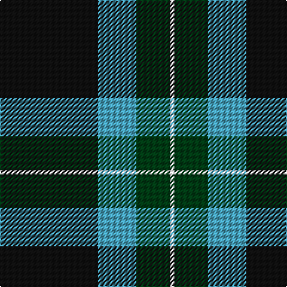

**Bands:** [KYGW](/stripes/kygw/) · **Stripes:** [K LG DG W](/stripes/stripes4/) K LG DG W

This was sourced from register-of-tartans.  It is a [4 band tartan](/bands/bands4/).

Original link https://www.tartanregister.gov.uk/tartanDetails.aspx?ref=11365

## Register references

External register numbers recorded for this tartan.

- Scottish Register of Tartans: [11365](https://www.tartanregister.gov.uk/tartanDetails.aspx?ref=11365)

## Thread count
K/82 B32 DG28 LN/4

## Palette
Each colour and its ΔE from the base-6 reference it is a variant of.

| Colour | Shade | Base | ΔE (OKLab) |
|---|---|---|---|
| B | <code style="background-color:#48A4C0;">#48A4C0</code> `#48A4C0` | Y <code style="background-color:#F2BF00;">#F2BF00</code> | 0.29 |
| DG | <code style="background-color:#003C14;">#003C14</code> `#003C14` | G <code style="background-color:#006100;">#006100</code> | 0.13 |
| K | <code style="background-color:#101010;">#101010</code> `#101010` | K <code style="background-color:#000000;">#000000</code> | 0.17 |
| LN | <code style="background-color:#E0E0E0;">#E0E0E0</code> `#E0E0E0` | W <code style="background-color:#F7F7F7;">#F7F7F7</code> | 0.07 |

# Sample pattern

## Nearest tartans

The nearest existing variants by ΔTartan distance.

1. [Sinclair, Sir John](/setts/s4/db16k6g8ly1~x2/) — ΔT 0.83
1. [Boroughmuir](/setts/s5/dg30w8dt32ly1dt8~x2/) — ΔT 1.06
1. [Unidentified Furnishing #2](/setts/s6/r4g40k21lo2k21g2~x2/) — ΔT 1.29
1. [Kelley Oliphint (Commemorative)](/setts/s5/k3w2n27k31lr3~x2/) — ΔT 1.36
1. [McNiff, Kevin (Personal)](/setts/s4/g20r7db40w2~x2/) — ΔT 1.40
1. [Perry, Alex (Personal)](/setts/s4/k62n24lo5w8~x2/) — ΔT 1.41
1. [U.S. Border Patrol (Corporate)](/setts/s5/g40k15b10k10ly3~x2/) — ΔT 1.43
1. [Wesley Owen 2010 (Personal)](/setts/s4/k61g10g20w4~x2/) — ΔT 1.43
1. [Wilson's No.205](/setts/s4/w1dg10dp4lt1~x2/) — ΔT 1.45
1. [Campbell of Loch Awe](/setts/s5/k2g11k26b11k2~x2/) — ΔT 1.48

## Neighbour map

Every grey dot is one of 14299 variants placed by the first two principal components of the ΔTartan feature space (44% of its variance). Red is this tartan; blue dots are its nearest — click one to open its page.

<svg viewBox="0 0 640 380" role="img" style="max-width:100%;height:auto;border:1px solid #e0e0e0;border-radius:4px;display:block" xmlns="http://www.w3.org/2000/svg"><image href="/nn/cloud.v1.png" width="640" height="380"/><a href="/setts/s4/db16k6g8ly1~x2/"><circle cx="265.8" cy="226.7" r="4" fill="#3465a4"><title>Sinclair, Sir John</title></circle></a><a href="/setts/s5/dg30w8dt32ly1dt8~x2/"><circle cx="322.7" cy="193.2" r="4" fill="#3465a4"><title>Boroughmuir</title></circle></a><a href="/setts/s6/r4g40k21lo2k21g2~x2/"><circle cx="298.8" cy="185.1" r="4" fill="#3465a4"><title>Unidentified Furnishing #2</title></circle></a><a href="/setts/s5/k3w2n27k31lr3~x2/"><circle cx="328.9" cy="199.6" r="4" fill="#3465a4"><title>Kelley Oliphint (Commemorative)</title></circle></a><a href="/setts/s4/g20r7db40w2~x2/"><circle cx="346.3" cy="211.5" r="4" fill="#3465a4"><title>McNiff, Kevin (Personal)</title></circle></a><a href="/setts/s4/k62n24lo5w8~x2/"><circle cx="342.7" cy="212.0" r="4" fill="#3465a4"><title>Perry, Alex (Personal)</title></circle></a><a href="/setts/s5/g40k15b10k10ly3~x2/"><circle cx="280.0" cy="216.3" r="4" fill="#3465a4"><title>U.S. Border Patrol (Corporate)</title></circle></a><a href="/setts/s4/k61g10g20w4~x2/"><circle cx="361.0" cy="211.2" r="4" fill="#3465a4"><title>Wesley Owen 2010 (Personal)</title></circle></a><a href="/setts/s4/w1dg10dp4lt1~x2/"><circle cx="334.6" cy="224.9" r="4" fill="#3465a4"><title>Wilson's No.205</title></circle></a><a href="/setts/s5/k2g11k26b11k2~x2/"><circle cx="350.4" cy="244.0" r="4" fill="#3465a4"><title>Campbell of Loch Awe</title></circle></a><circle cx="312.6" cy="213.7" r="5" fill="#c00000"/></svg>

ID: /setts/s4/k41lg16dg14w2~x2/
