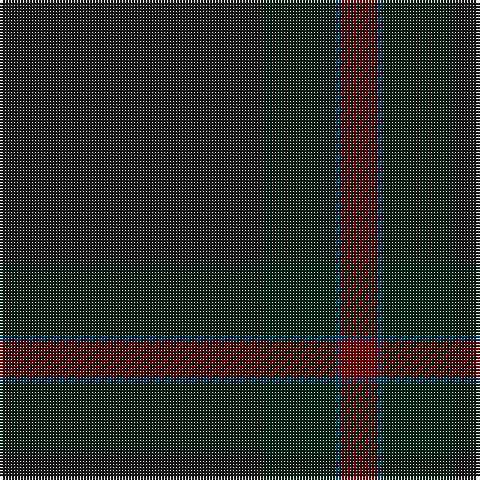

This page is one **sett** — a single exact thread-count. It belongs to the [tartan](/tartans/k44dg12dt1o6/)
(the same proportion at any scale), whose colour order is pattern [KGBR](/stripes/kgbr/).

Sourced from house-of-tartan.  It is a [4 stripe tartan](/stripes/stripes4/).

Original link http://www.house-of-tartan.scotland.net/house/TartanViewjs.asp?colr=Def&tnam=10331

## Thread count
K/88 DG24 DB2 DR/12

## Palette

Palette: <strong>Tartan Register</strong> <small style="color:#888">(3 of 6 colours)</small>
<table><thead><tr><th>Colour</th><th>Threads</th><th>Shade</th><th>Base</th><th>OKLCh</th></tr></thead><tbody><tr><td>K/</td><td style="text-align:right;font-variant-numeric:tabular-nums">88</td><td><code style="background-color:#181818;">#181818</code> <small style="color:#888">#181818</small></td><td>K <code style="background-color:#000000;">#000000</code></td><td><small style="color:#888">oklch(20.9% 0.000 89.9)</small></td></tr><tr><td>DG</td><td style="text-align:right;font-variant-numeric:tabular-nums">24</td><td><code style="background-color:#002414;">#002414</code> <small style="color:#888">#002414</small></td><td>G <code style="background-color:#006100;">#006100</code></td><td><small style="color:#888">oklch(23.0% 0.052 159.9)</small></td></tr><tr><td>DB</td><td style="text-align:right;font-variant-numeric:tabular-nums">2</td><td><code style="background-color:#003C64;">#003C64</code> <small style="color:#888">#003C64</small></td><td>B <code style="background-color:#2A418A;">#2A418A</code></td><td><small style="color:#888">oklch(34.5% 0.089 246.0)</small></td></tr><tr><td>DR/</td><td style="text-align:right;font-variant-numeric:tabular-nums">12</td><td><code style="background-color:#700000;">#700000</code> <small style="color:#888">#700000</small></td><td>R <code style="background-color:#CC0000;">#CC0000</code></td><td><small style="color:#888">oklch(34.2% 0.140 29.2)</small></td></tr></tbody></table>

# Sample pattern

## Nearest tartans

The nearest existing variants by ΔTartan distance, with this tartan at the top so the swatches line up against it.

ΔTartan

Tartan

Sett

—

<a href="/ttd/edit/#slug=k44dg12dt1o6~x2">Heslop, William D Name Tartan Tartan Number: 10331. Earliest known date: 2011 This tartan was created for the Heslop family descended from William Douglas Heslop, who was born on 1st December 1857. His father, John Heslop was born in Lurdenlaw by Kelso in 1825 and his mother, Jessie Turnbull, was born in Jedburgh in 1826. They married in 1849 and sailed to the USA. The tartan may be worn by anyone with the surname Heslop. The copyright owner is William D Heslop. See products available Copyright © Blair Urquhart, Comrie, 2015</a> <a class="nn-out" href="/setts/s4/k44dg12dt1o6~x2/" title="open its dictionary page">↗</a>

1.87

<a href="/ttd/edit/#slug=k120db4k12dt36dg3k6">Scottish Football Association (Corp)</a> <a class="nn-out" href="/setts/s6/k120db4k12dt36dg3k6/" title="open its dictionary page">↗</a>

2.60

<a href="/ttd/edit/#slug=dt4k43k20dt7y2~x2">Deighan (Edinburgh)</a> <a class="nn-out" href="/setts/s5/dt4k43k20dt7y2~x2/" title="open its dictionary page">↗</a>

3.13

<a href="/ttd/edit/#slug=dg23db3k8db4dg4db56dy8">Tern House</a> <a class="nn-out" href="/setts/s7/dg23db3k8db4dg4db56dy8/" title="open its dictionary page">↗</a>

3.22

<a href="/ttd/edit/#slug=dt4k2dt4k45n2k3n2~x2">STLTH (Corporate)</a> <a class="nn-out" href="/setts/s7/dt4k2dt4k45n2k3n2~x2/" title="open its dictionary page">↗</a>

3.32

<a href="/ttd/edit/#slug=dg3dy30dg40r3~x2">Sanix Muted</a> <a class="nn-out" href="/setts/s4/dg3dy30dg40r3~x2/" title="open its dictionary page">↗</a>

3.32

<a href="/ttd/edit/#slug=do2dg11dt27dg8r2~x2">Hector, James (Corporate)</a> <a class="nn-out" href="/setts/s5/do2dg11dt27dg8r2~x2/" title="open its dictionary page">↗</a>

3.33

<a href="/ttd/edit/#slug=dg8dt27dg11do2dg11dt27dg8r2~x2">Hector, James</a> <a class="nn-out" href="/setts/s8/dg8dt27dg11do2dg11dt27dg8r2~x2/" title="open its dictionary page">↗</a>

3.33

<a href="/ttd/edit/#slug=db13dt13dg21db34dt55do3">Bouncing Blackie (Personal)</a> <a class="nn-out" href="/setts/s6/db13dt13dg21db34dt55do3/" title="open its dictionary page">↗</a>

3.34

<a href="/ttd/edit/#slug=do11n1do4n8r1~x8">Cairns, David (Personal)</a> <a class="nn-out" href="/setts/s5/do11n1do4n8r1~x8/" title="open its dictionary page">↗</a>

3.41

<a href="/ttd/edit/#slug=db88dt35w3dt10">Scottish Tourist Board (1990)</a> <a class="nn-out" href="/setts/s4/db88dt35w3dt10/" title="open its dictionary page">↗</a>

## Neighbour map

Every grey dot is one of 14299 variants placed by the first two principal components of the ΔTartan feature space (44% of its variance). Red is this tartan; blue dots are its nearest — click one to open its page.

<svg viewBox="0 0 640 380" role="img" style="max-width:100%;height:auto;border:1px solid #e0e0e0;border-radius:4px;display:block" xmlns="http://www.w3.org/2000/svg"><image href="/nn/cloud.v1.png" width="640" height="380"/><a href="/setts/s6/k120db4k12dt36dg3k6/"><circle cx="626.0" cy="264.9" r="4" fill="#3465a4"><title>Scottish Football Association (Corp)</title></circle></a><a href="/setts/s5/dt4k43k20dt7y2~x2/"><circle cx="533.0" cy="302.7" r="4" fill="#3465a4"><title>Deighan (Edinburgh)</title></circle></a><a href="/setts/s7/dg23db3k8db4dg4db56dy8/"><circle cx="527.1" cy="265.1" r="4" fill="#3465a4"><title>Tern House</title></circle></a><a href="/setts/s7/dt4k2dt4k45n2k3n2~x2/"><circle cx="626.0" cy="265.5" r="4" fill="#3465a4"><title>STLTH (Corporate)</title></circle></a><a href="/setts/s4/dg3dy30dg40r3~x2/"><circle cx="536.7" cy="335.3" r="4" fill="#3465a4"><title>Sanix Muted</title></circle></a><a href="/setts/s5/do2dg11dt27dg8r2~x2/"><circle cx="491.9" cy="310.5" r="4" fill="#3465a4"><title>Hector, James (Corporate)</title></circle></a><a href="/setts/s8/dg8dt27dg11do2dg11dt27dg8r2~x2/"><circle cx="508.8" cy="315.9" r="4" fill="#3465a4"><title>Hector, James</title></circle></a><a href="/setts/s6/db13dt13dg21db34dt55do3/"><circle cx="528.7" cy="353.0" r="4" fill="#3465a4"><title>Bouncing Blackie (Personal)</title></circle></a><a href="/setts/s5/do11n1do4n8r1~x8/"><circle cx="545.1" cy="340.1" r="4" fill="#3465a4"><title>Cairns, David (Personal)</title></circle></a><a href="/setts/s4/db88dt35w3dt10/"><circle cx="611.6" cy="307.1" r="4" fill="#3465a4"><title>Scottish Tourist Board (1990)</title></circle></a><circle cx="626.0" cy="297.4" r="5" fill="#c00000"/></svg>

ID: /setts/s4/k44dg12dt1o6~x2/
