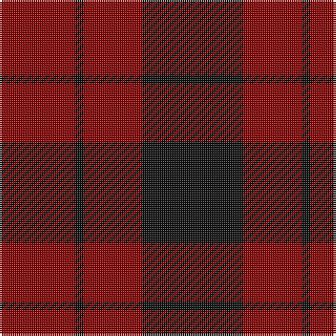

In pattern [KRKR](/patterns/krkr/).

This was sourced from register-of-tartans.  It is a [4 stripes tartan](/stripes/stripes4/).

Original link https://www.tartanregister.gov.uk/tartanDetails.aspx?ref=2094

## Attestations

This cloth appears in 2 source records; the oldest owns this page.

- 01/01/2002 — Lendrum (Black & Red) or MacFarlane (register-of-tartans, [record](https://www.tartanregister.gov.uk/tartanDetails.aspx?ref=2094))
- pre 2002 — Lendrum (Black & Red) (tartans-authority, [record](http://www.tartansauthority.com/tartan-ferret/display/1190/))

## Thread count
DR/36 K4 DR28 K/48

## Palette
Each colour and its ΔE from the base-6 reference it is a variant of.

| Colour | Shade | Base | ΔE (OKLab) |
|---|---|---|---|
| DR | <code style="background-color:#880000;">#880000</code> `#880000` | R <code style="background-color:#C80000;">#C80000</code> | 0.14 |
| K | <code style="background-color:#101010;">#101010</code> `#101010` | K <code style="background-color:#000000;">#000000</code> | 0.17 |

# Sample pattern

## Nearest tartans

The nearest existing variants by ΔTartan distance.

1. [Clan Anord (Corporate)](/setts/s4/k6r40k40r6-k101010-r880000/) — ΔT 1.26
1. [Wcwm 9275-1333-2](/setts/s4/k40r6k40r40-k101010-r880000/) — ΔT 1.42
1. [MacAn of Lurgyvallan (Hose)](/setts/s6/r36k4r20g24r16k8-g006818-k101010-r880000/) — ΔT 1.81
1. [Romsdal Tresfjord](/setts/s5/k4r8k14r2k4-k101010-r880000/) — ΔT 1.89
1. [Lendrum or MacFarlane Clan Tartan Tartan Number: 1190. Earliest known date: (1815-20) MacGregor-Hastie's notes say 'The sett is the same as MacFarlane Black and Red See products available Copyright © Blair Urquhart, Comrie, 2015](/setts/s4/k67r32k6r32-k101010-rc80000/) — ΔT 1.98
1. [Scottish Watch](/setts/s4/r208g78y8g78-g003820-r880000-yd09800/) — ΔT 1.99
1. [Lugo (2013)](/setts/s4/r80g32y8g32-g003820-rb03000-ye0a126/) — ΔT 2.05
1. [MacFarlane Red & Black (Artefact)](/setts/s4/k120r68k12r68-k101010-rc80000/) — ΔT 2.05
1. [MacLeod of Raasay (Highland Society of London)](/setts/s5/k26r4k26r38k4-k101010-rc80000/) — ΔT 2.06
1. [MacDonald of Sleat](/setts/s5/g32r10g4r36k4-g11450d-k000000-raa0000/) — ΔT 2.06

## Neighbour map

Every grey dot is one of 15726 variants placed by the first two principal components of the ΔTartan feature space (44% of its variance). Red is this tartan; blue dots are its nearest — click one to open its page.

<svg viewBox="0 0 640 380" role="img" style="max-width:100%;height:auto;border:1px solid #e0e0e0;border-radius:4px;display:block" xmlns="http://www.w3.org/2000/svg"><image href="/nn/cloud.v1.png" width="640" height="380"/><a href="/setts/s4/k6r40k40r6-k101010-r880000/"><circle cx="399.4" cy="306.9" r="4" fill="#3465a4"><title>Clan Anord (Corporate)</title></circle></a><a href="/setts/s4/k40r6k40r40-k101010-r880000/"><circle cx="430.4" cy="344.2" r="4" fill="#3465a4"><title>Wcwm 9275-1333-2</title></circle></a><a href="/setts/s6/r36k4r20g24r16k8-g006818-k101010-r880000/"><circle cx="424.1" cy="274.6" r="4" fill="#3465a4"><title>MacAn of Lurgyvallan (Hose)</title></circle></a><a href="/setts/s5/k4r8k14r2k4-k101010-r880000/"><circle cx="482.7" cy="314.4" r="4" fill="#3465a4"><title>Romsdal Tresfjord</title></circle></a><a href="/setts/s4/k67r32k6r32-k101010-rc80000/"><circle cx="365.7" cy="270.3" r="4" fill="#3465a4"><title>Lendrum or MacFarlane Clan Tartan Tartan Number: 1190. Earliest known date: (1815-20) MacGregor-Hastie's notes say 'The sett is the same as MacFarlane Black and Red See products available Copyright © Blair Urquhart, Comrie, 2015</title></circle></a><a href="/setts/s4/r208g78y8g78-g003820-r880000-yd09800/"><circle cx="459.7" cy="244.0" r="4" fill="#3465a4"><title>Scottish Watch</title></circle></a><a href="/setts/s4/r80g32y8g32-g003820-rb03000-ye0a126/"><circle cx="351.0" cy="262.8" r="4" fill="#3465a4"><title>Lugo (2013)</title></circle></a><a href="/setts/s4/k120r68k12r68-k101010-rc80000/"><circle cx="346.8" cy="279.3" r="4" fill="#3465a4"><title>MacFarlane Red &amp; Black (Artefact)</title></circle></a><a href="/setts/s5/k26r4k26r38k4-k101010-rc80000/"><circle cx="375.8" cy="263.3" r="4" fill="#3465a4"><title>MacLeod of Raasay (Highland Society of London)</title></circle></a><a href="/setts/s5/g32r10g4r36k4-g11450d-k000000-raa0000/"><circle cx="364.2" cy="248.5" r="4" fill="#3465a4"><title>MacDonald of Sleat</title></circle></a><circle cx="422.5" cy="304.4" r="5" fill="#c00000"/></svg>

ID: /setts/s4/k48r28k4r36-k101010-r880000/
