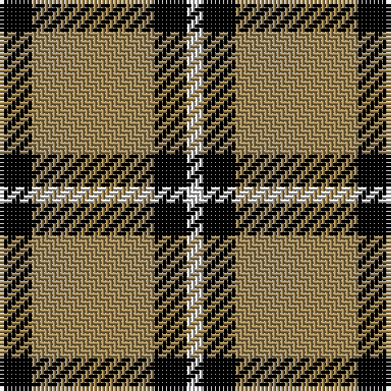

In pattern [KYKW](/patterns/kykw/).

This was sourced from tartans-authority.  It is a [4 stripes tartan](/stripes/stripes4/).

Original link http://www.tartansauthority.com/tartan-ferret/display/5775/

## Thread count
K/8 LT30 K8 LN/4

## Palette
Each colour and its ΔE from the base-6 reference it is a variant of.

| Colour | Shade | Base | ΔE (OKLab) |
|---|---|---|---|
| K | <code style="background-color:#000000;">#000000</code> `#000000` | K <code style="background-color:#000000;">#000000</code> | 0.00 |
| LN | <code style="background-color:#E0E0E0;">#E0E0E0</code> `#E0E0E0` | W <code style="background-color:#F7F7F7;">#F7F7F7</code> | 0.07 |
| LT | <code style="background-color:#A08858;">#A08858</code> `#A08858` | Y <code style="background-color:#F2BF00;">#F2BF00</code> | 0.21 |

# Sample pattern

## Nearest tartans

The nearest existing variants by ΔTartan distance.

1. [Juchter (Personal)](/setts/s4/g20w5r3w5~g003820-rc80000-we0e0e0~x2/) — ΔT 0.85
1. [Lords of Skye (Fashion?)](/setts/s4/k46g7k8w20~g604000-k101010-wfcfcfc~x2/) — ΔT 1.15
1. [Shembe Zulu Church](/setts/s5/k5w25r6k45w4~k101010-rc80000-wfcfcfc~x2/) — ΔT 1.18
1. [MacLeod of Lewis (Vestiarium Scoticum)](/setts/s5/k8y1k8y12r1~k101010-rc80000-yd8b000~x4/) — ΔT 1.22
1. [Lords of Skye Trade Tartan Tartan Number: 1218. Earliest known date: 1983 Nothing See products available Copyright © Blair Urquhart, Comrie, 2015](/setts/s4/k46g7k8w20~g604000-k101010-we0e0e0~x2/) — ΔT 1.23
1. [Lords of Skye](/setts/s4/k46g7k8w20~g503c14-k101010-we0e0e0~x2/) — ΔT 1.27
1. [Barclay, dress](/setts/s4/w1y6k6y1~k000000-we0e0e0-yf0c000~x2/) — ΔT 1.36
1. [Loch Tummel](/setts/s5/g38w9g3k9w3~g603800-k101010-wfcfcfc~x2/) — ΔT 1.40
1. [Barclay Dress](/setts/s4/y1k6y6ya1~k000000-yaaaa00-yaaaaaaa~x2/) — ΔT 1.40
1. [MacLeod of Lewis](/setts/s5/k8y1k8y12r1~k000000-rc00000-yf0c000~x4/) — ΔT 1.46

## Neighbour map

Every grey dot is one of 15726 variants placed by the first two principal components of the ΔTartan feature space (44% of its variance). Red is this tartan; blue dots are its nearest — click one to open its page.

<svg viewBox="0 0 640 380" role="img" style="max-width:100%;height:auto;border:1px solid #e0e0e0;border-radius:4px;display:block" xmlns="http://www.w3.org/2000/svg"><image href="/nn/cloud.v1.png" width="640" height="380"/><a href="/setts/s4/g20w5r3w5~g003820-rc80000-we0e0e0~x2/"><circle cx="304.2" cy="249.5" r="4" fill="#3465a4"><title>Juchter (Personal)</title></circle></a><a href="/setts/s4/k46g7k8w20~g604000-k101010-wfcfcfc~x2/"><circle cx="333.6" cy="258.1" r="4" fill="#3465a4"><title>Lords of Skye (Fashion?)</title></circle></a><a href="/setts/s5/k5w25r6k45w4~k101010-rc80000-wfcfcfc~x2/"><circle cx="314.7" cy="206.4" r="4" fill="#3465a4"><title>Shembe Zulu Church</title></circle></a><a href="/setts/s5/k8y1k8y12r1~k101010-rc80000-yd8b000~x4/"><circle cx="295.3" cy="227.1" r="4" fill="#3465a4"><title>MacLeod of Lewis (Vestiarium Scoticum)</title></circle></a><a href="/setts/s4/k46g7k8w20~g604000-k101010-we0e0e0~x2/"><circle cx="339.0" cy="261.0" r="4" fill="#3465a4"><title>Lords of Skye Trade Tartan Tartan Number: 1218. Earliest known date: 1983 Nothing See products available Copyright © Blair Urquhart, Comrie, 2015</title></circle></a><a href="/setts/s4/k46g7k8w20~g503c14-k101010-we0e0e0~x2/"><circle cx="339.0" cy="261.3" r="4" fill="#3465a4"><title>Lords of Skye</title></circle></a><a href="/setts/s4/w1y6k6y1~k000000-we0e0e0-yf0c000~x2/"><circle cx="236.5" cy="253.9" r="4" fill="#3465a4"><title>Barclay, dress</title></circle></a><a href="/setts/s5/g38w9g3k9w3~g603800-k101010-wfcfcfc~x2/"><circle cx="381.5" cy="200.7" r="4" fill="#3465a4"><title>Loch Tummel</title></circle></a><a href="/setts/s4/y1k6y6ya1~k000000-yaaaa00-yaaaaaaa~x2/"><circle cx="239.1" cy="262.3" r="4" fill="#3465a4"><title>Barclay Dress</title></circle></a><a href="/setts/s5/k8y1k8y12r1~k000000-rc00000-yf0c000~x4/"><circle cx="287.5" cy="227.0" r="4" fill="#3465a4"><title>MacLeod of Lewis</title></circle></a><circle cx="306.4" cy="243.6" r="5" fill="#c00000"/></svg>

ID: /setts/s4/k4y15k4w2~k000000-we0e0e0-ya08858~x2/
