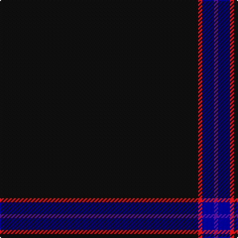

**Bands:** [BBRK](/stripes/bbrk/) · **Stripes:** [DP DB R K](/stripes/stripes4/) DP DB R K

This was sourced from register-of-tartans.  It is a [4 band tartan](/bands/bands4/).

Original link https://www.tartanregister.gov.uk/tartanDetails.aspx?ref=10130

## Register references

External register numbers recorded for this tartan.

- Scottish Register of Tartans: [10130](https://www.tartanregister.gov.uk/tartanDetails.aspx?ref=10130)

## Thread count
K/200 R4 DB12 P/4

## Palette
Each colour and its ΔE from the base-6 reference it is a variant of.

| Colour | Shade | Base | ΔE (OKLab) |
|---|---|---|---|
| DB | <code style="background-color:#000080;">#000080</code> `#000080` | B <code style="background-color:#2A418A;">#2A418A</code> | 0.14 |
| K | <code style="background-color:#101010;">#101010</code> `#101010` | K <code style="background-color:#000000;">#000000</code> | 0.17 |
| P | <code style="background-color:#551A8B;">#551A8B</code> `#551A8B` | B <code style="background-color:#2A418A;">#2A418A</code> | 0.10 |
| R | <code style="background-color:#D41A1F;">#D41A1F</code> `#D41A1F` | R <code style="background-color:#CC0000;">#CC0000</code> | 0.03 |

# Sample pattern

## Nearest tartans

The nearest existing variants by ΔTartan distance.

1. [Alich (Personal)](/setts/s4/k50r1dt3dp1~x4/) — ΔT 0.32
1. [Allt Dubh (Black Burn)](/setts/s6/k99r5k4r3k2y1~x2/) — ΔT 1.43
1. [Galloway (Name)](/setts/s4/r2k50n2r1~x2/) — ΔT 1.76
1. [SmartWool](/setts/s5/k200dy3lo3dy3lo3/) — ΔT 1.77
1. [Eternity, Dedicated 2 Weddings](/setts/s5/do88o3ly2k2lr1~x2/) — ΔT 2.11
1. [St. David's (District)](/setts/s6/dg60r2dg8r1dg5k2/) — ΔT 2.31
1. [Callaghan](/setts/s7/k5ly1k8dg8k41o1k5~x2/) — ΔT 2.36
1. [Webster, Colin Wesley (Personal)](/setts/s10/k100dp5k4dp3k2y1k2dp2k4dp5~x2/) — ΔT 2.52
1. [Pisniak (Personal)](/setts/s7/dt40dg3dp4dt28lo2lr2dt7~x2/) — ΔT 2.68
1. [Pasteur](/setts/s4/dy10ly1dy30y3~x4/) — ΔT 2.78

## Neighbour map

Every grey dot is one of 14313 variants placed by the first two principal components of the ΔTartan feature space (44% of its variance). Red is this tartan; blue dots are its nearest — click one to open its page.

<svg viewBox="0 0 640 380" role="img" style="max-width:100%;height:auto;border:1px solid #e0e0e0;border-radius:4px;display:block" xmlns="http://www.w3.org/2000/svg"><image href="/nn/cloud.v1.png" width="640" height="380"/><a href="/setts/s4/k50r1dt3dp1~x4/"><circle cx="626.0" cy="217.5" r="4" fill="#3465a4"><title>Alich (Personal)</title></circle></a><a href="/setts/s6/k99r5k4r3k2y1~x2/"><circle cx="626.0" cy="194.0" r="4" fill="#3465a4"><title>Allt Dubh (Black Burn)</title></circle></a><a href="/setts/s4/r2k50n2r1~x2/"><circle cx="626.0" cy="204.7" r="4" fill="#3465a4"><title>Galloway (Name)</title></circle></a><a href="/setts/s5/k200dy3lo3dy3lo3/"><circle cx="626.0" cy="191.6" r="4" fill="#3465a4"><title>SmartWool</title></circle></a><a href="/setts/s5/do88o3ly2k2lr1~x2/"><circle cx="626.0" cy="155.7" r="4" fill="#3465a4"><title>Eternity, Dedicated 2 Weddings</title></circle></a><a href="/setts/s6/dg60r2dg8r1dg5k2/"><circle cx="626.0" cy="200.6" r="4" fill="#3465a4"><title>St. David's (District)</title></circle></a><a href="/setts/s7/k5ly1k8dg8k41o1k5~x2/"><circle cx="626.0" cy="196.2" r="4" fill="#3465a4"><title>Callaghan</title></circle></a><a href="/setts/s10/k100dp5k4dp3k2y1k2dp2k4dp5~x2/"><circle cx="626.0" cy="148.6" r="4" fill="#3465a4"><title>Webster, Colin Wesley (Personal)</title></circle></a><a href="/setts/s7/dt40dg3dp4dt28lo2lr2dt7~x2/"><circle cx="626.0" cy="204.6" r="4" fill="#3465a4"><title>Pisniak (Personal)</title></circle></a><a href="/setts/s4/dy10ly1dy30y3~x4/"><circle cx="626.0" cy="239.5" r="4" fill="#3465a4"><title>Pasteur</title></circle></a><circle cx="626.0" cy="213.8" r="5" fill="#c00000"/></svg>

ID: /setts/s4/k50r1db3dp1~x4/
