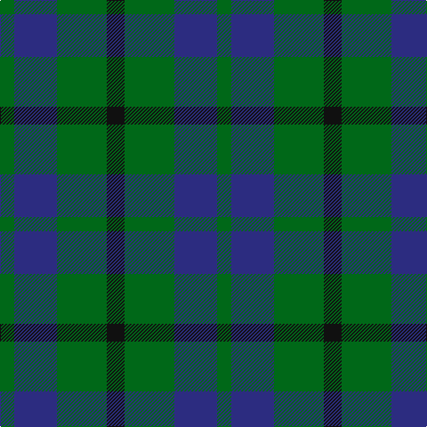

**Bands:** [GBGK](/stripes/gbgk/) · **Stripes:** [G DB G K](/stripes/stripes4/) G DB G K

This was sourced from tartans-authority.  It is a [4 band tartan](/bands/bands4/).

Original link http://www.tartansauthority.com/tartan-ferret/display/8861/

## Thread count
G/16 DB48 G56 K/20

## Palette
Each colour and its ΔE from the base-6 reference it is a variant of.

| Colour | Shade | Base | ΔE (OKLab) |
|---|---|---|---|
| DB | <code style="background-color:#2C2C80;">#2C2C80</code> `#2C2C80` | B <code style="background-color:#2A418A;">#2A418A</code> | 0.06 |
| G | <code style="background-color:#006818;">#006818</code> `#006818` | G <code style="background-color:#006100;">#006100</code> | 0.02 |
| K | <code style="background-color:#101010;">#101010</code> `#101010` | K <code style="background-color:#000000;">#000000</code> | 0.17 |

# Sample pattern

## Nearest tartans

The nearest existing variants by ΔTartan distance.

1. [Agnew](/setts/s3/db53g42r14/) — ΔT 1.17
1. [Agnew](/setts/s3/db53g42r14~x2/) — ΔT 1.27
1. [Glen Lyon #2](/setts/s5/t2g4k5g4t1~x2/) — ΔT 1.31
1. [Ferguson](/setts/s3/db6g5r1~x4/) — ΔT 1.32
1. [Austin Clan](/setts/s5/db4k4db4g9k2~x2/) — ΔT 1.35
1. [Wilson's No 84, Ferguson](/setts/s3/db5g6r1~x4/) — ΔT 1.42
1. [Wilson's No 62, (Ferguson)](/setts/s3/db13r2g13~x2/) — ΔT 1.48
1. [Wilson's No.055](/setts/s3/g6dp5t1~x4/) — ΔT 1.52
1. [Omega Delta Sigma, National Veterans Fraternity](/setts/s4/k15dt40k9o10~x2/) — ΔT 1.54
1. [Wilson's No.050](/setts/s3/k5g6t1~x4/) — ΔT 1.56

## Neighbour map

Every grey dot is one of 14313 variants placed by the first two principal components of the ΔTartan feature space (44% of its variance). Red is this tartan; blue dots are its nearest — click one to open its page.

<svg viewBox="0 0 640 380" role="img" style="max-width:100%;height:auto;border:1px solid #e0e0e0;border-radius:4px;display:block" xmlns="http://www.w3.org/2000/svg"><image href="/nn/cloud.v1.png" width="640" height="380"/><a href="/setts/s3/db53g42r14/"><circle cx="247.9" cy="346.4" r="4" fill="#3465a4"><title>Agnew</title></circle></a><a href="/setts/s3/db53g42r14~x2/"><circle cx="252.0" cy="348.3" r="4" fill="#3465a4"><title>Agnew</title></circle></a><a href="/setts/s5/t2g4k5g4t1~x2/"><circle cx="230.3" cy="315.1" r="4" fill="#3465a4"><title>Glen Lyon #2</title></circle></a><a href="/setts/s3/db6g5r1~x4/"><circle cx="293.4" cy="323.9" r="4" fill="#3465a4"><title>Ferguson</title></circle></a><a href="/setts/s5/db4k4db4g9k2~x2/"><circle cx="208.9" cy="323.5" r="4" fill="#3465a4"><title>Austin Clan</title></circle></a><a href="/setts/s3/db5g6r1~x4/"><circle cx="291.6" cy="323.8" r="4" fill="#3465a4"><title>Wilson's No 84, Ferguson</title></circle></a><a href="/setts/s3/db13r2g13~x2/"><circle cx="288.6" cy="320.4" r="4" fill="#3465a4"><title>Wilson's No 62, (Ferguson)</title></circle></a><a href="/setts/s3/g6dp5t1~x4/"><circle cx="289.8" cy="319.3" r="4" fill="#3465a4"><title>Wilson's No.055</title></circle></a><a href="/setts/s4/k15dt40k9o10~x2/"><circle cx="319.0" cy="320.9" r="4" fill="#3465a4"><title>Omega Delta Sigma, National Veterans Fraternity</title></circle></a><a href="/setts/s3/k5g6t1~x4/"><circle cx="284.5" cy="325.5" r="4" fill="#3465a4"><title>Wilson's No.050</title></circle></a><circle cx="265.1" cy="346.0" r="5" fill="#c00000"/></svg>

ID: /setts/s4/k5g14db12g4~x4/
