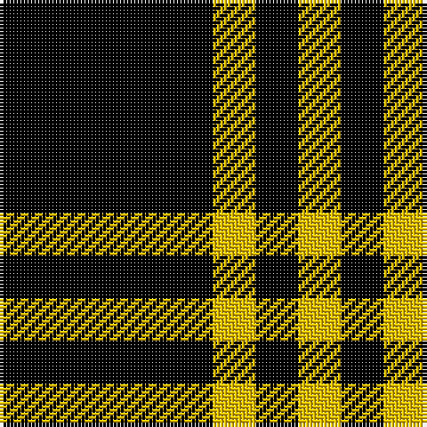

This page is one **sett** — a single exact thread-count. It belongs to the [tartan](/tartans/k5ly1k1/)
(the same proportion at any scale), whose colour order is pattern [KYKY](/stripes/kyky/).

Sourced from weddslist.  It is a [4 stripe tartan](/stripes/stripes4/).

Original link http://www.weddslist.com/cgi-bin/tartans/pg.pl?source=sts

## Thread count
K/60 Y12 K12 Y/12

## Palette

Palette: <strong>Ingles Buchan</strong> <small style="color:#888">(1 of 2 colours)</small>
<table><thead><tr><th>Colour</th><th>Threads</th><th>Shade</th><th>Base</th><th>OKLCh</th></tr></thead><tbody><tr><td>K/</td><td style="text-align:right;font-variant-numeric:tabular-nums">60</td><td><code style="background-color:#000000;">#000000</code> <small style="color:#888">#000000</small></td><td>K <code style="background-color:#000000;">#000000</code></td><td><small style="color:#888">oklch(0.0% 0.000 0.0)</small></td></tr><tr><td>Y</td><td style="text-align:right;font-variant-numeric:tabular-nums">12</td><td><code style="background-color:#F0C000;">#F0C000</code> <small style="color:#888">#F0C000</small></td><td>Y <code style="background-color:#F2BF00;">#F2BF00</code></td><td><small style="color:#888">oklch(82.7% 0.169 90.5)</small></td></tr><tr><td>K</td><td style="text-align:right;font-variant-numeric:tabular-nums">12</td><td><code style="background-color:#000000;">#000000</code> <small style="color:#888">#000000</small></td><td>K <code style="background-color:#000000;">#000000</code></td><td><small style="color:#888">oklch(0.0% 0.000 0.0)</small></td></tr><tr><td>Y/</td><td style="text-align:right;font-variant-numeric:tabular-nums">12</td><td><code style="background-color:#F0C000;">#F0C000</code> <small style="color:#888">#F0C000</small></td><td>Y <code style="background-color:#F2BF00;">#F2BF00</code></td><td><small style="color:#888">oklch(82.7% 0.169 90.5)</small></td></tr></tbody></table>

# Sample pattern

## Nearest tartans

The nearest existing variants by ΔTartan distance, with this tartan at the top so the swatches line up against it.

ΔTartan

Tartan

Sett

—

<a href="/ttd/edit/#slug=k5ly1k1~x12">Justus</a> <a class="nn-out" href="/setts/s4/k5ly1k1~x12/" title="open its dictionary page">↗</a>

1.16

<a href="/setts/s4/k5lo1k1~x20/">Justus #2 (Personal)</a>

1.61

<a href="/setts/s6/k5lo1k1lo1~x20/">Justus #2 (Personal)</a>

1.84

<a href="/ttd/edit/#slug=k21lb2k5lb9k13g2~x4">New Zealand (2000)</a> <a class="nn-out" href="/setts/s6/k21lb2k5lb9k13g2~x4/" title="open its dictionary page">↗</a>

1.85

<a href="/ttd/edit/#slug=k46o7k8w20~x2">Lords, of Skye</a> <a class="nn-out" href="/setts/s4/k46o7k8w20~x2/" title="open its dictionary page">↗</a>

2.02

<a href="/ttd/edit/#slug=ly7k4ly4k39r4~x2">Welsh National #3</a> <a class="nn-out" href="/setts/s5/ly7k4ly4k39r4~x2/" title="open its dictionary page">↗</a>

2.16

<a href="/ttd/edit/#slug=ly9k4ly4k45r4~x2">Gwynn (Name)</a> <a class="nn-out" href="/setts/s5/ly9k4ly4k45r4~x2/" title="open its dictionary page">↗</a>

2.18

<a href="/ttd/edit/#slug=k21w2k5w9k13g2~x4">New Zealand District Tartan Tartan Number: 3250. Earliest known date: 2000 Designed as a District sett by Timely Marketing Promotions, Christchurch, New Zealand See products available Copyright © Blair Urquhart, Comrie, 2015</a> <a class="nn-out" href="/setts/s6/k21w2k5w9k13g2~x4/" title="open its dictionary page">↗</a>

2.34

<a href="/ttd/edit/#slug=k6ly1k6ly6~x6">Raeburn</a> <a class="nn-out" href="/setts/s4/k6ly1k6ly6~x6/" title="open its dictionary page">↗</a>

2.35

<a href="/ttd/edit/#slug=k46dy7k8w20~x2">Lords of Skye (Fashion?)</a> <a class="nn-out" href="/setts/s4/k46dy7k8w20~x2/" title="open its dictionary page">↗</a>

2.38

<a href="/ttd/edit/#slug=k34ly3k34ly26~x2">Raeburn</a> <a class="nn-out" href="/setts/s4/k34ly3k34ly26~x2/" title="open its dictionary page">↗</a>

## Neighbour map

Every grey dot is one of 14359 variants placed by the first two principal components of the ΔTartan feature space (44% of its variance). Red is this tartan; blue dots are its nearest — click one to open its page.

<svg viewBox="0 0 640 380" role="img" style="max-width:100%;height:auto;border:1px solid #e0e0e0;border-radius:4px;display:block" xmlns="http://www.w3.org/2000/svg"><image href="/nn/cloud.v1.png" width="640" height="380"/><a href="/setts/s4/k5lo1k1~x20/"><circle cx="442.6" cy="284.9" r="4" fill="#3465a4"><title>Justus #2 (Personal)</title></circle></a><a href="/setts/s6/k5lo1k1lo1~x20/"><circle cx="399.0" cy="260.2" r="4" fill="#3465a4"><title>Justus #2 (Personal)</title></circle></a><a href="/setts/s6/k21lb2k5lb9k13g2~x4/"><circle cx="415.2" cy="235.1" r="4" fill="#3465a4"><title>New Zealand (2000)</title></circle></a><a href="/setts/s4/k46o7k8w20~x2/"><circle cx="336.8" cy="257.5" r="4" fill="#3465a4"><title>Lords, of Skye</title></circle></a><a href="/setts/s5/ly7k4ly4k39r4~x2/"><circle cx="444.0" cy="208.1" r="4" fill="#3465a4"><title>Welsh National #3</title></circle></a><a href="/setts/s5/ly9k4ly4k45r4~x2/"><circle cx="452.2" cy="202.0" r="4" fill="#3465a4"><title>Gwynn (Name)</title></circle></a><a href="/setts/s6/k21w2k5w9k13g2~x4/"><circle cx="414.9" cy="228.3" r="4" fill="#3465a4"><title>New Zealand District Tartan Tartan Number: 3250. Earliest known date: 2000 Designed as a District sett by Timely Marketing Promotions, Christchurch, New Zealand See products available Copyright © Blair Urquhart, Comrie, 2015</title></circle></a><a href="/setts/s4/k6ly1k6ly6~x6/"><circle cx="312.1" cy="307.5" r="4" fill="#3465a4"><title>Raeburn</title></circle></a><a href="/setts/s4/k46dy7k8w20~x2/"><circle cx="334.9" cy="251.0" r="4" fill="#3465a4"><title>Lords of Skye (Fashion?)</title></circle></a><a href="/setts/s4/k34ly3k34ly26~x2/"><circle cx="390.0" cy="279.3" r="4" fill="#3465a4"><title>Raeburn</title></circle></a><circle cx="425.6" cy="282.9" r="5" fill="#c00000"/></svg>

ID: /setts/s4/k5ly1k1~x12/
