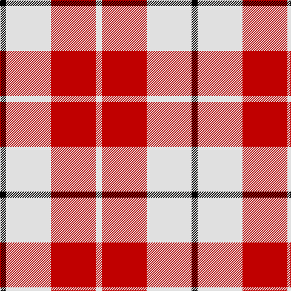

In pattern [KWRW](/patterns/kwrw/).

This was sourced from weddslist.  It is a [4 stripes tartan](/stripes/stripes4/).

Original link http://www.weddslist.com/cgi-bin/tartans/pg.pl?source=sts

## Thread count
K/10 LN74 R74 LN/10

## Palette
Each colour and its ΔE from the base-6 reference it is a variant of.

| Colour | Shade | Base | ΔE (OKLab) |
|---|---|---|---|
| K | <code style="background-color:#000000;">#000000</code> `#000000` | K <code style="background-color:#000000;">#000000</code> | 0.00 |
| LN | <code style="background-color:#E0E0E0;">#E0E0E0</code> `#E0E0E0` | W <code style="background-color:#F7F7F7;">#F7F7F7</code> | 0.07 |
| R | <code style="background-color:#C00000;">#C00000</code> `#C00000` | R <code style="background-color:#CC0000;">#CC0000</code> | 0.03 |

# Sample pattern

## Nearest tartans

The nearest existing variants by ΔTartan distance.

1. [MacRae of Conchra #2](/setts/s4/k5w37r37w5~k101010-rdc0000-we0e0e0~x2/) — ΔT 0.49
1. [Lewis, Magenta (Dance)](/setts/s4/w4r31w35y4~rb80478-wf0e0c8-y54b8b8~x2/) — ΔT 1.24
1. [Hose (Dunmore)](/setts/s3/r13k1w13~k000000-rc80000-wc8c8c8~x4/) — ΔT 1.34
1. [Buchanan VS](/setts/s6/w2r4w2r4w9k1~k000000-rff0000-wd0d0d0/) — ΔT 1.38
1. [Ailsa, Red V2 (Dance)](/setts/s6/r8ra3r28w32ra3w4~rc8002c-ra880000-wf0e0c8~x2/) — ΔT 1.47
1. [Buchanan #5](/setts/s6/k2w28r13w2r13w2~k101010-r960028-we0e0e0~x2/) — ΔT 1.53
1. [Lewis, Red (Dance)](/setts/s4/r4w35r31w4~rd40000-wf0e0c8~x2/) — ΔT 1.54
1. [Masai Shuka 24 (Artefact)](/setts/s4/b15w2r20w3~b2888c4-rc80000-we0e0e0~x4/) — ΔT 1.57
1. [Buchanan 4](/setts/s6/k2w28r13w2r13w2~k000000-r900030-we0e0e0~x2/) — ΔT 1.57
1. [Erskine Red & White (Dance)](/setts/s6/r2w1r9w9r1w2~rc80000-wfcfcfc~x6/) — ΔT 1.58

## Neighbour map

Every grey dot is one of 15726 variants placed by the first two principal components of the ΔTartan feature space (44% of its variance). Red is this tartan; blue dots are its nearest — click one to open its page.

<svg viewBox="0 0 640 380" role="img" style="max-width:100%;height:auto;border:1px solid #e0e0e0;border-radius:4px;display:block" xmlns="http://www.w3.org/2000/svg"><image href="/nn/cloud.v1.png" width="640" height="380"/><a href="/setts/s4/k5w37r37w5~k101010-rdc0000-we0e0e0~x2/"><circle cx="281.5" cy="230.3" r="4" fill="#3465a4"><title>MacRae of Conchra #2</title></circle></a><a href="/setts/s4/w4r31w35y4~rb80478-wf0e0c8-y54b8b8~x2/"><circle cx="306.9" cy="225.6" r="4" fill="#3465a4"><title>Lewis, Magenta (Dance)</title></circle></a><a href="/setts/s3/r13k1w13~k000000-rc80000-wc8c8c8~x4/"><circle cx="305.7" cy="242.8" r="4" fill="#3465a4"><title>Hose (Dunmore)</title></circle></a><a href="/setts/s6/w2r4w2r4w9k1~k000000-rff0000-wd0d0d0/"><circle cx="322.3" cy="214.0" r="4" fill="#3465a4"><title>Buchanan VS</title></circle></a><a href="/setts/s6/r8ra3r28w32ra3w4~rc8002c-ra880000-wf0e0c8~x2/"><circle cx="293.3" cy="186.6" r="4" fill="#3465a4"><title>Ailsa, Red V2 (Dance)</title></circle></a><a href="/setts/s6/k2w28r13w2r13w2~k101010-r960028-we0e0e0~x2/"><circle cx="322.4" cy="179.1" r="4" fill="#3465a4"><title>Buchanan #5</title></circle></a><a href="/setts/s4/r4w35r31w4~rd40000-wf0e0c8~x2/"><circle cx="349.9" cy="242.4" r="4" fill="#3465a4"><title>Lewis, Red (Dance)</title></circle></a><a href="/setts/s4/b15w2r20w3~b2888c4-rc80000-we0e0e0~x4/"><circle cx="300.3" cy="235.0" r="4" fill="#3465a4"><title>Masai Shuka 24 (Artefact)</title></circle></a><a href="/setts/s6/k2w28r13w2r13w2~k000000-r900030-we0e0e0~x2/"><circle cx="318.9" cy="178.6" r="4" fill="#3465a4"><title>Buchanan 4</title></circle></a><a href="/setts/s6/r2w1r9w9r1w2~rc80000-wfcfcfc~x6/"><circle cx="322.0" cy="208.3" r="4" fill="#3465a4"><title>Erskine Red &amp; White (Dance)</title></circle></a><circle cx="271.9" cy="229.8" r="5" fill="#c00000"/></svg>

ID: /setts/s4/k5w37r37w5~k000000-rc00000-we0e0e0~x2/
