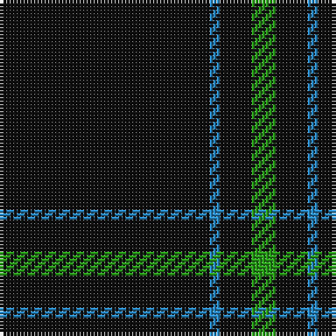

**Bands:** [KBKG](/stripes/kbkg/) · **Stripes:** [K T K G](/stripes/stripes4/) K T K G

This was sourced from tartans-authority.  It is a [4 band tartan](/bands/bands4/).

Original link http://www.tartansauthority.com/tartan-ferret/display/6018/

## Thread count
K/60 B3 K9 G/7

## Palette
Each colour and its ΔE from the base-6 reference it is a variant of.

| Colour | Shade | Base | ΔE (OKLab) |
|---|---|---|---|
| B | <code style="background-color:#2888C4;">#2888C4</code> `#2888C4` | B <code style="background-color:#2A418A;">#2A418A</code> | 0.21 |
| G | <code style="background-color:#289C18;">#289C18</code> `#289C18` | G <code style="background-color:#006100;">#006100</code> | 0.19 |
| K | <code style="background-color:#101010;">#101010</code> `#101010` | K <code style="background-color:#000000;">#000000</code> | 0.17 |

# Sample pattern

## Nearest tartans

The nearest existing variants by ΔTartan distance.

1. [Dunnotar (School)](/setts/s4/k72w3k11db9/) — ΔT 0.84
1. [Fily (Verneuil L'tang) (Personal)](/setts/s3/k20w2t1~x6/) — ΔT 1.46
1. [Chafyn House (School)](/setts/s7/k72r3k11t9k11r3k37/) — ΔT 1.50
1. [NewGeneration Alchemy (NGA) Inc](/setts/s6/k31r2k10db1k1w1~x4/) — ΔT 1.70
1. [Unidentified #45](/setts/s7/k24dg3r3k24r2k2r2/) — ΔT 1.73
1. [Pasteur Fancy Tartan Tartan Number: 7094. Earliest known date: 1836 The pattern is taken from a shawl or cloak which appears in a portrait of Louie Pasteur's mother. The portrait was drawn in pastels when Pasteur was just 13 years old. The information came Marie-Claude Fortier researching the life of Pasteur. See products available Copyright © Blair Urquhart, Comrie, 2015](/setts/s4/do10ly1do30y3~x4/) — ΔT 1.76
1. [Fily (Verneuil L'tang) (Personal)](/setts/s3/k20w2lt1~x6/) — ΔT 1.89
1. [MacLaine of Lochbuie Hunting](/setts/s5/dt32r3dt4k2lo3~x2/) — ΔT 1.99
1. [Lanoir](/setts/s6/k4r4k20r1k20w4~x6/) — ΔT 1.99
1. [Dewi Sant](/setts/s6/dg30r2dg8r1dg5w2/) — ΔT 2.04

## Neighbour map

Every grey dot is one of 14299 variants placed by the first two principal components of the ΔTartan feature space (44% of its variance). Red is this tartan; blue dots are its nearest — click one to open its page.

<svg viewBox="0 0 640 380" role="img" style="max-width:100%;height:auto;border:1px solid #e0e0e0;border-radius:4px;display:block" xmlns="http://www.w3.org/2000/svg"><image href="/nn/cloud.v1.png" width="640" height="380"/><a href="/setts/s4/k72w3k11db9/"><circle cx="626.0" cy="233.0" r="4" fill="#3465a4"><title>Dunnotar (School)</title></circle></a><a href="/setts/s3/k20w2t1~x6/"><circle cx="601.0" cy="226.8" r="4" fill="#3465a4"><title>Fily (Verneuil L'tang) (Personal)</title></circle></a><a href="/setts/s7/k72r3k11t9k11r3k37/"><circle cx="626.0" cy="213.8" r="4" fill="#3465a4"><title>Chafyn House (School)</title></circle></a><a href="/setts/s6/k31r2k10db1k1w1~x4/"><circle cx="626.0" cy="172.4" r="4" fill="#3465a4"><title>NewGeneration Alchemy (NGA) Inc</title></circle></a><a href="/setts/s7/k24dg3r3k24r2k2r2/"><circle cx="578.3" cy="225.2" r="4" fill="#3465a4"><title>Unidentified #45</title></circle></a><a href="/setts/s4/do10ly1do30y3~x4/"><circle cx="626.0" cy="231.9" r="4" fill="#3465a4"><title>Pasteur Fancy Tartan Tartan Number: 7094. Earliest known date: 1836 The pattern is taken from a shawl or cloak which appears in a portrait of Louie Pasteur's mother. The portrait was drawn in pastels when Pasteur was just 13 years old. The information came Marie-Claude Fortier researching the life of Pasteur. See products available Copyright © Blair Urquhart, Comrie, 2015</title></circle></a><a href="/setts/s3/k20w2lt1~x6/"><circle cx="588.0" cy="220.6" r="4" fill="#3465a4"><title>Fily (Verneuil L'tang) (Personal)</title></circle></a><a href="/setts/s5/dt32r3dt4k2lo3~x2/"><circle cx="585.6" cy="212.7" r="4" fill="#3465a4"><title>MacLaine of Lochbuie Hunting</title></circle></a><a href="/setts/s6/k4r4k20r1k20w4~x6/"><circle cx="538.4" cy="209.3" r="4" fill="#3465a4"><title>Lanoir</title></circle></a><a href="/setts/s6/dg30r2dg8r1dg5w2/"><circle cx="626.0" cy="202.2" r="4" fill="#3465a4"><title>Dewi Sant</title></circle></a><circle cx="626.0" cy="231.3" r="5" fill="#c00000"/></svg>

ID: /setts/s4/k60t3k9g7/
