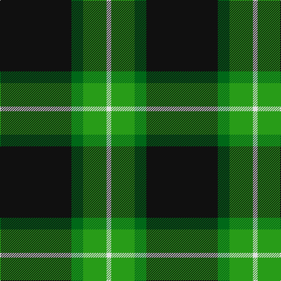

In pattern [KGGW](/patterns/kggw/).

This was sourced from tartans-authority.  It is a [4 stripes tartan](/stripes/stripes4/).

Original link http://www.tartansauthority.com/tartan-ferret/display/8505/

## Thread count
K/122 Ga20 G40 LN/8

## Palette
Each colour and its ΔE from the base-6 reference it is a variant of.

| Colour | Shade | Base | ΔE (OKLab) |
|---|---|---|---|
| G | <code style="background-color:#289C18;">#289C18</code> `#289C18` | G <code style="background-color:#006100;">#006100</code> | 0.19 |
| Ga | <code style="background-color:#006818;">#006818</code> `#006818` | G <code style="background-color:#006100;">#006100</code> | 0.02 |
| K | <code style="background-color:#101010;">#101010</code> `#101010` | K <code style="background-color:#000000;">#000000</code> | 0.17 |
| LN | <code style="background-color:#E0E0E0;">#E0E0E0</code> `#E0E0E0` | W <code style="background-color:#F7F7F7;">#F7F7F7</code> | 0.07 |

# Sample pattern

## Nearest tartans

The nearest existing variants by ΔTartan distance.

1. [Wilson's No.205](/setts/s4/w1b4g10wa1~b280034-g044028-w00fcfc-wafcfcfc~x2/) — ΔT 1.14
1. [Perry, Alex (Personal)](/setts/s4/k62b24y5w8~b5c5c5c-k101010-wfcfcfc-ybc8c00~x2/) — ΔT 1.18
1. [Forbes VS](/setts/s6/r1g16k8g3k4y1~g004c00-k000000-rc80000-yffc800/) — ΔT 1.24
1. [Wilson's No.189](/setts/s4/b4g10r1w1~b440044-g006818-rc80000-wfcfcfc~x2/) — ΔT 1.29
1. [O'Donoghue](/setts/s5/g62k40y3k3w3~g006818-k101010-wf8f8f8-ye8c000~x2/) — ΔT 1.36
1. [Forbes VS](/setts/s6/r1g16k8g3k4y1~g11450d-k000000-raa0000-yaaaa00~x2/) — ΔT 1.37
1. [Forbes VS](/setts/s6/r1g16k8g3k4y1~g11450d-k000000-raa0000-yaaaa00/) — ΔT 1.37
1. [Childers Regimental Tartan Tartan Number: 1090. Earliest known date: 1907 1s Battalion, 1st Gurkha Rifles is recorded as using this tartan for plaids, ribbons and bag-covers. See products available Copyright © Blair Urquhart, Comrie, 2015](/setts/s6/k88g17k8ga28k8r6~g289c18-ga006818-k101010-rc80000~x2/) — ΔT 1.37
1. [Childers (Personal)](/setts/s6/k44g8k4ga13k4w3~g408060-ga006818-k101010-we0e0e0~x2/) — ΔT 1.37
1. [Bumbee #1 (Fashion)](/setts/s4/g10k2b5g1~b300048-g006818-k000000~x8/) — ΔT 1.42

## Neighbour map

Every grey dot is one of 15726 variants placed by the first two principal components of the ΔTartan feature space (44% of its variance). Red is this tartan; blue dots are its nearest — click one to open its page.

<svg viewBox="0 0 640 380" role="img" style="max-width:100%;height:auto;border:1px solid #e0e0e0;border-radius:4px;display:block" xmlns="http://www.w3.org/2000/svg"><image href="/nn/cloud.v1.png" width="640" height="380"/><a href="/setts/s4/w1b4g10wa1~b280034-g044028-w00fcfc-wafcfcfc~x2/"><circle cx="331.8" cy="228.2" r="4" fill="#3465a4"><title>Wilson's No.205</title></circle></a><a href="/setts/s4/k62b24y5w8~b5c5c5c-k101010-wfcfcfc-ybc8c00~x2/"><circle cx="340.3" cy="216.7" r="4" fill="#3465a4"><title>Perry, Alex (Personal)</title></circle></a><a href="/setts/s6/r1g16k8g3k4y1~g004c00-k000000-rc80000-yffc800/"><circle cx="337.5" cy="200.2" r="4" fill="#3465a4"><title>Forbes VS</title></circle></a><a href="/setts/s4/b4g10r1w1~b440044-g006818-rc80000-wfcfcfc~x2/"><circle cx="341.1" cy="226.7" r="4" fill="#3465a4"><title>Wilson's No.189</title></circle></a><a href="/setts/s5/g62k40y3k3w3~g006818-k101010-wf8f8f8-ye8c000~x2/"><circle cx="360.0" cy="188.2" r="4" fill="#3465a4"><title>O'Donoghue</title></circle></a><a href="/setts/s6/r1g16k8g3k4y1~g11450d-k000000-raa0000-yaaaa00~x2/"><circle cx="350.4" cy="204.9" r="4" fill="#3465a4"><title>Forbes VS</title></circle></a><a href="/setts/s6/r1g16k8g3k4y1~g11450d-k000000-raa0000-yaaaa00/"><circle cx="350.4" cy="204.9" r="4" fill="#3465a4"><title>Forbes VS</title></circle></a><a href="/setts/s6/k88g17k8ga28k8r6~g289c18-ga006818-k101010-rc80000~x2/"><circle cx="407.2" cy="198.0" r="4" fill="#3465a4"><title>Childers Regimental Tartan Tartan Number: 1090. Earliest known date: 1907 1s Battalion, 1st Gurkha Rifles is recorded as using this tartan for plaids, ribbons and bag-covers. See products available Copyright © Blair Urquhart, Comrie, 2015</title></circle></a><a href="/setts/s6/k44g8k4ga13k4w3~g408060-ga006818-k101010-we0e0e0~x2/"><circle cx="411.0" cy="194.7" r="4" fill="#3465a4"><title>Childers (Personal)</title></circle></a><a href="/setts/s4/g10k2b5g1~b300048-g006818-k000000~x8/"><circle cx="353.1" cy="265.6" r="4" fill="#3465a4"><title>Bumbee #1 (Fashion)</title></circle></a><circle cx="358.3" cy="214.8" r="5" fill="#c00000"/></svg>

ID: /setts/s4/k61g10ga20w4~g006818-ga289c18-k101010-we0e0e0~x2/
