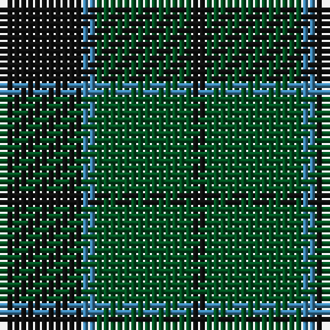

In pattern [KBGK](/patterns/kbgk/).

This was sourced from register-of-tartans.  It is a [4 stripes tartan](/stripes/stripes4/).

Original link https://www.tartanregister.gov.uk/tartanDetails.aspx?ref=1827

## Register references

External register numbers recorded for this tartan.

- Scottish Register of Tartans: [1827](https://www.tartanregister.gov.uk/tartanDetails.aspx?ref=1827)
- Scottish Tartans Authority (ITI): 235
- Scottish Tartans World Register: 235

## Thread count
K/12 B2 G14 K/2

## Palette
Each colour and its ΔE from the base-6 reference it is a variant of.

| Colour | Shade | Base | ΔE (OKLab) |
|---|---|---|---|
| B | <code style="background-color:#3C82AF;">#3C82AF</code> `#3C82AF` | B <code style="background-color:#2A418A;">#2A418A</code> | 0.19 |
| G | <code style="background-color:#005020;">#005020</code> `#005020` | G <code style="background-color:#006100;">#006100</code> | 0.07 |
| K | <code style="background-color:#101010;">#101010</code> `#101010` | K <code style="background-color:#000000;">#000000</code> | 0.17 |

# Sample pattern

## Nearest tartans

The nearest existing variants by ΔTartan distance.

1. [MacNab](/setts/s4/g15r3b11ba2~b141e46-ba3c82af-g005020-rdc0000~x2/) — ΔT 1.41
1. [MacKay Clan Tartan Tartan Number: 703. Earliest known date: 1816 Wilson's of Bannockburn (1819) record the same sett with blue changed to purple. Logan calls the colour 'corbeau' which is in fact a dark shade of green. The pattern shows a marked similarity to the Gunn tartan in all but colour, suggesting a territorial origin for both. Recently historians of Scottish dress have tended to stress the geographical sources, rather than the clan associations of the earliest Highland tartans. A sample was signed and sealed by the Chief for Highland Society of London in 1816. See products available Copyright © Blair Urquhart, Comrie, 2015](/setts/s6/g3b14g2k14g14k3~b003c64-g006818-k101010~x2/) — ΔT 1.52
1. [Wilson's No.062](/setts/s4/g13r2b13r2~b202060-g006818-rc80000~x2/) — ΔT 1.59
1. [Kincaid of Kincaid (Clan)](/setts/s3/k11g16r2~g006818-k101010-r880000~x4/) — ΔT 1.60
1. [Black Watch (variation)](/setts/s6/k5g23k18b21k33b3~b202060-g006818-k101010~x2/) — ΔT 1.61
1. [Red Watch (Fashion) #1](/setts/s4/g6k2r3k1~g006818-k101010-r880000~x4/) — ΔT 1.63
1. [Gunn (Logan)](/setts/s6/g2k12g1k12g12r2~g005020-k101010-rdc0000~x2/) — ΔT 1.63
1. [Green Highland, The (Fashion)](/setts/s6/b2g15ba3b7g7b2~b000088-ba381c0c-g004800~x4/) — ΔT 1.63
1. [Ferguson - 1930 (Old)](/setts/s3/g17r2b15~b2c2c80-g006818-rc80000~x2/) — ΔT 1.64
1. [MacCormick Hunting (Name)](/setts/s5/k3g20k20ga20k3~g003820-ga006818-k101010~x2/) — ΔT 1.65

## Neighbour map

Every grey dot is one of 15726 variants placed by the first two principal components of the ΔTartan feature space (44% of its variance). Red is this tartan; blue dots are its nearest — click one to open its page.

<svg viewBox="0 0 640 380" role="img" style="max-width:100%;height:auto;border:1px solid #e0e0e0;border-radius:4px;display:block" xmlns="http://www.w3.org/2000/svg"><image href="/nn/cloud.v1.png" width="640" height="380"/><a href="/setts/s4/g15r3b11ba2~b141e46-ba3c82af-g005020-rdc0000~x2/"><circle cx="280.3" cy="273.5" r="4" fill="#3465a4"><title>MacNab</title></circle></a><a href="/setts/s6/g3b14g2k14g14k3~b003c64-g006818-k101010~x2/"><circle cx="247.5" cy="284.2" r="4" fill="#3465a4"><title>MacKay Clan Tartan Tartan Number: 703. Earliest known date: 1816 Wilson's of Bannockburn (1819) record the same sett with blue changed to purple. Logan calls the colour 'corbeau' which is in fact a dark shade of green. The pattern shows a marked similarity to the Gunn tartan in all but colour, suggesting a territorial origin for both. Recently historians of Scottish dress have tended to stress the geographical sources, rather than the clan associations of the earliest Highland tartans. A sample was signed and sealed by the Chief for Highland Society of London in 1816. See products available Copyright © Blair Urquhart, Comrie, 2015</title></circle></a><a href="/setts/s4/g13r2b13r2~b202060-g006818-rc80000~x2/"><circle cx="270.5" cy="283.0" r="4" fill="#3465a4"><title>Wilson's No.062</title></circle></a><a href="/setts/s3/k11g16r2~g006818-k101010-r880000~x4/"><circle cx="336.8" cy="312.7" r="4" fill="#3465a4"><title>Kincaid of Kincaid (Clan)</title></circle></a><a href="/setts/s6/k5g23k18b21k33b3~b202060-g006818-k101010~x2/"><circle cx="344.2" cy="283.1" r="4" fill="#3465a4"><title>Black Watch (variation)</title></circle></a><a href="/setts/s4/g6k2r3k1~g006818-k101010-r880000~x4/"><circle cx="281.8" cy="299.8" r="4" fill="#3465a4"><title>Red Watch (Fashion) #1</title></circle></a><a href="/setts/s6/g2k12g1k12g12r2~g005020-k101010-rdc0000~x2/"><circle cx="401.4" cy="265.0" r="4" fill="#3465a4"><title>Gunn (Logan)</title></circle></a><a href="/setts/s6/b2g15ba3b7g7b2~b000088-ba381c0c-g004800~x4/"><circle cx="386.5" cy="284.9" r="4" fill="#3465a4"><title>Green Highland, The (Fashion)</title></circle></a><a href="/setts/s3/g17r2b15~b2c2c80-g006818-rc80000~x2/"><circle cx="324.4" cy="311.0" r="4" fill="#3465a4"><title>Ferguson - 1930 (Old)</title></circle></a><a href="/setts/s5/k3g20k20ga20k3~g003820-ga006818-k101010~x2/"><circle cx="273.8" cy="310.4" r="4" fill="#3465a4"><title>MacCormick Hunting (Name)</title></circle></a><circle cx="333.9" cy="302.7" r="5" fill="#c00000"/></svg>

ID: /setts/s4/k6b1g7k1~b3c82af-g005020-k101010~x2/
