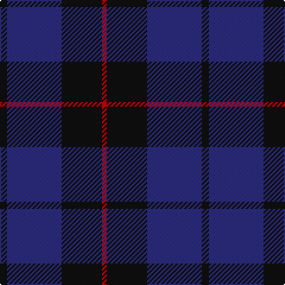

In pattern [KBKR](/patterns/kbkr/).

This was sourced from tartans-authority.  It is a [4 stripes tartan](/stripes/stripes4/).

Original link http://www.tartansauthority.com/tartan-ferret/display/8925/

## Thread count
K/6 DB46 K34 R/4

## Palette
Each colour and its ΔE from the base-6 reference it is a variant of.

| Colour | Shade | Base | ΔE (OKLab) |
|---|---|---|---|
| DB | <code style="background-color:#2C2C80;">#2C2C80</code> `#2C2C80` | B <code style="background-color:#2A418A;">#2A418A</code> | 0.06 |
| K | <code style="background-color:#101010;">#101010</code> `#101010` | K <code style="background-color:#000000;">#000000</code> | 0.17 |
| R | <code style="background-color:#C80000;">#C80000</code> `#C80000` | R <code style="background-color:#CC0000;">#CC0000</code> | 0.01 |

# Sample pattern

## Nearest tartans

The nearest existing variants by ΔTartan distance.

1. [MacKay (Blue) #2](/setts/s5/k30b8k30b56r4-b2c4084-k101010-rdc0000/) — ΔT 0.82
1. [Largan (?)](/setts/s6/b8k39b8k39b87r6-b2c2c80-k101010-rc80000/) — ΔT 1.07
1. [Morgan (MacKay Blue) Clan Tartan Tartan Number: 264. Earliest known date: 1842 The design comes from the Vestiarium Scoticum (1842). The authors, the Sobieski Stuart brothers, enjoyed a popular following among the Scottish gentry in the early Victorian era, and in the spirit of the times, added mystery, romance and some spurious historical documentation to the subject of tartan. Of the better known tartans, the book offers some minor variation, but in other cases it provides the only recorded version of many tartans in use today. See products available Copyright © Blair Urquhart, Comrie, 2015](/setts/s6/b4k12b4k12b32r4-b2c2c80-k101010-rc80000/) — ΔT 1.23
1. [Perthshire, New /Tourist Board](/setts/s6/b74r20g44b22g6r6-b000050-g003000-r800000/) — ΔT 1.23
1. [Marchmont (Personal)](/setts/s7/g4b48k48g4k48b48k4-b2c2c80-g289c18-k101010/) — ΔT 1.23
1. [Gagetown (School)](/setts/s6/b12k66b30k6b30k6-b343498-k101010/) — ΔT 1.33
1. [Laurel Cadre, The](/setts/s5/b12r8k64b75r8-b43146f-k101010-rdc0000/) — ΔT 1.34
1. [Royal Scotsman Train (Corporate)](/setts/s6/b10k4b28k28b4y4-b2c2c80-k101010-yb8b4b8/) — ΔT 1.43
1. [Unidentified Tartan Tartan Number: 598. Earliest known date: 0 Seen by Alex Lumsden in a Toronto subway 1984. See products available Copyright © Blair Urquhart, Comrie, 2015](/setts/s5/b48g6b48g57r12-b2c2c80-g604000-rc80000/) — ΔT 1.46
1. [Ardee (Corporate)](/setts/s5/b16r4b72ba72y4-b1c1c50-ba5c5c5c-rc80000-ya0a0a0/) — ΔT 1.53

## Neighbour map

Every grey dot is one of 15726 variants placed by the first two principal components of the ΔTartan feature space (44% of its variance). Red is this tartan; blue dots are its nearest — click one to open its page.

<svg viewBox="0 0 640 380" role="img" style="max-width:100%;height:auto;border:1px solid #e0e0e0;border-radius:4px;display:block" xmlns="http://www.w3.org/2000/svg"><image href="/nn/cloud.v1.png" width="640" height="380"/><a href="/setts/s5/k30b8k30b56r4-b2c4084-k101010-rdc0000/"><circle cx="376.3" cy="264.3" r="4" fill="#3465a4"><title>MacKay (Blue) #2</title></circle></a><a href="/setts/s6/b8k39b8k39b87r6-b2c2c80-k101010-rc80000/"><circle cx="427.2" cy="247.4" r="4" fill="#3465a4"><title>Largan (?)</title></circle></a><a href="/setts/s6/b4k12b4k12b32r4-b2c2c80-k101010-rc80000/"><circle cx="402.4" cy="265.7" r="4" fill="#3465a4"><title>Morgan (MacKay Blue) Clan Tartan Tartan Number: 264. Earliest known date: 1842 The design comes from the Vestiarium Scoticum (1842). The authors, the Sobieski Stuart brothers, enjoyed a popular following among the Scottish gentry in the early Victorian era, and in the spirit of the times, added mystery, romance and some spurious historical documentation to the subject of tartan. Of the better known tartans, the book offers some minor variation, but in other cases it provides the only recorded version of many tartans in use today. See products available Copyright © Blair Urquhart, Comrie, 2015</title></circle></a><a href="/setts/s6/b74r20g44b22g6r6-b000050-g003000-r800000/"><circle cx="385.0" cy="258.3" r="4" fill="#3465a4"><title>Perthshire, New /Tourist Board</title></circle></a><a href="/setts/s7/g4b48k48g4k48b48k4-b2c2c80-g289c18-k101010/"><circle cx="364.2" cy="257.8" r="4" fill="#3465a4"><title>Marchmont (Personal)</title></circle></a><a href="/setts/s6/b12k66b30k6b30k6-b343498-k101010/"><circle cx="411.5" cy="274.1" r="4" fill="#3465a4"><title>Gagetown (School)</title></circle></a><a href="/setts/s5/b12r8k64b75r8-b43146f-k101010-rdc0000/"><circle cx="366.0" cy="254.5" r="4" fill="#3465a4"><title>Laurel Cadre, The</title></circle></a><a href="/setts/s6/b10k4b28k28b4y4-b2c2c80-k101010-yb8b4b8/"><circle cx="351.0" cy="265.8" r="4" fill="#3465a4"><title>Royal Scotsman Train (Corporate)</title></circle></a><a href="/setts/s5/b48g6b48g57r12-b2c2c80-g604000-rc80000/"><circle cx="383.4" cy="289.5" r="4" fill="#3465a4"><title>Unidentified Tartan Tartan Number: 598. Earliest known date: 0 Seen by Alex Lumsden in a Toronto subway 1984. See products available Copyright © Blair Urquhart, Comrie, 2015</title></circle></a><a href="/setts/s5/b16r4b72ba72y4-b1c1c50-ba5c5c5c-rc80000-ya0a0a0/"><circle cx="397.3" cy="221.4" r="4" fill="#3465a4"><title>Ardee (Corporate)</title></circle></a><circle cx="392.5" cy="278.6" r="5" fill="#c00000"/></svg>

ID: /setts/s4/k6b46k34r4-b2c2c80-k101010-rc80000/
