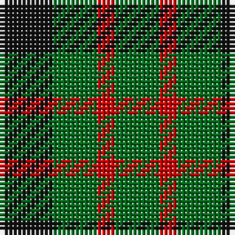

In pattern [GRGK](/stripes/grgk/).

This was sourced from register-of-tartans.  It is a [4 stripe tartan](/stripes/stripes4/).

Original link https://www.tartanregister.gov.uk/tartanDetails.aspx?ref=1383

## Also known as

This cloth is also recorded under:

- Glen Lyon #1

## Register references

External register numbers recorded for this tartan.

- Scottish Register of Tartans: [1383](https://www.tartanregister.gov.uk/tartanDetails.aspx?ref=1383)
- Scottish Tartans Authority (ITI): 23
- Scottish Tartans World Register: 23

## Thread count
K/12 G10 R4 G/10

## Palette
Each colour and the base-6 reference it is a variant of.

| Colour | Shade | Base |
|---|---|---|
| G | <code style="background-color:#006818;">#006818</code> `oklch(45.0% 0.142 145.0)` <small>#006818</small> | G <code style="background-color:#006100;">#006100</code> |
| K | <code style="background-color:#101010;">#101010</code> `oklch(17.3% 0.000 89.9)` <small>#101010</small> | K <code style="background-color:#000000;">#000000</code> |
| R | <code style="background-color:#C80000;">#C80000</code> `oklch(52.3% 0.215 29.2)` <small>#C80000</small> | R <code style="background-color:#CC0000;">#CC0000</code> |

# Sample pattern

## Nearest tartans

The nearest existing variants by ΔTartan distance, with this tartan at the top so the swatches line up against it.

ΔTartan

Tartan

Sett

—

<a href="/ttd/edit/#slug=k6g5r2~x2">Glen Lyon #1</a> <a class="nn-out" href="/setts/s4/k6g5r2~x2/" title="open its dictionary page">↗</a>

1.16

<a href="/ttd/edit/#slug=g4k5g4ly1~x2">Wilson's No.053 #2</a> <a class="nn-out" href="/setts/s4/g4k5g4ly1~x2/" title="open its dictionary page">↗</a>

1.17

<a href="/ttd/edit/#slug=g4k5g4r2~x2">Wilson's No.094</a> <a class="nn-out" href="/setts/s4/g4k5g4r2~x2/" title="open its dictionary page">↗</a>

1.22

<a href="/ttd/edit/#slug=g4dp5g4t2~x2">Wilson's No.209</a> <a class="nn-out" href="/setts/s4/g4dp5g4t2~x2/" title="open its dictionary page">↗</a>

1.44

<a href="/ttd/edit/#slug=k5g4t2~x2">Mull</a> <a class="nn-out" href="/setts/s3/k5g4t2~x2/" title="open its dictionary page">↗</a>

1.51

<a href="/ttd/edit/#slug=g2r2g2t1~x4">Wilson's No.207</a> <a class="nn-out" href="/setts/s4/g2r2g2t1~x4/" title="open its dictionary page">↗</a>

1.64

<a href="/ttd/edit/#slug=t2g4k5g4t1~x2">Glen Lyon #2</a> <a class="nn-out" href="/setts/s5/t2g4k5g4t1~x2/" title="open its dictionary page">↗</a>

1.72

<a href="/ttd/edit/#slug=dp2g4ly1~x4">Wilson's No.201</a> <a class="nn-out" href="/setts/s3/dp2g4ly1~x4/" title="open its dictionary page">↗</a>

1.73

<a href="/ttd/edit/#slug=g7k4r4~x2">Wilson's No.202</a> <a class="nn-out" href="/setts/s3/g7k4r4~x2/" title="open its dictionary page">↗</a>

1.77

<a href="/ttd/edit/#slug=g2k1g2t1~x8">Wilson's No.045</a> <a class="nn-out" href="/setts/s4/g2k1g2t1~x8/" title="open its dictionary page">↗</a>

1.82

<a href="/ttd/edit/#slug=k5g6t1~x4">Wilson's No.050</a> <a class="nn-out" href="/setts/s3/k5g6t1~x4/" title="open its dictionary page">↗</a>

## Neighbour map

Every grey dot is one of 14299 variants placed by the first two principal components of the ΔTartan feature space (44% of its variance). Red is this tartan; blue dots are its nearest — click one to open its page.

<svg viewBox="0 0 640 380" role="img" style="max-width:100%;height:auto;border:1px solid #e0e0e0;border-radius:4px;display:block" xmlns="http://www.w3.org/2000/svg"><image href="/nn/cloud.v1.png" width="640" height="380"/><a href="/setts/s4/g4k5g4ly1~x2/"><circle cx="279.5" cy="327.5" r="4" fill="#3465a4"><title>Wilson's No.053 #2</title></circle></a><a href="/setts/s4/g4k5g4r2~x2/"><circle cx="200.2" cy="359.2" r="4" fill="#3465a4"><title>Wilson's No.094</title></circle></a><a href="/setts/s4/g4dp5g4t2~x2/"><circle cx="217.4" cy="366.0" r="4" fill="#3465a4"><title>Wilson's No.209</title></circle></a><a href="/setts/s3/k5g4t2~x2/"><circle cx="178.2" cy="366.0" r="4" fill="#3465a4"><title>Mull</title></circle></a><a href="/setts/s4/g2r2g2t1~x4/"><circle cx="226.9" cy="366.0" r="4" fill="#3465a4"><title>Wilson's No.207</title></circle></a><a href="/setts/s5/t2g4k5g4t1~x2/"><circle cx="230.5" cy="314.9" r="4" fill="#3465a4"><title>Glen Lyon #2</title></circle></a><a href="/setts/s3/dp2g4ly1~x4/"><circle cx="265.0" cy="317.0" r="4" fill="#3465a4"><title>Wilson's No.201</title></circle></a><a href="/setts/s3/g7k4r4~x2/"><circle cx="160.0" cy="366.0" r="4" fill="#3465a4"><title>Wilson's No.202</title></circle></a><a href="/setts/s4/g2k1g2t1~x8/"><circle cx="301.7" cy="366.0" r="4" fill="#3465a4"><title>Wilson's No.045</title></circle></a><a href="/setts/s3/k5g6t1~x4/"><circle cx="284.7" cy="325.3" r="4" fill="#3465a4"><title>Wilson's No.050</title></circle></a><circle cx="243.4" cy="360.4" r="5" fill="#c00000"/></svg>

ID: /setts/s4/k6g5r2~x2/
