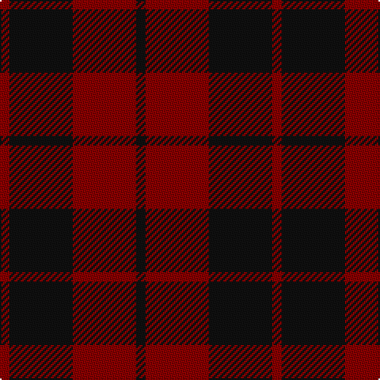

In pattern [KRKR](/patterns/krkr/).

This was sourced from tartans-authority.  It is a [4 stripes tartan](/stripes/stripes4/).

Original link http://www.tartansauthority.com/tartan-ferret/display/8245/

## Thread count
DR/6 K40 DR40 K/6

## Palette
Each colour and its ΔE from the base-6 reference it is a variant of.

| Colour | Shade | Base | ΔE (OKLab) |
|---|---|---|---|
| DR | <code style="background-color:#880000;">#880000</code> `#880000` | R <code style="background-color:#CC0000;">#CC0000</code> | 0.15 |
| K | <code style="background-color:#101010;">#101010</code> `#101010` | K <code style="background-color:#000000;">#000000</code> | 0.17 |

# Sample pattern

## Nearest tartans

The nearest existing variants by ΔTartan distance.

1. [Lendrum (Black & Red) or MacFarlane](/setts/s4/k48r28k4r36-k101010-r880000/) — ΔT 1.26
1. [Wcwm 9275-1333-2](/setts/s4/k40r6k40r40-k101010-r880000/) — ΔT 1.73
1. [MacIan](/setts/s7/r8k16r8k16r24k4y4-k101010-r880000-yd09800/) — ΔT 1.81
1. [MacDonald of Sleat](/setts/s5/g32r10g4r36k4-g11450d-k000000-raa0000/) — ΔT 1.85
1. [MacDonald of Sleat](/setts/s5/g16r5g2r18k2-g11450d-k000000-raa0000/) — ΔT 1.85
1. [Romsdal Tresfjord](/setts/s5/k4r8k14r2k4-k101010-r880000/) — ΔT 1.87
1. [Hillsdale (Corporate?)](/setts/s5/b26ba12r102b102ba10-b1c1c50-ba5c5c5c-r880000/) — ΔT 1.94
1. [Menzies of Culdares](/setts/s7/k8r4k44r44k6r8w4-k101010-r880000-wa8ace8/) — ΔT 2.03
1. [Rajput](/setts/s6/b12r78b20r20b42y10-b2c2c80-r880000-ye8c000/) — ΔT 2.06
1. [Lugo (2013)](/setts/s4/r80g32y8g32-g003820-rb03000-ye0a126/) — ΔT 2.06

## Neighbour map

Every grey dot is one of 15726 variants placed by the first two principal components of the ΔTartan feature space (44% of its variance). Red is this tartan; blue dots are its nearest — click one to open its page.

<svg viewBox="0 0 640 380" role="img" style="max-width:100%;height:auto;border:1px solid #e0e0e0;border-radius:4px;display:block" xmlns="http://www.w3.org/2000/svg"><image href="/nn/cloud.v1.png" width="640" height="380"/><a href="/setts/s4/k48r28k4r36-k101010-r880000/"><circle cx="422.5" cy="304.4" r="4" fill="#3465a4"><title>Lendrum (Black &amp; Red) or MacFarlane</title></circle></a><a href="/setts/s4/k40r6k40r40-k101010-r880000/"><circle cx="430.4" cy="344.2" r="4" fill="#3465a4"><title>Wcwm 9275-1333-2</title></circle></a><a href="/setts/s7/r8k16r8k16r24k4y4-k101010-r880000-yd09800/"><circle cx="310.5" cy="271.2" r="4" fill="#3465a4"><title>MacIan</title></circle></a><a href="/setts/s5/g32r10g4r36k4-g11450d-k000000-raa0000/"><circle cx="364.2" cy="248.5" r="4" fill="#3465a4"><title>MacDonald of Sleat</title></circle></a><a href="/setts/s5/g16r5g2r18k2-g11450d-k000000-raa0000/"><circle cx="364.2" cy="248.5" r="4" fill="#3465a4"><title>MacDonald of Sleat</title></circle></a><a href="/setts/s5/k4r8k14r2k4-k101010-r880000/"><circle cx="482.7" cy="314.4" r="4" fill="#3465a4"><title>Romsdal Tresfjord</title></circle></a><a href="/setts/s5/b26ba12r102b102ba10-b1c1c50-ba5c5c5c-r880000/"><circle cx="386.1" cy="261.7" r="4" fill="#3465a4"><title>Hillsdale (Corporate?)</title></circle></a><a href="/setts/s7/k8r4k44r44k6r8w4-k101010-r880000-wa8ace8/"><circle cx="370.3" cy="215.9" r="4" fill="#3465a4"><title>Menzies of Culdares</title></circle></a><a href="/setts/s6/b12r78b20r20b42y10-b2c2c80-r880000-ye8c000/"><circle cx="349.4" cy="246.1" r="4" fill="#3465a4"><title>Rajput</title></circle></a><a href="/setts/s4/r80g32y8g32-g003820-rb03000-ye0a126/"><circle cx="351.0" cy="262.8" r="4" fill="#3465a4"><title>Lugo (2013)</title></circle></a><circle cx="399.4" cy="306.9" r="5" fill="#c00000"/></svg>

ID: /setts/s4/k6r40k40r6-k101010-r880000/
