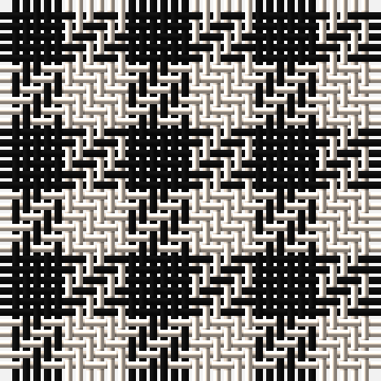

In pattern [KWKW](/patterns/kwkw/).

This was sourced from register-of-tartans.  It is a [4 stripes tartan](/stripes/stripes4/).

Original link https://www.tartanregister.gov.uk/tartanDetails.aspx?ref=3781

## Thread count
K/6 LY6 K6 LY/6

## Palette
Each colour and its ΔE from the base-6 reference it is a variant of.

| Colour | Shade | Base | ΔE (OKLab) |
|---|---|---|---|
| K | <code style="background-color:#101010;">#101010</code> `#101010` | K <code style="background-color:#000000;">#000000</code> | 0.17 |
| LY | <code style="background-color:#F8E8D8;">#F8E8D8</code> `#F8E8D8` | W <code style="background-color:#F4F4F0;">#F4F4F0</code> | 0.04 |

# Sample pattern

ID: /setts/s4/k6w6k6w6-k101010-wf8e8d8/
