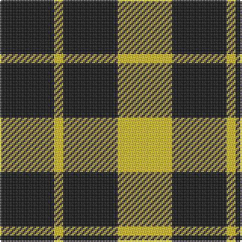

In pattern [KYKY](/patterns/kyky/).

This was sourced from house-of-tartan.  It is a [4 stripes tartan](/stripes/stripes4/).

Original link http://www.house-of-tartan.scotland.net/house/TartanViewjs.asp?colr=Def&tnam=1275

## Thread count
K/36 Y6 K36 Y/36

## Palette
Each colour and its ΔE from the base-6 reference it is a variant of.

| Colour | Shade | Base | ΔE (OKLab) |
|---|---|---|---|
| K | <code style="background-color:#101010;">#101010</code> `#101010` | K <code style="background-color:#000000;">#000000</code> | 0.17 |
| Y | <code style="background-color:#E8C000;">#E8C000</code> `#E8C000` | Y <code style="background-color:#F2BF00;">#F2BF00</code> | 0.02 |

# Sample pattern

## Nearest tartans

The nearest existing variants by ΔTartan distance.

1. [Raeburn](/setts/s4/k6y1k6y6~k000000-yf0c000~x6/) — ΔT 0.94
1. [Raeburn](/setts/s4/k34y3k34y26~k101010-ye8c000~x2/) — ΔT 1.31
1. [MacFarlane VS](/setts/s4/k7y6k1y6~k000000-yaaaaaa~x2/) — ΔT 1.37
1. [MacFarlane VS](/setts/s4/k7y6k1y6~k000000-yaaaaaa/) — ΔT 1.37
1. [MacFarlane VS](/setts/s4/k7w6k1w6~k000000-wd0d0d0/) — ΔT 1.62
1. [MacFarlane, Lendrum Black and White](/setts/s4/k7w6k1w6~k000000-we0e0e0~x4/) — ΔT 1.77
1. [Lauder](/setts/s6/y2k4y2k2y5r1~k000000-rc00000-yf0c000~x2/) — ΔT 1.92
1. [MacLeod Dress Clan Tartan Tartan Number: 1272. Earliest known date: 1829 See illustration in Bain where red is 4 threads. Sir Thomas Dick Lauder in a letter to Sir Walter Scott in 1829 wrote, MacLeod has got a sketch of this splendid tartan, "three black stryps upon ain yellow fylde," See products available Copyright © Blair Urquhart, Comrie, 2015](/setts/s5/k4y1k4y6r1~k101010-rc80000-ye8c000~x4/) — ΔT 1.93
1. [Special Saffron](/setts/s6/g86y44g21y44g86b10~b2888c4-g003820-ydc943c/) — ΔT 1.95
1. [Longford County, Crest Range](/setts/s6/w7k6y15k16k8w3~k101010-we0e0e0-ybc8c00~x2/) — ΔT 1.95

## Neighbour map

Every grey dot is one of 15726 variants placed by the first two principal components of the ΔTartan feature space (44% of its variance). Red is this tartan; blue dots are its nearest — click one to open its page.

<svg viewBox="0 0 640 380" role="img" style="max-width:100%;height:auto;border:1px solid #e0e0e0;border-radius:4px;display:block" xmlns="http://www.w3.org/2000/svg"><image href="/nn/cloud.v1.png" width="640" height="380"/><a href="/setts/s4/k6y1k6y6~k000000-yf0c000~x6/"><circle cx="310.9" cy="315.5" r="4" fill="#3465a4"><title>Raeburn</title></circle></a><a href="/setts/s4/k34y3k34y26~k101010-ye8c000~x2/"><circle cx="389.4" cy="287.6" r="4" fill="#3465a4"><title>Raeburn</title></circle></a><a href="/setts/s4/k7y6k1y6~k000000-yaaaaaa~x2/"><circle cx="298.1" cy="302.0" r="4" fill="#3465a4"><title>MacFarlane VS</title></circle></a><a href="/setts/s4/k7y6k1y6~k000000-yaaaaaa/"><circle cx="298.1" cy="302.0" r="4" fill="#3465a4"><title>MacFarlane VS</title></circle></a><a href="/setts/s4/k7w6k1w6~k000000-wd0d0d0/"><circle cx="291.2" cy="296.3" r="4" fill="#3465a4"><title>MacFarlane VS</title></circle></a><a href="/setts/s4/k7w6k1w6~k000000-we0e0e0~x4/"><circle cx="289.0" cy="294.2" r="4" fill="#3465a4"><title>MacFarlane, Lendrum Black and White</title></circle></a><a href="/setts/s6/y2k4y2k2y5r1~k000000-rc00000-yf0c000~x2/"><circle cx="231.6" cy="263.5" r="4" fill="#3465a4"><title>Lauder</title></circle></a><a href="/setts/s5/k4y1k4y6r1~k101010-rc80000-ye8c000~x4/"><circle cx="233.0" cy="258.0" r="4" fill="#3465a4"><title>MacLeod Dress Clan Tartan Tartan Number: 1272. Earliest known date: 1829 See illustration in Bain where red is 4 threads. Sir Thomas Dick Lauder in a letter to Sir Walter Scott in 1829 wrote, MacLeod has got a sketch of this splendid tartan, &quot;three black stryps upon ain yellow fylde,&quot; See products available Copyright © Blair Urquhart, Comrie, 2015</title></circle></a><a href="/setts/s6/g86y44g21y44g86b10~b2888c4-g003820-ydc943c/"><circle cx="353.3" cy="261.2" r="4" fill="#3465a4"><title>Special Saffron</title></circle></a><a href="/setts/s6/w7k6y15k16k8w3~k101010-we0e0e0-ybc8c00~x2/"><circle cx="215.8" cy="267.3" r="4" fill="#3465a4"><title>Longford County, Crest Range</title></circle></a><circle cx="313.7" cy="312.2" r="5" fill="#c00000"/></svg>

ID: /setts/s4/k6y1k6y6~k101010-ye8c000~x6/
