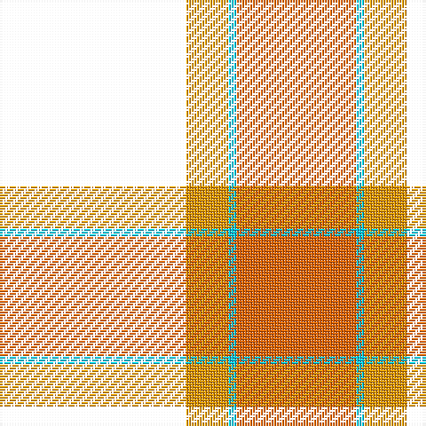

**Bands:** [KYWR](/stripes/kywr/) · **Stripes:** [K LO LT R](/stripes/stripes4/) K LO LT R

This was sourced from register-of-tartans.  It is a [4 band tartan](/bands/bands4/).

Original link https://www.tartanregister.gov.uk/tartanDetails.aspx?ref=10801

## Register references

External register numbers recorded for this tartan.

- Scottish Register of Tartans: [10801](https://www.tartanregister.gov.uk/tartanDetails.aspx?ref=10801)

## Thread count
N/70 Y16 LB3 O/45

## Palette
Each colour and its ΔE from the base-6 reference it is a variant of.

| Colour | Shade | Base | ΔE (OKLab) |
|---|---|---|---|
| LB | <code style="background-color:#00CCFF;">#00CCFF</code> `#00CCFF` | W <code style="background-color:#F7F7F7;">#F7F7F7</code> | 0.24 |
| O | <code style="background-color:#FF6600;">#FF6600</code> `#FF6600` | R <code style="background-color:#CC0000;">#CC0000</code> | 0.17 |
| Y | <code style="background-color:#FF9900;">#FF9900</code> `#FF9900` | Y <code style="background-color:#F2BF00;">#F2BF00</code> | 0.09 |

# Sample pattern

## Nearest tartans

The nearest existing variants by ΔTartan distance.

1. [Skinner](/setts/s4/db1r16k16ly1~x4/) — ΔT 1.34
1. [Oklahoma State University](/setts/s4/o80k52w7o12/) — ΔT 1.41
1. [Templar Grand Priory USA](/setts/s4/db3k32r27w2~x2/) — ΔT 1.48
1. [Billy Apple](/setts/s4/g1r8k13ly1~x6/) — ΔT 1.52
1. [MacPhail](/setts/s6/r25k7r3g13t1k2~x4/) — ΔT 1.58
1. [MacKintosh 6](/setts/s6/r5w2r28k12g16r3~x2/) — ΔT 1.59
1. [Papua New Guinea Pipes and Drums](/setts/s5/g3ly5r13k33w2~x2/) — ΔT 1.65
1. [Sturrock](/setts/s6/r52k32g22r16ly3r16/) — ΔT 1.65
1. [Burberry, Check](/setts/s5/k6w6k6o21r2~x4/) — ΔT 1.68
1. [Nunes (2014)](/setts/s5/k32w12r1w2r15~x2/) — ΔT 1.72

## Neighbour map

Every grey dot is one of 14299 variants placed by the first two principal components of the ΔTartan feature space (44% of its variance). Red is this tartan; blue dots are its nearest — click one to open its page.

<svg viewBox="0 0 640 380" role="img" style="max-width:100%;height:auto;border:1px solid #e0e0e0;border-radius:4px;display:block" xmlns="http://www.w3.org/2000/svg"><image href="/nn/cloud.v1.png" width="640" height="380"/><a href="/setts/s4/db1r16k16ly1~x4/"><circle cx="299.3" cy="192.3" r="4" fill="#3465a4"><title>Skinner</title></circle></a><a href="/setts/s4/o80k52w7o12/"><circle cx="264.6" cy="199.0" r="4" fill="#3465a4"><title>Oklahoma State University</title></circle></a><a href="/setts/s4/db3k32r27w2~x2/"><circle cx="315.6" cy="199.6" r="4" fill="#3465a4"><title>Templar Grand Priory USA</title></circle></a><a href="/setts/s4/g1r8k13ly1~x6/"><circle cx="332.4" cy="206.9" r="4" fill="#3465a4"><title>Billy Apple</title></circle></a><a href="/setts/s6/r25k7r3g13t1k2~x4/"><circle cx="325.8" cy="147.8" r="4" fill="#3465a4"><title>MacPhail</title></circle></a><a href="/setts/s6/r5w2r28k12g16r3~x2/"><circle cx="284.0" cy="177.6" r="4" fill="#3465a4"><title>MacKintosh 6</title></circle></a><a href="/setts/s5/g3ly5r13k33w2~x2/"><circle cx="307.5" cy="155.4" r="4" fill="#3465a4"><title>Papua New Guinea Pipes and Drums</title></circle></a><a href="/setts/s6/r52k32g22r16ly3r16/"><circle cx="311.0" cy="186.6" r="4" fill="#3465a4"><title>Sturrock</title></circle></a><a href="/setts/s5/k6w6k6o21r2~x4/"><circle cx="239.9" cy="196.7" r="4" fill="#3465a4"><title>Burberry, Check</title></circle></a><a href="/setts/s5/k32w12r1w2r15~x2/"><circle cx="309.9" cy="159.1" r="4" fill="#3465a4"><title>Nunes (2014)</title></circle></a><circle cx="285.6" cy="179.5" r="5" fill="#c00000"/></svg>

ID: /setts/s4/k70lo16lt3r45/
