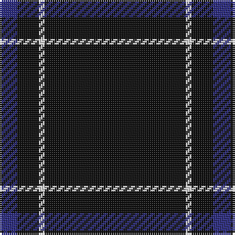

In pattern [BKWK](/patterns/bkwk/).

This was sourced from tartans-authority.  It is a [4 stripes tartan](/stripes/stripes4/).

Original link http://www.tartansauthority.com/tartan-ferret/display/8064/

## Thread count
DB/9 K11 LN3 K/72

## Palette
Each colour and its ΔE from the base-6 reference it is a variant of.

| Colour | Shade | Base | ΔE (OKLab) |
|---|---|---|---|
| DB | <code style="background-color:#2C2C80;">#2C2C80</code> `#2C2C80` | B <code style="background-color:#2A418A;">#2A418A</code> | 0.06 |
| K | <code style="background-color:#101010;">#101010</code> `#101010` | K <code style="background-color:#000000;">#000000</code> | 0.17 |
| LN | <code style="background-color:#E0E0E0;">#E0E0E0</code> `#E0E0E0` | W <code style="background-color:#F7F7F7;">#F7F7F7</code> | 0.07 |

# Sample pattern

## Nearest tartans

The nearest existing variants by ΔTartan distance.

1. [Wallington (Corporate?)](/setts/s4/k60b3k9g7~b2888c4-g289c18-k101010/) — ΔT 0.84
1. [Chafyn House (School)](/setts/s7/k72r3k11b9k11r3k37~b2888c4-k101010-rc80000/) — ΔT 1.31
1. [NewGeneration Alchemy (NGA) Inc](/setts/s6/k31r2k10b1k1w1~b2c2c80-k101010-rc80000-wfcfcfc~x4/) — ΔT 1.60
1. [Pasteur Fancy Tartan Tartan Number: 7094. Earliest known date: 1836 The pattern is taken from a shawl or cloak which appears in a portrait of Louie Pasteur's mother. The portrait was drawn in pastels when Pasteur was just 13 years old. The information came Marie-Claude Fortier researching the life of Pasteur. See products available Copyright © Blair Urquhart, Comrie, 2015](/setts/s4/b10y1b30g3~b34281c-g789484-ye4cca4~x4/) — ΔT 1.62
1. [NewGeneration Alchemy (NGA) Inc](/setts/s6/k31r2k10b1k1w1~b0000cd-k101010-rc8002c-wffffff~x4/) — ΔT 1.63
1. [Staines (2013)](/setts/s3/b1k12b1~b0000cd-k101010~x10/) — ΔT 1.76
1. [MacLaine of Lochbuie Hunting](/setts/s5/b32r3b4k2y3~b14283c-k101010-r880000-yd09800~x2/) — ΔT 1.79
1. [Unidentified #45](/setts/s7/k24g3r3k24r2k2r2~g005020-k101010-rdc0000/) — ΔT 1.85
1. [Loevenstein Castle 2 (Artefact)](/setts/s4/k20b1k4b3~b00008c-k000000~x4/) — ΔT 1.86
1. [Fily (Verneuil L'tang) (Personal)](/setts/s3/k20w2b1~b5c8ca8-k101010-we0e0e0~x6/) — ΔT 1.91

## Neighbour map

Every grey dot is one of 15726 variants placed by the first two principal components of the ΔTartan feature space (44% of its variance). Red is this tartan; blue dots are its nearest — click one to open its page.

<svg viewBox="0 0 640 380" role="img" style="max-width:100%;height:auto;border:1px solid #e0e0e0;border-radius:4px;display:block" xmlns="http://www.w3.org/2000/svg"><image href="/nn/cloud.v1.png" width="640" height="380"/><a href="/setts/s4/k60b3k9g7~b2888c4-g289c18-k101010/"><circle cx="626.0" cy="236.5" r="4" fill="#3465a4"><title>Wallington (Corporate?)</title></circle></a><a href="/setts/s7/k72r3k11b9k11r3k37~b2888c4-k101010-rc80000/"><circle cx="626.0" cy="217.3" r="4" fill="#3465a4"><title>Chafyn House (School)</title></circle></a><a href="/setts/s6/k31r2k10b1k1w1~b2c2c80-k101010-rc80000-wfcfcfc~x4/"><circle cx="626.0" cy="179.2" r="4" fill="#3465a4"><title>NewGeneration Alchemy (NGA) Inc</title></circle></a><a href="/setts/s4/b10y1b30g3~b34281c-g789484-ye4cca4~x4/"><circle cx="626.0" cy="236.3" r="4" fill="#3465a4"><title>Pasteur Fancy Tartan Tartan Number: 7094. Earliest known date: 1836 The pattern is taken from a shawl or cloak which appears in a portrait of Louie Pasteur's mother. The portrait was drawn in pastels when Pasteur was just 13 years old. The information came Marie-Claude Fortier researching the life of Pasteur. See products available Copyright © Blair Urquhart, Comrie, 2015</title></circle></a><a href="/setts/s6/k31r2k10b1k1w1~b0000cd-k101010-rc8002c-wffffff~x4/"><circle cx="626.0" cy="177.5" r="4" fill="#3465a4"><title>NewGeneration Alchemy (NGA) Inc</title></circle></a><a href="/setts/s3/b1k12b1~b0000cd-k101010~x10/"><circle cx="626.0" cy="301.6" r="4" fill="#3465a4"><title>Staines (2013)</title></circle></a><a href="/setts/s5/b32r3b4k2y3~b14283c-k101010-r880000-yd09800~x2/"><circle cx="584.3" cy="212.8" r="4" fill="#3465a4"><title>MacLaine of Lochbuie Hunting</title></circle></a><a href="/setts/s7/k24g3r3k24r2k2r2~g005020-k101010-rdc0000/"><circle cx="577.2" cy="228.8" r="4" fill="#3465a4"><title>Unidentified #45</title></circle></a><a href="/setts/s4/k20b1k4b3~b00008c-k000000~x4/"><circle cx="626.0" cy="280.3" r="4" fill="#3465a4"><title>Loevenstein Castle 2 (Artefact)</title></circle></a><a href="/setts/s3/k20w2b1~b5c8ca8-k101010-we0e0e0~x6/"><circle cx="599.4" cy="235.9" r="4" fill="#3465a4"><title>Fily (Verneuil L'tang) (Personal)</title></circle></a><circle cx="626.0" cy="236.5" r="5" fill="#c00000"/></svg>

ID: /setts/s4/k72w3k11b9~b2c2c80-k101010-we0e0e0/
