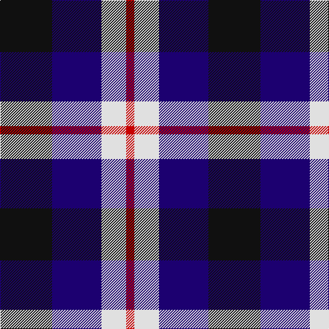

In pattern [KBWR](/patterns/kbwr/).

This was sourced from tartans-authority.  It is a [4 stripes tartan](/stripes/stripes4/).

Original link http://www.tartansauthority.com/tartan-ferret/display/7536/

## Attestations

This cloth appears in 2 source records; the oldest owns this page.

- 1995 — Raven (Fashion) (tartans-authority, [record](http://www.tartansauthority.com/tartan-ferret/display/7536/))
- undated — Raven (register-of-tartans, [record](https://www.tartanregister.gov.uk/tartanDetails.aspx?ref=5571))

## Thread count
K/76 DB72 LN36 R/12

## Palette
Each colour and its ΔE from the base-6 reference it is a variant of.

| Colour | Shade | Base | ΔE (OKLab) |
|---|---|---|---|
| DB | <code style="background-color:#1C0070;">#1C0070</code> `#1C0070` | B <code style="background-color:#2C4084;">#2C4084</code> | 0.14 |
| K | <code style="background-color:#101010;">#101010</code> `#101010` | K <code style="background-color:#000000;">#000000</code> | 0.17 |
| LN | <code style="background-color:#E0E0E0;">#E0E0E0</code> `#E0E0E0` | W <code style="background-color:#F4F4F0;">#F4F4F0</code> | 0.06 |
| R | <code style="background-color:#C80000;">#C80000</code> `#C80000` | R <code style="background-color:#C80000;">#C80000</code> | 0.00 |

# Sample pattern

## Nearest tartans

The nearest existing variants by ΔTartan distance.

1. [Marshall of Keith (Personal)](/setts/s5/b20k20b20g52y10-b3f0ffe-g003c14-k101010-ye8c000/) — ΔT 1.30
1. [Unnamed, No 60](/setts/s4/b12k10g10r2-b800080-g008000-k000000-rc00000/) — ΔT 1.31
1. [Mayer, Chris (Personal)](/setts/s4/b10g60k60r10-b0000ff-g808080-k000000-rff0000/) — ΔT 1.31
1. [Edinburgh Tattoo 50th (Commemorative](/setts/s5/k4b32r24g32k4-b000090-g008854-k000000-rc80000/) — ΔT 1.32
1. [Wilson's No 220](/setts/s4/b16k22g18w4-b5a008c-g005020-k101010-we0e0e0/) — ΔT 1.33
1. [Thorntons Law (Corporate)](/setts/s4/b20g20r10w2-b1c0070-g0098a0-rc80000-wf8f8f8/) — ΔT 1.33
1. [Pride of the Glen](/setts/s4/g12b12ba16w4-b000080-ba780078-g006818-wffffff/) — ΔT 1.34
1. [Harbison (2015)](/setts/s4/g42b68r28w12-b202060-g146400-rc80000-wffffff/) — ΔT 1.37
1. [St. Johnstone F.C. (Sports)](/setts/s7/k24w12k32b28y8b28w4-b2c2c80-k101010-wc0c0c0-yd09800/) — ΔT 1.42
1. [Wilson's, No 220](/setts/s4/b16k22g18w4-b800080-g008000-k000000-we0e0e0/) — ΔT 1.42

## Neighbour map

Every grey dot is one of 15726 variants placed by the first two principal components of the ΔTartan feature space (44% of its variance). Red is this tartan; blue dots are its nearest — click one to open its page.

<svg viewBox="0 0 640 380" role="img" style="max-width:100%;height:auto;border:1px solid #e0e0e0;border-radius:4px;display:block" xmlns="http://www.w3.org/2000/svg"><image href="/nn/cloud.v1.png" width="640" height="380"/><a href="/setts/s5/b20k20b20g52y10-b3f0ffe-g003c14-k101010-ye8c000/"><circle cx="155.0" cy="262.9" r="4" fill="#3465a4"><title>Marshall of Keith (Personal)</title></circle></a><a href="/setts/s4/b12k10g10r2-b800080-g008000-k000000-rc00000/"><circle cx="120.8" cy="274.5" r="4" fill="#3465a4"><title>Unnamed, No 60</title></circle></a><a href="/setts/s4/b10g60k60r10-b0000ff-g808080-k000000-rff0000/"><circle cx="190.3" cy="245.3" r="4" fill="#3465a4"><title>Mayer, Chris (Personal)</title></circle></a><a href="/setts/s5/k4b32r24g32k4-b000090-g008854-k000000-rc80000/"><circle cx="139.8" cy="232.0" r="4" fill="#3465a4"><title>Edinburgh Tattoo 50th (Commemorative</title></circle></a><a href="/setts/s4/b16k22g18w4-b5a008c-g005020-k101010-we0e0e0/"><circle cx="140.6" cy="292.3" r="4" fill="#3465a4"><title>Wilson's No 220</title></circle></a><a href="/setts/s4/b20g20r10w2-b1c0070-g0098a0-rc80000-wf8f8f8/"><circle cx="176.3" cy="241.5" r="4" fill="#3465a4"><title>Thorntons Law (Corporate)</title></circle></a><a href="/setts/s4/g12b12ba16w4-b000080-ba780078-g006818-wffffff/"><circle cx="98.8" cy="296.7" r="4" fill="#3465a4"><title>Pride of the Glen</title></circle></a><a href="/setts/s4/g42b68r28w12-b202060-g146400-rc80000-wffffff/"><circle cx="175.3" cy="266.2" r="4" fill="#3465a4"><title>Harbison (2015)</title></circle></a><a href="/setts/s7/k24w12k32b28y8b28w4-b2c2c80-k101010-wc0c0c0-yd09800/"><circle cx="178.2" cy="241.5" r="4" fill="#3465a4"><title>St. Johnstone F.C. (Sports)</title></circle></a><a href="/setts/s4/b16k22g18w4-b800080-g008000-k000000-we0e0e0/"><circle cx="108.6" cy="277.2" r="4" fill="#3465a4"><title>Wilson's, No 220</title></circle></a><circle cx="144.5" cy="261.6" r="5" fill="#c00000"/></svg>

ID: /setts/s4/k76b72w36r12-b1c0070-k101010-rc80000-we0e0e0/
