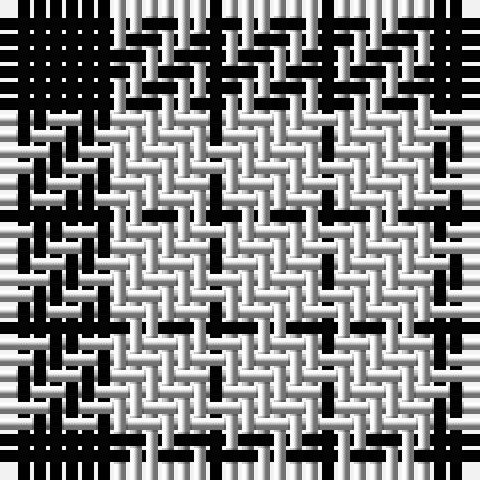

In pattern [KWKW](/stripes/kwkw/).

This was sourced from weddslist.  It is a [4 stripe tartan](/stripes/stripes4/).

Original link http://www.weddslist.com/cgi-bin/tartans/pg.pl?source=rb

## Thread count
K/7 N6 K1 N/6

## Palette
Each colour and the base-6 reference it is a variant of.

| Colour | Shade | Base |
|---|---|---|
| K | <code style="background-color:#000000;">#000000</code> `oklch(0.0% 0.000 0.0)` <small>#000000</small> | K <code style="background-color:#000000;">#000000</code> |
| N | <code style="background-color:#D0D0D0;">#D0D0D0</code> `oklch(85.8% 0.000 89.9)` <small>#D0D0D0</small> | W <code style="background-color:#F7F7F7;">#F7F7F7</code> |

# Sample pattern

## Nearest tartans

The nearest existing variants by ΔTartan distance.

1. [MacFarlane VS](/setts/s4/k7lr6k1~x2/) — ΔT 0.62
1. [MacFarlane VS](/setts/s4/k7lr6k1/) — ΔT 0.62
1. [MacFarlane B/W or Lendrum Clan Tartan Tartan Number: 1251. Earliest known date: 1842 The design comes from the Vestiarium Scoticum (1842). The authors, the Sobieski Stuart brothers, enjoyed a popular following among the Scottish gentry in the early Victorian era, and in the spirit of the times, added mystery, romance and some spurious historical documentation to the subject of tartan. Of the better known tartans, the book offers some minor variation, but in other cases it provides the only recorded version of many tartans in use today. See products available Copyright © Blair Urquhart, Comrie, 2015](/setts/s4/k7w6k1~x2/) — ΔT 0.85
1. [Lendrum (B&W)](/setts/s4/k7w6k1~x4/) — ΔT 1.26
1. [MacLeod, Black & White](/setts/s5/w8k1w8k12w1~x2/) — ΔT 1.50
1. [MacPhee (Black and White)](/setts/s4/k22w3k3w22~x2/) — ΔT 1.62
1. [Cairn (Marton Mills)](/setts/s5/k2w1k8w8k1~x8/) — ΔT 1.65
1. [MacLeod Black & White](/setts/s5/w14k2w14k19w2~x2/) — ΔT 1.67
1. [Unidentified Sample](/setts/s6/db11r4ly9db4ly2db11~x2/) — ΔT 1.76
1. [Jahore](/setts/s5/db20k5db18ly26k6~x2/) — ΔT 1.82

## Neighbour map

Every grey dot is one of 14299 variants placed by the first two principal components of the ΔTartan feature space (44% of its variance). Red is this tartan; blue dots are its nearest — click one to open its page.

<svg viewBox="0 0 640 380" role="img" style="max-width:100%;height:auto;border:1px solid #e0e0e0;border-radius:4px;display:block" xmlns="http://www.w3.org/2000/svg"><image href="/nn/cloud.v1.png" width="640" height="380"/><a href="/setts/s4/k7lr6k1~x2/"><circle cx="300.3" cy="292.9" r="4" fill="#3465a4"><title>MacFarlane VS</title></circle></a><a href="/setts/s4/k7lr6k1/"><circle cx="300.3" cy="292.9" r="4" fill="#3465a4"><title>MacFarlane VS</title></circle></a><a href="/setts/s4/k7w6k1~x2/"><circle cx="293.1" cy="281.9" r="4" fill="#3465a4"><title>MacFarlane B/W or Lendrum Clan Tartan Tartan Number: 1251. Earliest known date: 1842 The design comes from the Vestiarium Scoticum (1842). The authors, the Sobieski Stuart brothers, enjoyed a popular following among the Scottish gentry in the early Victorian era, and in the spirit of the times, added mystery, romance and some spurious historical documentation to the subject of tartan. Of the better known tartans, the book offers some minor variation, but in other cases it provides the only recorded version of many tartans in use today. See products available Copyright © Blair Urquhart, Comrie, 2015</title></circle></a><a href="/setts/s4/k7w6k1~x4/"><circle cx="287.8" cy="277.3" r="4" fill="#3465a4"><title>Lendrum (B&amp;W)</title></circle></a><a href="/setts/s5/w8k1w8k12w1~x2/"><circle cx="320.2" cy="229.4" r="4" fill="#3465a4"><title>MacLeod, Black &amp; White</title></circle></a><a href="/setts/s4/k22w3k3w22~x2/"><circle cx="284.4" cy="248.4" r="4" fill="#3465a4"><title>MacPhee (Black and White)</title></circle></a><a href="/setts/s5/k2w1k8w8k1~x8/"><circle cx="312.6" cy="237.3" r="4" fill="#3465a4"><title>Cairn (Marton Mills)</title></circle></a><a href="/setts/s5/w14k2w14k19w2~x2/"><circle cx="313.1" cy="233.7" r="4" fill="#3465a4"><title>MacLeod Black &amp; White</title></circle></a><a href="/setts/s6/db11r4ly9db4ly2db11~x2/"><circle cx="293.6" cy="265.2" r="4" fill="#3465a4"><title>Unidentified Sample</title></circle></a><a href="/setts/s5/db20k5db18ly26k6~x2/"><circle cx="206.4" cy="264.7" r="4" fill="#3465a4"><title>Jahore</title></circle></a><circle cx="293.2" cy="286.5" r="5" fill="#c00000"/></svg>

ID: /setts/s4/k7lb6k1/
