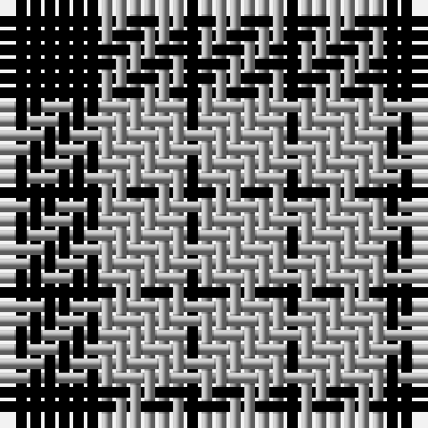

**Bands:** [KYKY](/stripes/kyky/) · **Stripes:** [K LR K LR](/stripes/stripes4/) K LR K LR

This was sourced from weddslist.  It is a [4 band tartan](/bands/bands4/).

Original link http://www.weddslist.com/cgi-bin/tartans/pg.pl?source=x

## Register references

External register numbers recorded for this tartan.

- Scottish Register of Tartans: [1166](https://www.tartanregister.gov.uk/tartanDetails.aspx?ref=1166)
- Scottish Register of Tartans: [1758](https://www.tartanregister.gov.uk/tartanDetails.aspx?ref=1758)
- Scottish Register of Tartans: [2307](https://www.tartanregister.gov.uk/tartanDetails.aspx?ref=2307)
- Scottish Register of Tartans: [2540](https://www.tartanregister.gov.uk/tartanDetails.aspx?ref=2540)
- Scottish Register of Tartans: [2625](https://www.tartanregister.gov.uk/tartanDetails.aspx?ref=2625)
- Scottish Register of Tartans: [2862](https://www.tartanregister.gov.uk/tartanDetails.aspx?ref=2862)
- Scottish Register of Tartans: [982](https://www.tartanregister.gov.uk/tartanDetails.aspx?ref=982)
- Scottish Tartans Authority (ITI): 1429
- Scottish Tartans Authority (ITI): 218
- Scottish Tartans World Register: 1042
- Scottish Tartans World Register: 127
- Scottish Tartans World Register: 1429
- Scottish Tartans World Register: 218
- Scottish Tartans World Register: 2218
- Scottish Tartans World Register: 737
- Scottish Tartans World Register: 897

## Variants

Other setts woven to the same stripe pattern.

- [MacFarlane VS](/setts/s4/k7lr6k1~x2/)

## Thread count
K/7 N6 K1 N/6

## Palette
Each colour and its ΔE from the base-6 reference it is a variant of.

| Colour | Shade | Base | ΔE (OKLab) |
|---|---|---|---|
| K | <code style="background-color:#000000;">#000000</code> `#000000` | K <code style="background-color:#000000;">#000000</code> | 0.00 |
| N | <code style="background-color:#AAAAAA;">#AAAAAA</code> `#AAAAAA` | Y <code style="background-color:#F2BF00;">#F2BF00</code> | 0.19 |

# Sample pattern

## Nearest tartans

The nearest existing variants by ΔTartan distance.

1. [MacFarlane VS](/setts/s4/k7lr6k1~x2/) — ΔT 0.00
1. [MacFarlane VS](/setts/s4/k7lb6k1/) — ΔT 0.62
1. [MacFarlane B/W or Lendrum Clan Tartan Tartan Number: 1251. Earliest known date: 1842 The design comes from the Vestiarium Scoticum (1842). The authors, the Sobieski Stuart brothers, enjoyed a popular following among the Scottish gentry in the early Victorian era, and in the spirit of the times, added mystery, romance and some spurious historical documentation to the subject of tartan. Of the better known tartans, the book offers some minor variation, but in other cases it provides the only recorded version of many tartans in use today. See products available Copyright © Blair Urquhart, Comrie, 2015](/setts/s4/k7w6k1~x2/) — ΔT 1.44
1. [MacLeod, Black & White](/setts/s5/w8k1w8k12w1~x2/) — ΔT 1.63
1. [Cairn (Marton Mills)](/setts/s5/k2w1k8w8k1~x8/) — ΔT 1.72
1. [Lords of Skye (Fashion?)](/setts/s4/k46dy7k8w20~x2/) — ΔT 1.73
1. [Raeburn](/setts/s4/k34ly3k34ly26~x2/) — ΔT 1.76
1. [Raeburn](/setts/s4/k6ly1k6ly6~x6/) — ΔT 1.78
1. [Jahore](/setts/s5/db20k5db18ly26k6~x2/) — ΔT 1.81
1. [Unidentified Sample](/setts/s6/db11r4ly9db4ly2db11~x2/) — ΔT 1.81

## Neighbour map

Every grey dot is one of 14299 variants placed by the first two principal components of the ΔTartan feature space (44% of its variance). Red is this tartan; blue dots are its nearest — click one to open its page.

<svg viewBox="0 0 640 380" role="img" style="max-width:100%;height:auto;border:1px solid #e0e0e0;border-radius:4px;display:block" xmlns="http://www.w3.org/2000/svg"><image href="/nn/cloud.v1.png" width="640" height="380"/><a href="/setts/s4/k7lr6k1~x2/"><circle cx="300.3" cy="292.9" r="4" fill="#3465a4"><title>MacFarlane VS</title></circle></a><a href="/setts/s4/k7lb6k1/"><circle cx="293.2" cy="286.5" r="4" fill="#3465a4"><title>MacFarlane VS</title></circle></a><a href="/setts/s4/k7w6k1~x2/"><circle cx="293.1" cy="281.9" r="4" fill="#3465a4"><title>MacFarlane B/W or Lendrum Clan Tartan Tartan Number: 1251. Earliest known date: 1842 The design comes from the Vestiarium Scoticum (1842). The authors, the Sobieski Stuart brothers, enjoyed a popular following among the Scottish gentry in the early Victorian era, and in the spirit of the times, added mystery, romance and some spurious historical documentation to the subject of tartan. Of the better known tartans, the book offers some minor variation, but in other cases it provides the only recorded version of many tartans in use today. See products available Copyright © Blair Urquhart, Comrie, 2015</title></circle></a><a href="/setts/s5/w8k1w8k12w1~x2/"><circle cx="320.2" cy="229.4" r="4" fill="#3465a4"><title>MacLeod, Black &amp; White</title></circle></a><a href="/setts/s5/k2w1k8w8k1~x8/"><circle cx="312.6" cy="237.3" r="4" fill="#3465a4"><title>Cairn (Marton Mills)</title></circle></a><a href="/setts/s4/k46dy7k8w20~x2/"><circle cx="335.8" cy="249.6" r="4" fill="#3465a4"><title>Lords of Skye (Fashion?)</title></circle></a><a href="/setts/s4/k34ly3k34ly26~x2/"><circle cx="390.9" cy="278.0" r="4" fill="#3465a4"><title>Raeburn</title></circle></a><a href="/setts/s4/k6ly1k6ly6~x6/"><circle cx="312.8" cy="305.8" r="4" fill="#3465a4"><title>Raeburn</title></circle></a><a href="/setts/s5/db20k5db18ly26k6~x2/"><circle cx="206.4" cy="264.7" r="4" fill="#3465a4"><title>Jahore</title></circle></a><a href="/setts/s6/db11r4ly9db4ly2db11~x2/"><circle cx="293.6" cy="265.2" r="4" fill="#3465a4"><title>Unidentified Sample</title></circle></a><circle cx="300.3" cy="292.9" r="5" fill="#c00000"/></svg>

ID: /setts/s4/k7lr6k1/
