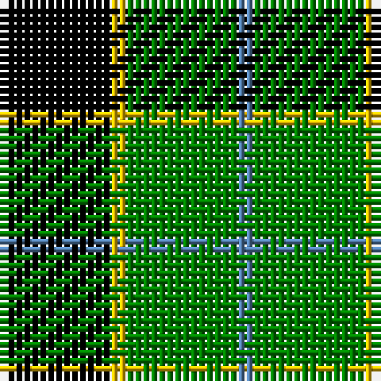

This page is one **sett** — a single exact thread-count. It belongs to the [tartan](/tartans/k7y1g7b1/)
(the same proportion at any scale), whose colour order is pattern [BGYK](/stripes/bgyk/).

Sourced from weddslist.  It is a [4 stripe tartan](/stripes/stripes4/).

Original link http://www.weddslist.com/cgi-bin/tartans/pg.pl?source=sts

## Thread count
K/14 Y2 G14 B/2

## Palette
Each colour and the base-6 reference it is a variant of.

| Colour | Shade | Base |
|---|---|---|
| B | <code style="background-color:#5480B0;">#5480B0</code> `oklch(58.8% 0.089 251.5)` <small>#5480B0</small> | B <code style="background-color:#2A418A;">#2A418A</code> |
| G | <code style="background-color:#008000;">#008000</code> `oklch(52.0% 0.177 142.5)` <small>#008000</small> | G <code style="background-color:#006100;">#006100</code> |
| K | <code style="background-color:#000000;">#000000</code> `oklch(0.0% 0.000 0.0)` <small>#000000</small> | K <code style="background-color:#000000;">#000000</code> |
| Y | <code style="background-color:#F0C000;">#F0C000</code> `oklch(82.7% 0.169 90.5)` <small>#F0C000</small> | Y <code style="background-color:#F2BF00;">#F2BF00</code> |

# Sample pattern

## Nearest tartans

The nearest existing variants by ΔTartan distance, with this tartan at the top so the swatches line up against it.

ΔTartan

Tartan

Sett

—

<a href="/ttd/edit/#slug=k7ly1g7t1~x2">Wilson's, No 140</a> <a class="nn-out" href="/setts/s4/k7ly1g7t1~x2/" title="open its dictionary page">↗</a>

0.88

<a href="/ttd/edit/#slug=k7r3k24g28ly3~x2">Robert Gordon University</a> <a class="nn-out" href="/setts/s5/k7r3k24g28ly3~x2/" title="open its dictionary page">↗</a>

0.94

<a href="/ttd/edit/#slug=k8b5g44k40r6">Douglas, Black</a> <a class="nn-out" href="/setts/s5/k8b5g44k40r6/" title="open its dictionary page">↗</a>

1.00

<a href="/ttd/edit/#slug=k7w1g7t1~x2">Wilson's No.079</a> <a class="nn-out" href="/setts/s4/k7w1g7t1~x2/" title="open its dictionary page">↗</a>

1.06

<a href="/ttd/edit/#slug=k30db7g36k5~x2">Innes, hunting</a> <a class="nn-out" href="/setts/s4/k30db7g36k5~x2/" title="open its dictionary page">↗</a>

1.21

<a href="/ttd/edit/#slug=k4g33k33ly4~x2">Wallace, hunting</a> <a class="nn-out" href="/setts/s4/k4g33k33ly4~x2/" title="open its dictionary page">↗</a>

1.24

<a href="/ttd/edit/#slug=k2g9t1k6b4g2~x2">Unnamed 3</a> <a class="nn-out" href="/setts/s6/k2g9t1k6b4g2~x2/" title="open its dictionary page">↗</a>

1.29

<a href="/setts/s4/k6ly1g6~x4/">Wilson's No.197</a>

1.31

<a href="/ttd/edit/#slug=g6r2g13k6w2k16r3~x2">Sinclair, hunting</a> <a class="nn-out" href="/setts/s7/g6r2g13k6w2k16r3~x2/" title="open its dictionary page">↗</a>

1.35

<a href="/ttd/edit/#slug=k1g8k8ly1~x4">Wallace Htg (Clan)</a> <a class="nn-out" href="/setts/s4/k1g8k8ly1~x4/" title="open its dictionary page">↗</a>

1.36

<a href="/ttd/edit/#slug=g1db5g1k5g6ly1~x2">MacKay</a> <a class="nn-out" href="/setts/s6/g1db5g1k5g6ly1~x2/" title="open its dictionary page">↗</a>

## Neighbour map

Every grey dot is one of 14299 variants placed by the first two principal components of the ΔTartan feature space (44% of its variance). Red is this tartan; blue dots are its nearest — click one to open its page.

<svg viewBox="0 0 640 380" role="img" style="max-width:100%;height:auto;border:1px solid #e0e0e0;border-radius:4px;display:block" xmlns="http://www.w3.org/2000/svg"><image href="/nn/cloud.v1.png" width="640" height="380"/><a href="/setts/s5/k7r3k24g28ly3~x2/"><circle cx="233.3" cy="214.7" r="4" fill="#3465a4"><title>Robert Gordon University</title></circle></a><a href="/setts/s5/k8b5g44k40r6/"><circle cx="237.8" cy="222.7" r="4" fill="#3465a4"><title>Douglas, Black</title></circle></a><a href="/setts/s4/k7w1g7t1~x2/"><circle cx="222.0" cy="251.2" r="4" fill="#3465a4"><title>Wilson's No.079</title></circle></a><a href="/setts/s4/k30db7g36k5~x2/"><circle cx="243.4" cy="271.0" r="4" fill="#3465a4"><title>Innes, hunting</title></circle></a><a href="/setts/s4/k4g33k33ly4~x2/"><circle cx="273.4" cy="255.7" r="4" fill="#3465a4"><title>Wallace, hunting</title></circle></a><a href="/setts/s6/k2g9t1k6b4g2~x2/"><circle cx="190.0" cy="221.9" r="4" fill="#3465a4"><title>Unnamed 3</title></circle></a><a href="/setts/s4/k6ly1g6~x4/"><circle cx="224.5" cy="271.9" r="4" fill="#3465a4"><title>Wilson's No.197</title></circle></a><a href="/setts/s7/g6r2g13k6w2k16r3~x2/"><circle cx="203.3" cy="215.8" r="4" fill="#3465a4"><title>Sinclair, hunting</title></circle></a><a href="/setts/s4/k1g8k8ly1~x4/"><circle cx="280.8" cy="261.8" r="4" fill="#3465a4"><title>Wallace Htg (Clan)</title></circle></a><a href="/setts/s6/g1db5g1k5g6ly1~x2/"><circle cx="157.1" cy="237.7" r="4" fill="#3465a4"><title>MacKay</title></circle></a><circle cx="202.0" cy="244.5" r="5" fill="#c00000"/></svg>

ID: /setts/s4/k7ly1g7t1~x2/
