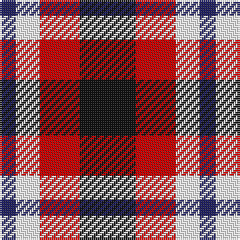

In pattern [BWRK](/patterns/bwrk/).

This was sourced from tartans-authority.  It is a [4 stripes tartan](/stripes/stripes4/).

Original link http://www.tartansauthority.com/tartan-ferret/display/10849/

## Thread count
DB/8 W12 R20 K/28

## Palette
Each colour and its ΔE from the base-6 reference it is a variant of.

| Colour | Shade | Base | ΔE (OKLab) |
|---|---|---|---|
| DB | <code style="background-color:#202060;">#202060</code> `#202060` | B <code style="background-color:#2A418A;">#2A418A</code> | 0.11 |
| K | <code style="background-color:#101010;">#101010</code> `#101010` | K <code style="background-color:#000000;">#000000</code> | 0.17 |
| R | <code style="background-color:#C80000;">#C80000</code> `#C80000` | R <code style="background-color:#CC0000;">#CC0000</code> | 0.01 |
| W | <code style="background-color:#FCFCFC;">#FCFCFC</code> `#FCFCFC` | W <code style="background-color:#F7F7F7;">#F7F7F7</code> | 0.01 |

# Sample pattern

## Nearest tartans

The nearest existing variants by ΔTartan distance.

1. [Thomas Newcomen's Combustion Engine](/setts/s4/k7r5w3b2~b0000cd-k101010-rff0000-wffffff~x4/) — ΔT 0.49
1. [SAL Grindrande Stiernan (Corporate)](/setts/s4/r3g1k3w1~g006818-k101010-rc80000-wfcfcfc~x20/) — ΔT 0.82
1. [Austin / Wilson's No 137](/setts/s5/b3k3b3g6r2~b800080-g008000-k000000-rc00000~x2/) — ΔT 1.14
1. [SAL Glindrande Stiernan](/setts/s4/r3g1k3w1~g008b00-k101010-rff0000-wffffff~x20/) — ΔT 1.15
1. [Clark](/setts/s5/r3k1g1k1w3~g004c00-k000000-rc80000-wd0d0d0~x4/) — ΔT 1.22
1. [Austin / Wilson's No 173](/setts/s5/b3k3b3g6y2~b800080-g008000-k000000-yf0c000~x2/) — ΔT 1.30
1. [Wilson's, No 113](/setts/s4/r1g3b3w1~b800080-g008000-rc00000-we0e0e0~x4/) — ΔT 1.34
1. [Clark](/setts/s5/b3k1g1k1r3~b4367ae-g11450d-k000000-raa0000~x8/) — ΔT 1.39
1. [Clark](/setts/s5/b3k1g1k1r3~b4367ae-g11450d-k000000-raa0000~x4/) — ΔT 1.39
1. [Haggis Hostels](/setts/s4/r10b5w5ba4~b5f749c-ba14283c-r960028-we8ccb8~x8/) — ΔT 1.42

## Neighbour map

Every grey dot is one of 15726 variants placed by the first two principal components of the ΔTartan feature space (44% of its variance). Red is this tartan; blue dots are its nearest — click one to open its page.

<svg viewBox="0 0 640 380" role="img" style="max-width:100%;height:auto;border:1px solid #e0e0e0;border-radius:4px;display:block" xmlns="http://www.w3.org/2000/svg"><image href="/nn/cloud.v1.png" width="640" height="380"/><a href="/setts/s4/k7r5w3b2~b0000cd-k101010-rff0000-wffffff~x4/"><circle cx="103.0" cy="277.5" r="4" fill="#3465a4"><title>Thomas Newcomen's Combustion Engine</title></circle></a><a href="/setts/s4/r3g1k3w1~g006818-k101010-rc80000-wfcfcfc~x20/"><circle cx="108.2" cy="282.6" r="4" fill="#3465a4"><title>SAL Grindrande Stiernan (Corporate)</title></circle></a><a href="/setts/s5/b3k3b3g6r2~b800080-g008000-k000000-rc00000~x2/"><circle cx="82.8" cy="295.7" r="4" fill="#3465a4"><title>Austin / Wilson's No 137</title></circle></a><a href="/setts/s4/r3g1k3w1~g008b00-k101010-rff0000-wffffff~x20/"><circle cx="101.9" cy="275.8" r="4" fill="#3465a4"><title>SAL Glindrande Stiernan</title></circle></a><a href="/setts/s5/r3k1g1k1w3~g004c00-k000000-rc80000-wd0d0d0~x4/"><circle cx="72.4" cy="259.7" r="4" fill="#3465a4"><title>Clark</title></circle></a><a href="/setts/s5/b3k3b3g6y2~b800080-g008000-k000000-yf0c000~x2/"><circle cx="68.7" cy="291.7" r="4" fill="#3465a4"><title>Austin / Wilson's No 173</title></circle></a><a href="/setts/s4/r1g3b3w1~b800080-g008000-rc00000-we0e0e0~x4/"><circle cx="117.7" cy="287.6" r="4" fill="#3465a4"><title>Wilson's, No 113</title></circle></a><a href="/setts/s5/b3k1g1k1r3~b4367ae-g11450d-k000000-raa0000~x8/"><circle cx="98.0" cy="278.9" r="4" fill="#3465a4"><title>Clark</title></circle></a><a href="/setts/s5/b3k1g1k1r3~b4367ae-g11450d-k000000-raa0000~x4/"><circle cx="98.0" cy="278.9" r="4" fill="#3465a4"><title>Clark</title></circle></a><a href="/setts/s4/r10b5w5ba4~b5f749c-ba14283c-r960028-we8ccb8~x8/"><circle cx="111.9" cy="307.3" r="4" fill="#3465a4"><title>Haggis Hostels</title></circle></a><circle cx="108.8" cy="282.2" r="5" fill="#c00000"/></svg>

ID: /setts/s4/k7r5w3b2~b202060-k101010-rc80000-wfcfcfc~x4/
